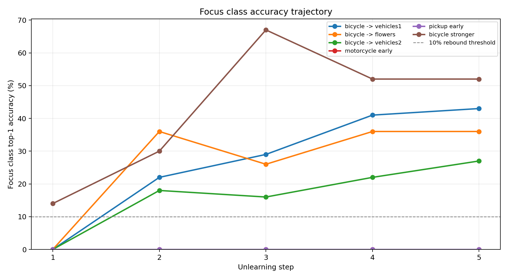
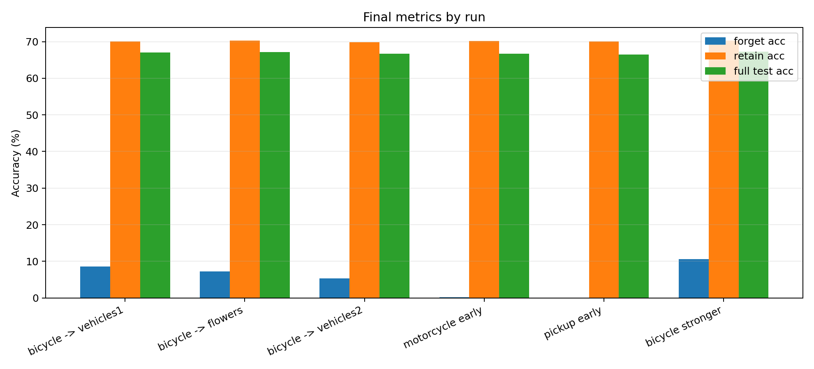
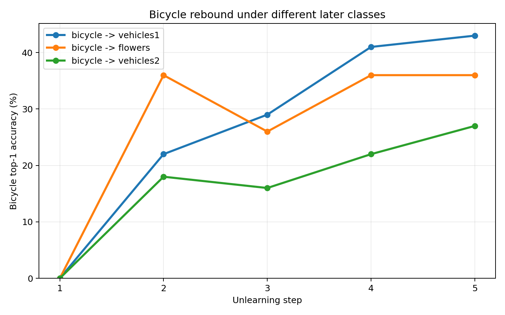
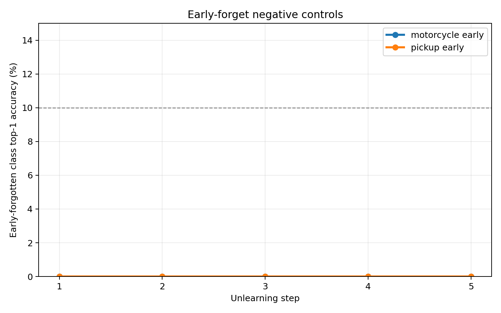
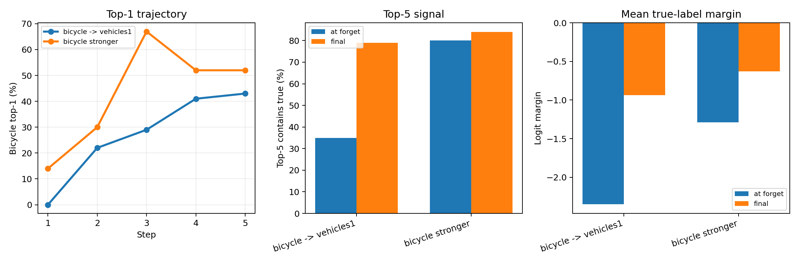
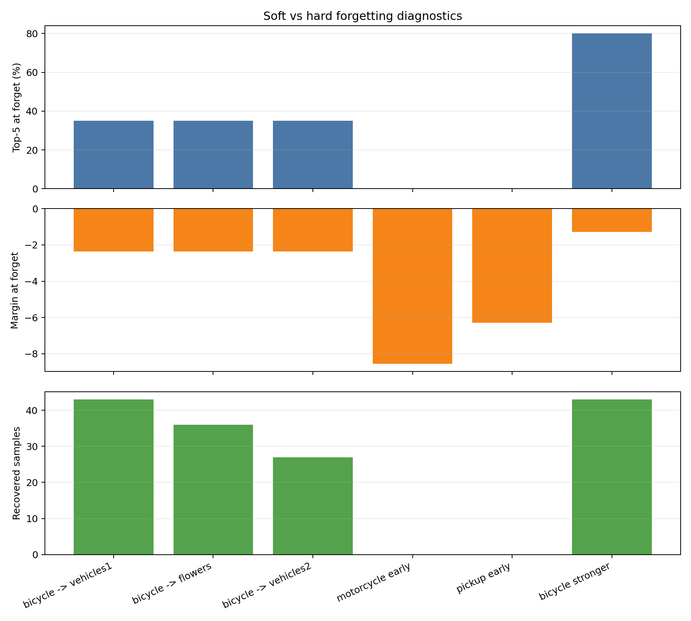
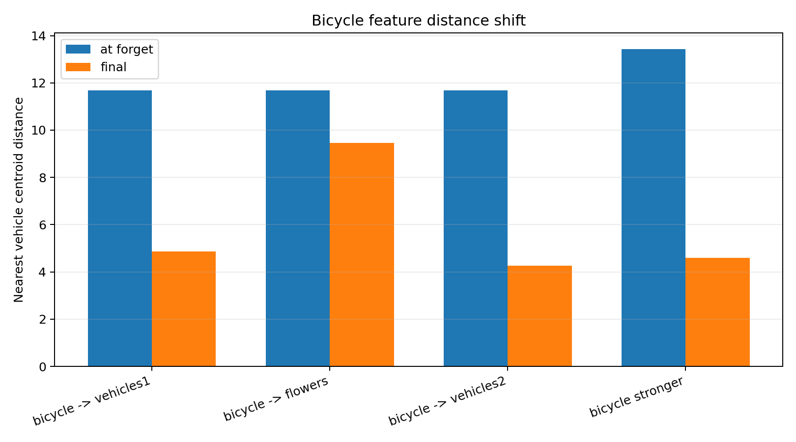

# 6_6 CIFAR-100 Bicycle Rebound Cause Probe Analysis

## 實驗問題與判讀標準

這份報告彙整 5 條控制實驗與 1 條原始 positive control，目標是判斷 `bicycle / 腳踏車 (8)` 的 post-forget rebound 比較像哪一種原因：vehicle-specific shared representation、一般 sequential drift、單純早忘 exposure，或 forgetting strength 不足。

本報告使用同一個 significant rebound 定義：later top-1 accuracy 至少 `10%`，且比 forget-step top-1 高至少 `5pp`。所有 accuracy 都來自 CIFAR-100 test split。

| Run ID | Order | Purpose | Expected signal |
| --- | --- | --- | --- |
| vehicles1_official_seed1_k5 | 8,13,48,58,90 | 原始 positive control：bicycle 先忘，再忘 vehicles_1 | 應重現 bicycle rebound，作為對照基準 |
| bicycle_then_flowers_seed1_k5 | 8,54,62,70,82 | 先忘 bicycle，再忘 flowers | 若不 rebound，支持 vehicle-specific update 假說 |
| bicycle_then_vehicles2_seed1_k5 | 8,41,69,81,89 | 先忘 bicycle，再忘 vehicles_2 | 若 rebound，支持 shared vehicle representation 假說 |
| motorcycle_then_vehicles_no_bicycle_seed1_k5 | 48,13,58,90,8 | 讓 motorcycle 早忘，bicycle 最後忘 | 若 motorcycle 仍不 rebound，排除單純 exposure 解釋 |
| pickup_then_vehicles_no_bicycle_seed1_k5 | 58,13,48,90,8 | 讓 pickup_truck 早忘，bicycle 最後忘 | 若 pickup_truck 仍不 rebound，排除單純 exposure 解釋 |
| bicycle_stronger_then_vehicles1_seed1_k5 | 8,13,48,58,90 | bicycle 先忘，UNLEARN_EPOCHS=20，再忘 vehicles_1 | 若 top-5 降低且 rebound 消失，支持 forget strength 是直接原因 |

**本章結論：**這組控制實驗可以直接分辨三件事：flowers 後是否也 rebound、其他車輛類別早忘是否也 rebound、以及單純增加 `UNLEARN_EPOCHS` 是否能讓 bicycle 被忘得更深。

## 整體結果總覽

| Run ID | Focus class | Forget step | Status | At forget top-1 | Max later top-1 | Final top-1 | At forget top-5 | At forget margin | Recovered samples | Forget nearest vehicle dist | Final nearest vehicle dist |
| --- | --- | --- | --- | --- | --- | --- | --- | --- | --- | --- | --- |
| vehicles1_official_seed1_k5 | 腳踏車 / bicycle (8) | 1 | rebound | 0.0% | 43.0% | 43.0% | 35.0% | -2.35 | 43 | 11.69 | 4.86 |
| bicycle_then_flowers_seed1_k5 | 腳踏車 / bicycle (8) | 1 | rebound | 0.0% | 36.0% | 36.0% | 35.0% | -2.35 | 36 | 11.69 | 9.45 |
| bicycle_then_vehicles2_seed1_k5 | 腳踏車 / bicycle (8) | 1 | rebound | 0.0% | 27.0% | 27.0% | 35.0% | -2.35 | 27 | 11.69 | 4.27 |
| motorcycle_then_vehicles_no_bicycle_seed1_k5 | 摩托車 / motorcycle (48) | 1 | no rebound | 0.0% | 0.0% | 0.0% | 0.0% | -8.56 | 0 | n/a | n/a |
| pickup_then_vehicles_no_bicycle_seed1_k5 | 皮卡車 / pickup_truck (58) | 1 | no rebound | 0.0% | 0.0% | 0.0% | 0.0% | -6.29 | 0 | n/a | n/a |
| bicycle_stronger_then_vehicles1_seed1_k5 | 腳踏車 / bicycle (8) | 1 | rebound | 14.0% | 67.0% | 52.0% | 80.0% | -1.29 | 43 | 13.44 | 4.59 |

| Run ID | Status | Final forget acc | Final retain acc | Final full test acc |
| --- | --- | --- | --- | --- |
| vehicles1_official_seed1_k5 | rebound | 8.6% | 70.1% | 67.0% |
| bicycle_then_flowers_seed1_k5 | rebound | 7.2% | 70.3% | 67.2% |
| bicycle_then_vehicles2_seed1_k5 | rebound | 5.4% | 69.9% | 66.7% |
| motorcycle_then_vehicles_no_bicycle_seed1_k5 | no rebound | 0.2% | 70.1% | 66.7% |
| pickup_then_vehicles_no_bicycle_seed1_k5 | no rebound | 0.0% | 70.0% | 66.5% |
| bicycle_stronger_then_vehicles1_seed1_k5 | rebound | 10.6% | 70.3% | 67.3% |

**本章結論：**6 條 run 裡，只有 bicycle 作為 focus class 時出現 rebound；motorcycle 與 pickup 作為 early-forgotten focus class 時都沒有 rebound。final retain accuracy 都維持在約 `69.9%~70.3%`，代表這些現象不是整個模型崩壞造成。

## Bicycle 後續接 flowers vs vehicles_2

| Run | At forget top-1 | Max later top-1 | Final top-1 | At forget top-5 | At forget margin | Recovered samples |
| --- | --- | --- | --- | --- | --- | --- |
| bicycle -> vehicles1 | 0.0% | 43.0% | 43.0% | 35.0% | -2.35 | 43 |
| bicycle -> flowers | 0.0% | 36.0% | 36.0% | 35.0% | -2.35 | 36 |
| bicycle -> vehicles2 | 0.0% | 27.0% | 27.0% | 35.0% | -2.35 | 27 |

`bicycle_then_flowers` 的 bicycle 從 `0.0%` 回到 final `36.0%`，`bicycle_then_vehicles2` 從 `0.0%` 回到 final `27.0%`。這兩條都符合 significant rebound。原本 `vehicles1_official` 從 `0.0%` 回到 `43.0%`，仍是最高，但 flowers 也能造成明顯回升。

**本章結論：**bicycle rebound 不能被簡化成「只有後續忘 vehicle 類別才會發生」。flowers 後也回到 `36.0%`，所以更合理的解釋是 bicycle 本身被忘得較淺，後續 sequential update 即使不是 vehicle-specific，也可能讓 decision boundary 回漂。

## Early-forget negative controls：motorcycle / pickup

| Run | Focus class | At forget top-1 | Max later top-1 | Final top-1 | At forget top-5 | At forget margin | Recovered samples |
| --- | --- | --- | --- | --- | --- | --- | --- |
| motorcycle early | 摩托車 / motorcycle (48) | 0.0% | 0.0% | 0.0% | 0.0% | -8.56 | 0 |
| pickup early | 皮卡車 / pickup_truck (58) | 0.0% | 0.0% | 0.0% | 0.0% | -6.29 | 0 |

motorcycle 早忘後 top-1 從 `0.0%` 到 final 仍是 `0.0%`，pickup_truck 早忘後也是 `0.0%`。兩者 forget-step top-5 都是 `0.0%`，margin 分別是 `-8.56` 與 `-6.29`，比 bicycle 的 `-2.35` 更負很多。

**本章結論：**「比較早被忘、有更多 later steps」不是 rebound 的充分條件。motorcycle / pickup 都早忘但完全不 rebound，支持 bicycle 的特殊性在於 soft-forgotten signal，而不是 exposure 長短。

## Stronger forgetting 是否有效

| Run | At forget top-1 | Max later top-1 | Final top-1 | At forget top-5 | Final top-5 | At forget margin | Final margin |
| --- | --- | --- | --- | --- | --- | --- | --- |
| bicycle -> vehicles1 | 0.0% | 43.0% | 43.0% | 35.0% | 79.0% | -2.35 | -0.94 |
| bicycle stronger | 14.0% | 67.0% | 52.0% | 80.0% | 84.0% | -1.29 | -0.63 |

`bicycle_stronger_then_vehicles1` 使用 `UNLEARN_EPOCHS=20`，但 bicycle forget-step top-1 反而是 `14.0%`，top-5 是 `80.0%`，比原始 official run 的 top-1 `0.0%`、top-5 `35.0%` 更不像 deeper forgetting。final bicycle top-1 仍有 `52.0%`。

**本章結論：**單純把 unlearn epochs 從 `10` 加到 `20` 沒有讓 bicycle 忘得更深，反而保留更強 top-k signal。若要測試 forgetting strength，下一步應該改 `unlearn_lr`、mask threshold、loss weighting 或更直接的 class suppression，而不是只加 epoch。

## Top-5、margin、recovered samples 分析

| Run ID | Focus class | Status | At forget top-1 | At forget top-5 | At forget margin | Recovered samples |
| --- | --- | --- | --- | --- | --- | --- |
| vehicles1_official_seed1_k5 | 腳踏車 / bicycle (8) | rebound | 0.0% | 35.0% | -2.35 | 43 |
| bicycle_then_flowers_seed1_k5 | 腳踏車 / bicycle (8) | rebound | 0.0% | 35.0% | -2.35 | 36 |
| bicycle_then_vehicles2_seed1_k5 | 腳踏車 / bicycle (8) | rebound | 0.0% | 35.0% | -2.35 | 27 |
| motorcycle_then_vehicles_no_bicycle_seed1_k5 | 摩托車 / motorcycle (48) | no rebound | 0.0% | 0.0% | -8.56 | 0 |
| pickup_then_vehicles_no_bicycle_seed1_k5 | 皮卡車 / pickup_truck (58) | no rebound | 0.0% | 0.0% | -6.29 | 0 |
| bicycle_stronger_then_vehicles1_seed1_k5 | 腳踏車 / bicycle (8) | rebound | 14.0% | 80.0% | -1.29 | 43 |

原始 bicycle official run 在 forget step 已經 top-1 `0.0%`，但 top-5 還有 `35.0%`；flowers / vehicles2 run 也是同一個 step1 checkpoint，所以 top-5 同樣是 `35.0%`。相對地，motorcycle / pickup 的 forget-step top-5 都是 `0.0%`，且 recovered samples 都是 `0`。

**本章結論：**bicycle rebound 的關鍵證據是 soft-forgotten：top-1 已被壓到 `0.0%`，但 top-5 仍有 `35.0%`，margin 也只到 `-2.35`。motorcycle / pickup 則是 hard-forgotten，top-5 `0.0%` 且 margin 更負，因此後續 update 很難把它們拉回 top-1。

## Feature centroid distance 分析

| Run | Forget-step nearest vehicle dist | Final nearest vehicle dist |
| --- | --- | --- |
| bicycle -> vehicles1 | 11.69 | 4.86 |
| bicycle -> flowers | 11.69 | 9.45 |
| bicycle -> vehicles2 | 11.69 | 4.27 |
| bicycle stronger | 13.44 | 4.59 |

bicycle official run 的 nearest vehicle centroid distance 從 forget step `11.69` 降到 final `4.86`；bicycle_then_vehicles2 從 `11.69` 降到 `4.27`；bicycle_then_flowers final 則是 `9.45`，靠近幅度較小但仍然 rebound。stronger run 從 `13.44` 降到 `4.59`。

**本章結論：**feature distance 支持「後續 steps 會改變 bicycle 的 representation / boundary 狀態」，尤其 vehicles1 / vehicles2 / stronger run final 都靠近 vehicle centroid。不過 flowers run final distance 仍較遠卻也 rebound，因此 feature centroid distance 不能單獨解釋全部現象，必須和 top-5、margin 一起看。

## Step-by-step trajectory 明細

| Run | Step | New class | Focus acc | Forget acc | Retain acc | Full test acc |
| --- | --- | --- | --- | --- | --- | --- |
| bicycle -> vehicles1 | 1 | 腳踏車 / bicycle (8) | 0.0% | 0.0% | 69.9% | 69.2% |
| bicycle -> vehicles1 | 2 | 公車 / bus (13) | 22.0% | 11.0% | 70.4% | 69.2% |
| bicycle -> vehicles1 | 3 | 摩托車 / motorcycle (48) | 29.0% | 9.7% | 70.1% | 68.3% |
| bicycle -> vehicles1 | 4 | 皮卡車 / pickup_truck (58) | 41.0% | 10.2% | 70.3% | 67.9% |
| bicycle -> vehicles1 | 5 | 火車 / train (90) | 43.0% | 8.6% | 70.1% | 67.0% |
| bicycle -> flowers | 1 | 腳踏車 / bicycle (8) | 0.0% | 0.0% | 69.9% | 69.2% |
| bicycle -> flowers | 2 | 蘭花 / orchid (54) | 36.0% | 18.0% | 70.1% | 69.0% |
| bicycle -> flowers | 3 | 罌粟花 / poppy (62) | 26.0% | 8.7% | 70.3% | 68.5% |
| bicycle -> flowers | 4 | 玫瑰 / rose (70) | 36.0% | 9.0% | 70.4% | 67.9% |
| bicycle -> flowers | 5 | 向日葵 / sunflower (82) | 36.0% | 7.2% | 70.3% | 67.2% |
| bicycle -> vehicles2 | 1 | 腳踏車 / bicycle (8) | 0.0% | 0.0% | 69.9% | 69.2% |
| bicycle -> vehicles2 | 2 | 割草機 / lawn_mower (41) | 18.0% | 9.0% | 70.0% | 68.8% |
| bicycle -> vehicles2 | 3 | 火箭 / rocket (69) | 16.0% | 5.3% | 70.2% | 68.2% |
| bicycle -> vehicles2 | 4 | 路面電車 / streetcar (81) | 22.0% | 5.5% | 70.0% | 67.5% |
| bicycle -> vehicles2 | 5 | 拖拉機 / tractor (89) | 27.0% | 5.4% | 69.9% | 66.7% |
| motorcycle early | 1 | 摩托車 / motorcycle (48) | 0.0% | 0.0% | 70.0% | 69.3% |
| motorcycle early | 2 | 公車 / bus (13) | 0.0% | 0.0% | 70.4% | 69.0% |
| motorcycle early | 3 | 皮卡車 / pickup_truck (58) | 0.0% | 0.0% | 70.5% | 68.4% |
| motorcycle early | 4 | 火車 / train (90) | 0.0% | 0.0% | 70.3% | 67.5% |
| motorcycle early | 5 | 腳踏車 / bicycle (8) | 0.0% | 0.2% | 70.1% | 66.7% |
| pickup early | 1 | 皮卡車 / pickup_truck (58) | 0.0% | 0.0% | 70.7% | 70.0% |
| pickup early | 2 | 公車 / bus (13) | 0.0% | 0.0% | 70.6% | 69.2% |
| pickup early | 3 | 摩托車 / motorcycle (48) | 0.0% | 0.0% | 70.3% | 68.2% |
| pickup early | 4 | 火車 / train (90) | 0.0% | 0.0% | 70.2% | 67.4% |
| pickup early | 5 | 腳踏車 / bicycle (8) | 0.0% | 0.0% | 70.0% | 66.5% |
| bicycle stronger | 1 | 腳踏車 / bicycle (8) | 14.0% | 14.0% | 70.0% | 69.4% |
| bicycle stronger | 2 | 公車 / bus (13) | 30.0% | 15.0% | 70.6% | 69.5% |
| bicycle stronger | 3 | 摩托車 / motorcycle (48) | 67.0% | 22.3% | 70.4% | 69.0% |
| bicycle stronger | 4 | 皮卡車 / pickup_truck (58) | 52.0% | 13.0% | 70.4% | 68.1% |
| bicycle stronger | 5 | 火車 / train (90) | 52.0% | 10.6% | 70.3% | 67.3% |

**本章結論：**逐步數據顯示 bicycle rebound 在 step2 就出現：official `22.0%`、flowers `36.0%`、vehicles2 `18.0%`。motorcycle / pickup 則從 step1 到 step5 都維持 `0.0%`。

## 最終結論與限制

目前控制實驗支持以下判斷：

- `bicycle_then_flowers` 也 rebound：需要考慮 general sequential drift，而不是只看 vehicle-specific update。
- motorcycle / pickup_truck 早忘仍不 rebound：支持 bicycle 特殊性不是單純 exposure。
- stronger forget 後 bicycle 仍 rebound：表示後續 vehicle boundary / feature drift 很強。
- bicycle rebound 的主因目前更像是 bicycle 本身的 soft-forgotten / boundary sensitivity，而不是純 vehicle-specific shared representation。
- flowers 後也 rebound，代表 general sequential drift 必須納入解釋。
- motorcycle / pickup 早忘後不 rebound，代表 exposure 不是充分條件。
- `UNLEARN_EPOCHS=20` 沒有形成 stronger forgetting，因此不能用這條 run 證明「更強 forgetting 會消除 rebound」。

**本章結論：**目前最可信的說法是：bicycle 在 forget step 被壓掉 top-1，但仍保留 top-5 candidate signal 與較不負的 margin；後續 sequential updates 會讓邊界回漂，因此 bicycle 比其他 early-forgotten classes 更容易回到 top-1。這是 seed=1 的機制分析，不應誇大成跨 seed 結論。

## Notes

- Significant rebound 定義：later top-1 >= `10%` 且比 forget-step top-1 高至少 `5pp`。
- Top-5、margin、recovered samples、feature distance 使用 CIFAR-100 test split 與對應 checkpoints 計算。
- Feature centroid distance 只比較交通工具相關類別，不代表 CIFAR-100 全部 100 類的 feature geometry。