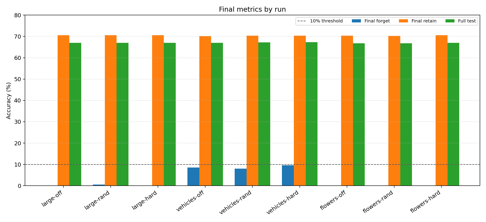
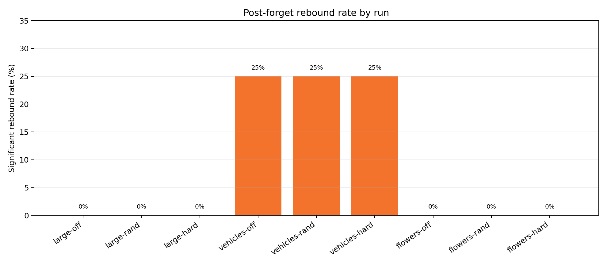
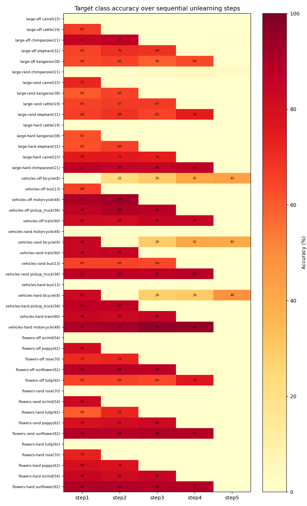
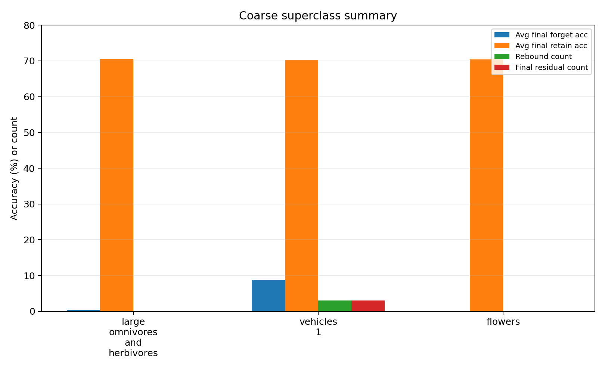
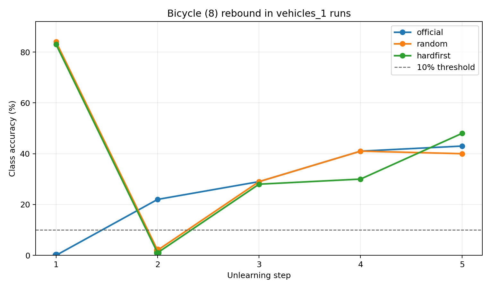
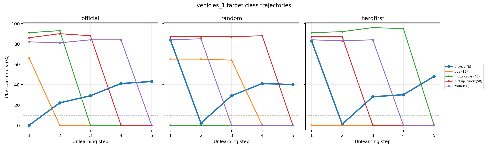

# 6_6 CIFAR-100 Single-Coarse Rebound 實驗結果分析

## 實驗設定

- Namespace：`sequential_single_coarse_rebound_cifar100`
- Dataset：CIFAR-100，固定 `seed=1`。
- 每條 run 只選一個 CIFAR-100 coarse superclass，依序忘記其中 5 個 fine classes。
- 本次比較三個 coarse superclass：大型雜食/草食動物、車輛 1、花卉。
- 每個 coarse superclass 各跑三種順序：官方順序、隨機順序、困難優先。
- Significant post-forget rebound 定義：`max_later_accuracy >= 10%`，且比 `accuracy_at_forget` 至少高 `5pp`。
- 本報告只分析已完成結果，不重新訓練、不重新 unlearn。

## 整體結果

- 9 條 run 全部完成：`9/9`。
- old forgotten class 可觀察 later steps 的樣本共有 `36` 個，其中 significant rebound 為 `3` 個。
- final residual，也就是最後仍高於 10% 的已忘類別，共 `3` 個。
- immediate forgetting lag 為 `0` 個，表示每個 newly forgotten class 在剛被忘記當步都已經壓到 10% 以下或等於附近。

關鍵結論很集中：這批 single-coarse probe 中，明顯 rebound 只出現在 `vehicles_1`，而且三種順序都是同一個 fine class：`bicycle / 腳踏車 (8)`。大型雜食/草食動物與花卉組沒有出現 significant rebound，因此目前結果不支持「所有 old forgotten class 都普遍 rebound」；比較合理的說法是，rebound 可能和特定 coarse superclass、特定 fine class、或該類別與 retained classes 的共享特徵有關。

## 圖表總覽

## 9 條 Run Final Metrics

| Coarse superclass | 順序 | Run ID | Forget order | Progress | Eval CSVs | Final forget acc | Final retain acc | Final full test acc | Rebound rate | Final residual count | Missing eval |
| --- | --- | --- | --- | --- | --- | --- | --- | --- | --- | --- | --- |
| 大型雜食/草食動物 | 官方順序 | large_omni_official_seed1_k5 | 15,19,21,31,38 | success | 5 | 0.2% | 70.6% | 67.0% | 0/4 | 0 | 0 |
| 大型雜食/草食動物 | 隨機順序 | large_omni_random_seed1_k5 | 21,15,38,19,31 | success | 5 | 0.6% | 70.5% | 67.0% | 0/4 | 0 | 0 |
| 大型雜食/草食動物 | 困難優先 | large_omni_hardfirst_seed1_k5 | 19,38,31,15,21 | success | 5 | 0.0% | 70.6% | 67.0% | 0/4 | 0 | 0 |
| 車輛 1 | 官方順序 | vehicles1_official_seed1_k5 | 8,13,48,58,90 | success | 5 | 8.6% | 70.1% | 67.0% | 1/4 | 1 | 0 |
| 車輛 1 | 隨機順序 | vehicles1_random_seed1_k5 | 48,8,90,13,58 | success | 5 | 8.0% | 70.3% | 67.2% | 1/4 | 1 | 0 |
| 車輛 1 | 困難優先 | vehicles1_hardfirst_seed1_k5 | 13,8,58,90,48 | success | 5 | 9.6% | 70.3% | 67.3% | 1/4 | 1 | 0 |
| 花卉 | 官方順序 | flowers_official_seed1_k5 | 54,62,70,82,92 | success | 5 | 0.0% | 70.3% | 66.8% | 0/4 | 0 | 0 |
| 花卉 | 隨機順序 | flowers_random_seed1_k5 | 70,54,92,62,82 | success | 5 | 0.0% | 70.3% | 66.8% | 0/4 | 0 | 0 |
| 花卉 | 困難優先 | flowers_hardfirst_seed1_k5 | 92,70,62,54,82 | success | 5 | 0.0% | 70.5% | 67.0% | 0/4 | 0 | 0 |

## Coarse Superclass 比較

| Coarse superclass | Runs | 平均 final forget acc | 平均 final retain acc | Rebound count | Final residual count |
| --- | --- | --- | --- | --- | --- |
| 大型雜食/草食動物 | 3 | 0.3% | 70.6% | 0/12 | 0 |
| 車輛 1 | 3 | 8.7% | 70.3% | 3/12 | 3 |
| 花卉 | 3 | 0.0% | 70.4% | 0/12 | 0 |

分組結果顯示，`vehicles_1` 的平均 final forget accuracy 約 8% 到 10% 附近，明顯高於另外兩組，且所有 rebound 與 final residual 都集中在這一組。`large_omni` 的 final forget acc 幾乎歸零，`flowers` 則完全歸零，代表同樣的 unlearning 流程對不同 coarse superclass 的後續殘留行為並不一致。

## 順序比較

| 順序 | 平均 final forget acc | 平均 final retain acc | Rebound count |
| --- | --- | --- | --- |
| 官方順序 | 2.9% | 70.3% | 1/12 |
| 隨機順序 | 2.9% | 70.4% | 1/12 |
| 困難優先 | 3.2% | 70.5% | 1/12 |

順序本身沒有改變主要結論：`vehicles_1` 在官方、隨機、困難優先三種順序中都出現 `bicycle (8)` rebound；`large_omni` 與 `flowers` 在三種順序中都沒有 significant rebound。不過順序仍然有意義，因為只有較早被忘記的 class 才有足夠 later steps 可以觀察 rebound；如果某個 class 排在最後，就無法測量 post-forget rebound，只能看 final residual。

## Significant Post-Forget Rebound

| Coarse superclass | 順序 | Class | Forget step | At forget | Max later | Final |
| --- | --- | --- | --- | --- | --- | --- |
| 車輛 1 | 官方順序 | 腳踏車 / bicycle (8) | 1 | 0.0% | 43.0% | 43.0% |
| 車輛 1 | 隨機順序 | 腳踏車 / bicycle (8) | 2 | 2.0% | 41.0% | 40.0% |
| 車輛 1 | 困難優先 | 腳踏車 / bicycle (8) | 2 | 1.0% | 48.0% | 48.0% |

這三個 rebound row 都是 `bicycle / 腳踏車 (8)`。它在三種順序中剛被忘記時 accuracy 都被壓低到 0% 到 2%，但後續 step 又回升到 41% 到 48%，而且 final accuracy 仍維持 40% 到 48%。這代表它不是 immediate forgetting 沒做好，而是比較像 old forgotten class 在後續 unlearning 其他車輛類別時重新恢復辨識能力。

## vehicles_1 詳細分析：每一步每個車輛類別準確率

以下表格只列 `vehicles_1` 的五個 target classes，因為這一組是本次唯一出現 rebound 的 coarse superclass。完整 CIFAR-100 100 個 class 在每一步的 accuracy 仍保留於 `6_6_cifar100_single_coarse_rebound_step_accuracy_wide.csv` 與 `6_6_cifar100_single_coarse_rebound_step_accuracy_long.csv`。

### vehicles_1 official：8,13,48,58,90

| Step | Newly forgotten | Forgotten so far | Forget acc | Retain acc | bicycle (8) | bus (13) | motorcycle (48) | pickup_truck (58) | train (90) |
| --- | --- | --- | --- | --- | --- | --- | --- | --- | --- |
| 1 | 腳踏車 / bicycle (8) | 8 | 0.0% | 69.9% | 0.0% | 66.0% | 91.0% | 86.0% | 82.0% |
| 2 | 公車 / bus (13) | 8,13 | 11.0% | 70.4% | 22.0% | 0.0% | 93.0% | 90.0% | 81.0% |
| 3 | 摩托車 / motorcycle (48) | 8,13,48 | 9.7% | 70.1% | 29.0% | 0.0% | 0.0% | 88.0% | 84.0% |
| 4 | 皮卡車 / pickup_truck (58) | 8,13,48,58 | 10.2% | 70.3% | 41.0% | 0.0% | 0.0% | 0.0% | 84.0% |
| 5 | 火車 / train (90) | 8,13,48,58,90 | 8.6% | 70.1% | 43.0% | 0.0% | 0.0% | 0.0% | 0.0% |

### vehicles_1 random：48,8,90,13,58

| Step | Newly forgotten | Forgotten so far | Forget acc | Retain acc | bicycle (8) | bus (13) | motorcycle (48) | pickup_truck (58) | train (90) |
| --- | --- | --- | --- | --- | --- | --- | --- | --- | --- |
| 1 | 摩托車 / motorcycle (48) | 48 | 0.0% | 70.0% | 84.0% | 65.0% | 0.0% | 87.0% | 84.0% |
| 2 | 腳踏車 / bicycle (8) | 48,8 | 1.0% | 70.0% | 2.0% | 65.0% | 0.0% | 87.0% | 85.0% |
| 3 | 火車 / train (90) | 48,8,90 | 9.7% | 69.8% | 29.0% | 64.0% | 0.0% | 87.0% | 0.0% |
| 4 | 公車 / bus (13) | 48,8,90,13 | 10.2% | 70.2% | 41.0% | 0.0% | 0.0% | 88.0% | 0.0% |
| 5 | 皮卡車 / pickup_truck (58) | 48,8,90,13,58 | 8.0% | 70.3% | 40.0% | 0.0% | 0.0% | 0.0% | 0.0% |

### vehicles_1 hardfirst：13,8,58,90,48

| Step | Newly forgotten | Forgotten so far | Forget acc | Retain acc | bicycle (8) | bus (13) | motorcycle (48) | pickup_truck (58) | train (90) |
| --- | --- | --- | --- | --- | --- | --- | --- | --- | --- |
| 1 | 公車 / bus (13) | 13 | 0.0% | 70.6% | 83.0% | 0.0% | 91.0% | 87.0% | 84.0% |
| 2 | 腳踏車 / bicycle (8) | 13,8 | 0.5% | 70.6% | 1.0% | 0.0% | 92.0% | 87.0% | 83.0% |
| 3 | 皮卡車 / pickup_truck (58) | 13,8,58 | 9.3% | 70.6% | 28.0% | 0.0% | 96.0% | 0.0% | 84.0% |
| 4 | 火車 / train (90) | 13,8,58,90 | 7.5% | 70.3% | 30.0% | 0.0% | 95.0% | 0.0% | 0.0% |
| 5 | 摩托車 / motorcycle (48) | 13,8,58,90,48 | 9.6% | 70.3% | 48.0% | 0.0% | 0.0% | 0.0% | 0.0% |

### vehicles_1 rebound 診斷表

| 順序 | Class | Forget step | At forget | Max later | Final | Significant rebound |
| --- | --- | --- | --- | --- | --- | --- |
| 官方順序 | 腳踏車 / bicycle (8) | 1 | 0.0% | 43.0% | 43.0% | 是 |
| 官方順序 | 公車 / bus (13) | 2 | 0.0% | 0.0% | 0.0% | 否 |
| 官方順序 | 摩托車 / motorcycle (48) | 3 | 0.0% | 0.0% | 0.0% | 否 |
| 官方順序 | 皮卡車 / pickup_truck (58) | 4 | 0.0% | 0.0% | 0.0% | 否 |
| 官方順序 | 火車 / train (90) | 5 | 0.0% | n/a | 0.0% | 否 |
| 隨機順序 | 腳踏車 / bicycle (8) | 2 | 2.0% | 41.0% | 40.0% | 是 |
| 隨機順序 | 公車 / bus (13) | 4 | 0.0% | 0.0% | 0.0% | 否 |
| 隨機順序 | 摩托車 / motorcycle (48) | 1 | 0.0% | 0.0% | 0.0% | 否 |
| 隨機順序 | 皮卡車 / pickup_truck (58) | 5 | 0.0% | n/a | 0.0% | 否 |
| 隨機順序 | 火車 / train (90) | 3 | 0.0% | 0.0% | 0.0% | 否 |
| 困難優先 | 腳踏車 / bicycle (8) | 2 | 1.0% | 48.0% | 48.0% | 是 |
| 困難優先 | 公車 / bus (13) | 1 | 0.0% | 0.0% | 0.0% | 否 |
| 困難優先 | 摩托車 / motorcycle (48) | 5 | 0.0% | n/a | 0.0% | 否 |
| 困難優先 | 皮卡車 / pickup_truck (58) | 3 | 0.0% | 0.0% | 0.0% | 否 |
| 困難優先 | 火車 / train (90) | 4 | 0.0% | 0.0% | 0.0% | 否 |

從逐步表格看，`bicycle / 腳踏車 (8)` 的行為和其他車輛類別不同。它在剛被忘記時確實被壓到 0% 到 2%，但後續每當繼續忘其他 vehicles_1 類別時又逐步回升；official 從 0% 回到 22%、29%、41%、43%，random 從 2% 回到 29%、41%、40%，hardfirst 從 1% 回到 28%、30%、48%。相反地，`bus`、`motorcycle`、`pickup_truck`、`train` 一旦被忘記後大多維持在 0%，沒有同樣的回升軌跡。

可能原因可以分成三點。第一，這不是單純的 forgetting lag：`bicycle` 在被忘記當步已經降到 0% 到 2%，後續才回升。第二，這不是整個 vehicles_1 都忘不好：其他已忘車輛類別大多維持 0%，final residual 幾乎完全由 `bicycle` 貢獻。第三，這比較像 shared representation 被後續步驟重新調整：`bicycle` 和其他 vehicles_1 類別共享輪子、道路背景、交通工具輪廓等低階/中階視覺特徵，但它和 `bus/train/pickup_truck` 的外觀差異又足夠大，因此後續忘大型車輛時可能沒有直接把 bicycle feature 一起壓掉，反而讓它從 shared vehicle features 中被拉回來。

也因此，vehicles_1 的 final forget accuracy 偏高主要不是五個車輛類別都忘不好，而是被 `bicycle (8)` 單一類別拉高。這點很重要：若只看 final forget acc 8% 到 10%，可能會誤以為整個 vehicles_1 都有殘留；但逐類檢查後可見 final residual 幾乎完全由 bicycle 貢獻。

## vehicles_1 成因分析延伸報告

更細的 checkpoint-level 診斷已整理在 `6_6_cifar100_vehicles1_rebound_cause_analysis.md`。該報告不重新跑 unlearning，而是讀取三條 `vehicles_1` runs 的 step0-step5 checkpoints，追蹤 CIFAR-100 test split 中每張 vehicles_1 圖片的 prediction、logit margin、top-k、confusion、penultimate feature、mask overlap 與 parameter delta。

目前延伸分析支持的解釋是：`bicycle (8)` 的 rebound 不是 test data 評估錯置，也不是 immediate forgetting lag；比較像後續 sequential unlearning 其他車輛類別時，shared vehicle representation 或 classifier decision boundary 被重新調整，使一批 bicycle test samples 的 true-label margin 回升。

## 未發生 Rebound 的案例

### Immediate Forgetting Lag

| Coarse superclass | 順序 | Class | Forget step | At forget |
| --- | --- | --- | --- | --- |
| none | - | - | - | - |

這裡沒有任何 row，表示 newly forgotten class 在當步沒有明顯殘留。換句話說，這次觀察到的 `bicycle (8)` 問題不是因為第一時間忘不掉，而是因為後面再忘其他類別時發生 rebound。

### Final Residual

| Coarse superclass | 順序 | Class | Final accuracy |
| --- | --- | --- | --- |
| 車輛 1 | 官方順序 | 腳踏車 / bicycle (8) | 43.0% |
| 車輛 1 | 隨機順序 | 腳踏車 / bicycle (8) | 40.0% |
| 車輛 1 | 困難優先 | 腳踏車 / bicycle (8) | 48.0% |

final residual 也完全對應到 `bicycle (8)`，表示它不只短暫 rebound，而是一路殘留到 k=5 final evaluation。

## 結論

1. 這批 single-coarse 實驗沒有支持「old forgotten class rebound 普遍發生在所有類別」；9 條 run 中只有 3 個 significant rebound row。
2. rebound 高度集中在 `vehicles_1` 的 `bicycle / 腳踏車 (8)`，且三種順序都重現，表示這是一個穩定而值得追查的案例。
3. `large_omni` 與 `flowers` 幾乎沒有 rebound，說明同樣是 coarse superclass 內 sequential unlearning，不同語義群的 residual 行為差異很大。
4. 順序不是這次是否 rebound 的主要決定因素，但會影響可觀察 later steps 的長度，因此之後若要量化 rebound rate，應避免把重要 class 放在最後一步。
5. 本實驗固定 `seed=1`，所以目前結論應寫成初步 evidence；若要主張普遍性，需要補 seed 或補更多 coarse superclass。

## 建議下一步

- 以 `vehicles_1` 為 positive case，追蹤 `bicycle (8)` 在後續每一步的 confusion matrix 或 logits，看它是否被重新推回正確類別。
- 增加 3 到 5 個 coarse superclass，尤其是其他人工物與交通相關類別，檢查 rebound 是否是 vehicle-like classes 的特性。
- 若資源允許，再補不同 seed；若不考慮 seed，至少要增加不同 coarse superclass 來支撐「不是單一群組偶然現象」。
