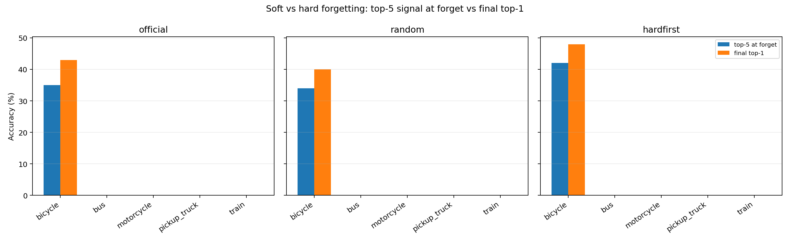
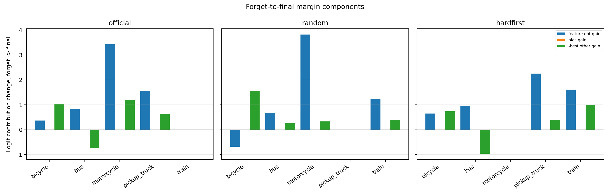
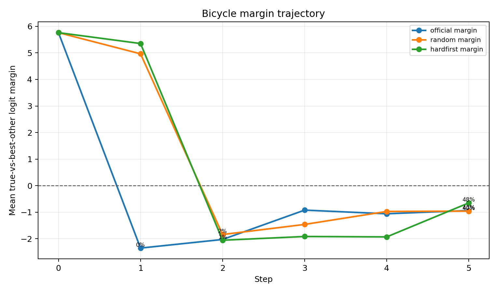
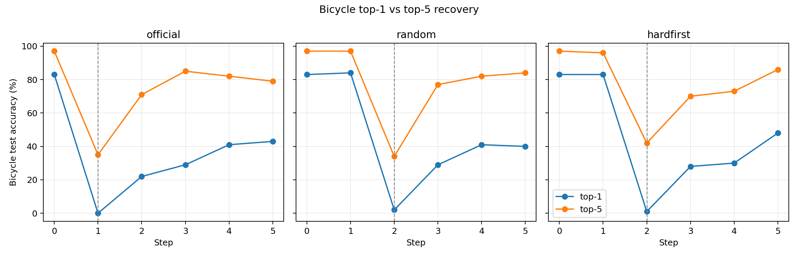
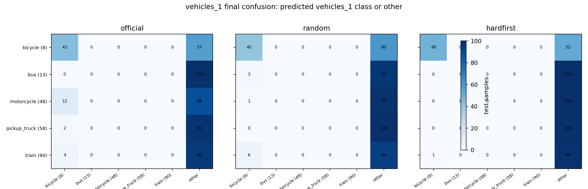
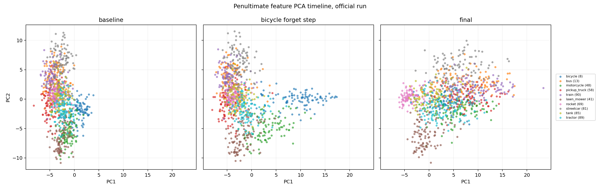
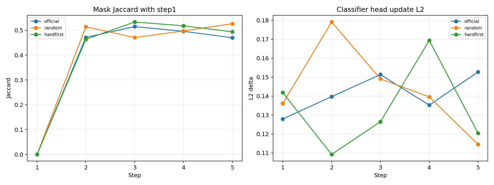
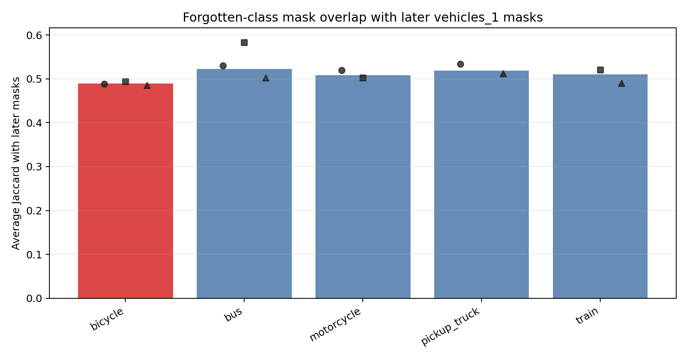

# 6_6 CIFAR-100 vehicles_1 / bicycle Rebound 成因分析

## 分析設定

- 使用 namespace：`sequential_single_coarse_rebound_cifar100`。
- 不重新跑 unlearning，只讀取已完成的 `vehicles_1` 三條 runs 的 checkpoints。
- 準確率、logit、prediction tracking 都使用 CIFAR-100 test split。
- 分析 checkpoints：每條 run 的 step0 baseline + step1-step5，共 `18` 個模型狀態。
- per-sample rows：`9000`，預期 `9000`；每條 run、每一步、vehicles_1 五類各 100 張 test images。
- mask overlap 使用 unlearn 實際預設 ratio：`with_0.5.pt`。

## Evidence Summary

目前證據比較支持：`bicycle / 腳踏車 (8)` 的 rebound 不是評估資料錯置，也不是 immediate forgetting lag，而是後續 sequential unlearning 調整 shared vehicle representation 或 classifier boundary 時，讓 bicycle 的 logit margin 局部回升。這仍是 evidence-supported hypothesis，還不是完全因果證明。

**快速結論：**最有說服力的數字是：`bicycle` 被忘當下 top-1 只有 `0/2/1%`，但 top-5 仍有 `35/34/42%`；其他 vehicles_1 類別被忘後 top-5 大多是 `0%`。所以 bicycle 不是沒有被忘，而是被軟性壓低，後續更新較容易把它拉回 top-1。

| Hypothesis | 判斷 | 主要證據 |
| --- | --- | --- |
| 評估假象 | 不支持 | evaluation script 使用 CIFAR-100 `train=False` test split；per-sample tracking 直接追蹤同一批 test images。 |
| forgetting lag | 不支持 | bicycle 在被忘記當步 top-1 accuracy 已降到 0% 到 2%，後續才回升。 |
| 少數樣本偶然翻正 | 部分不支持 | recovery 是數十張 test samples，而不是 1-2 張；需看 recovery table。 |
| decision boundary 回漂 | 支持 | bicycle mean margin 在 forget step 後往 final 方向回升，且 final top-1 accuracy 回到 40% 以上。 |
| shared vehicle features | 支持 | feature PCA / centroid 顯示 bicycle 仍和交通工具 representation 同區域；top-5 recovery 若高於 top-1，表示 representation 未完全消失。 |
| mask/update interference | 待驗證但合理 | 後續 step masks 與 classifier/head update 仍會改寫共享參數；mask overlap 和 delta table 提供初步證據。 |

## 為什麼 bicycle 被影響最多

現有數據顯示，`bicycle (8)` 和其他 vehicles_1 類別最大的差異不是 exposure，而是忘記後的殘餘訊號強度。`bicycle` 在 forget step 的 top-1 幾乎歸零，但 top-5 仍有 `34%~42%`；相反地，多數其他車輛類別一旦被忘，top-1 和 top-5 都接近 `0%`。這代表 bicycle 比較像 `soft-forgotten`：分類邊界暫時被壓下去，但 representation 或候選 ranking 沒有完全消失。



| 順序 | Class | Forget step | Later steps | Type | Forget top-1 | Forget top-5 | Forget mean margin | Forget median margin | Final top-1 | Final top-5 | Margin gain |
| --- | --- | --- | --- | --- | --- | --- | --- | --- | --- | --- | --- |
| 官方順序 | 腳踏車 / bicycle (8) | 1 | 4 | soft-forgotten | 0.0% | 35.0% | -2.35 | -2.05 | 43.0% | 79.0% | 1.42 |
| 官方順序 | 公車 / bus (13) | 2 | 3 | hard-forgotten | 0.0% | 0.0% | -6.86 | -6.82 | 0.0% | 0.0% | 0.12 |
| 官方順序 | 摩托車 / motorcycle (48) | 3 | 2 | hard-forgotten | 0.0% | 0.0% | -9.32 | -9.25 | 0.0% | 3.0% | 4.62 |
| 官方順序 | 皮卡車 / pickup_truck (58) | 4 | 1 | hard-forgotten | 0.0% | 0.0% | -7.90 | -7.94 | 0.0% | 0.0% | 2.17 |
| 官方順序 | 火車 / train (90) | 5 | 0 | hard-forgotten | 0.0% | 0.0% | -8.14 | -7.87 | 0.0% | 0.0% | 0.00 |
| 隨機順序 | 腳踏車 / bicycle (8) | 2 | 3 | soft-forgotten | 2.0% | 34.0% | -1.84 | -1.63 | 40.0% | 84.0% | 0.88 |
| 隨機順序 | 公車 / bus (13) | 4 | 1 | hard-forgotten | 0.0% | 0.0% | -8.18 | -8.24 | 0.0% | 0.0% | 0.93 |
| 隨機順序 | 摩托車 / motorcycle (48) | 1 | 4 | hard-forgotten | 0.0% | 0.0% | -8.56 | -8.42 | 0.0% | 2.0% | 4.15 |
| 隨機順序 | 皮卡車 / pickup_truck (58) | 5 | 0 | hard-forgotten | 0.0% | 0.0% | -7.91 | -7.99 | 0.0% | 0.0% | 0.00 |
| 隨機順序 | 火車 / train (90) | 3 | 2 | hard-forgotten | 0.0% | 0.0% | -6.65 | -6.63 | 0.0% | 1.0% | 1.63 |
| 困難優先 | 腳踏車 / bicycle (8) | 2 | 3 | soft-forgotten | 1.0% | 42.0% | -2.05 | -1.66 | 48.0% | 86.0% | 1.40 |
| 困難優先 | 公車 / bus (13) | 1 | 4 | hard-forgotten | 0.0% | 0.0% | -6.60 | -6.26 | 0.0% | 1.0% | -0.00 |
| 困難優先 | 摩托車 / motorcycle (48) | 5 | 0 | hard-forgotten | 0.0% | 0.0% | -7.57 | -7.51 | 0.0% | 0.0% | 0.00 |
| 困難優先 | 皮卡車 / pickup_truck (58) | 3 | 2 | hard-forgotten | 0.0% | 0.0% | -8.44 | -8.66 | 0.0% | 0.0% | 2.66 |
| 困難優先 | 火車 / train (90) | 4 | 1 | hard-forgotten | 0.0% | 0.0% | -8.67 | -8.35 | 0.0% | 0.0% | 2.59 |

**數據說明：**`Forget top-5` 表示該類別被忘當下是否仍在模型前 5 名候選內；`Margin gain` 表示從 forget step 到 final，true label 相對最佳競爭類別的 logit 是否變好。

**結論：**`bicycle` 三次 forget step 都是 soft-forgotten：top-1 `0/2/1%`，top-5 `35/34/42%`，final top-1 回到 `43/40/48%`。相反地，`bus` 在 hardfirst step1、`motorcycle` 在 random step1 被忘時 top-5 都是 `0%`，final top-1 仍是 `0%`；因此 rebound 的關鍵不是早忘，而是 forget 後是否還保留 top-k 訊號。

### Recovered vs non-recovered bicycle samples

| 順序 | Group | Samples | Top-5 contains bicycle at forget | Mean top-5 rank at forget | Mean margin at forget | Mean margin gain | Top wrong preds at forget |
| --- | --- | --- | --- | --- | --- | --- | --- |
| 官方順序 | recovered | 43 | 53.5% | 4.30 | -1.64 | 2.71 | apple (0): 14, bear (3): 9, beaver (4): 5 |
| 官方順序 | not recovered | 57 | 21.1% | 4.58 | -2.88 | 0.43 | beaver (4): 11, bed (5): 7, apple (0): 7 |
| 隨機順序 | recovered | 39 | 35.9% | 3.43 | -1.19 | 2.38 | bed (5): 23, bottle (9): 6, beaver (4): 4 |
| 隨機順序 | not recovered | 59 | 30.5% | 4.17 | -2.34 | -0.02 | bed (5): 19, baby (2): 7, bottle (9): 7 |
| 困難優先 | recovered | 47 | 59.6% | 3.82 | -1.20 | 1.82 | bed (5): 15, apple (0): 8, bottle (9): 8 |
| 困難優先 | not recovered | 52 | 25.0% | 4.54 | -2.88 | 1.05 | bed (5): 13, baby (2): 6, lobster (45): 4 |

**數據說明：**`recovered` 是 forget step 判錯、final 又判回 bicycle 的 test images；`Top-5 contains bicycle at forget` 越高，代表忘記當下仍保留 bicycle 候選訊號。

**結論：**bicycle rebound 是一批樣本整體跨回 decision boundary：三條 run 有 `43/39/47` 張 recovered samples。recovered samples 在 forget step 的平均 margin 是 `-1.64/-1.19/-1.20`，比未 recovery 的 `-2.88/-2.34/-2.88` 更接近 0，所以它們本來就比較容易被後續更新拉回。

### Logit decomposition：margin 回升從哪裡來



| 順序 | Class | Forget step | True-logit gain | Feature-dot gain | Bias gain | Best-other logit gain | Margin gain | Final acc |
| --- | --- | --- | --- | --- | --- | --- | --- | --- |
| 官方順序 | 腳踏車 / bicycle (8) | 1 | 0.38 | 0.37 | 0.01 | -1.03 | 1.42 | 43.0% |
| 官方順序 | 公車 / bus (13) | 2 | 0.84 | 0.84 | 0.00 | 0.73 | 0.12 | 0.0% |
| 官方順序 | 摩托車 / motorcycle (48) | 3 | 3.43 | 3.43 | 0.00 | -1.20 | 4.62 | 0.0% |
| 官方順序 | 皮卡車 / pickup_truck (58) | 4 | 1.55 | 1.55 | 0.00 | -0.62 | 2.17 | 0.0% |
| 官方順序 | 火車 / train (90) | 5 | 0.00 | 0.00 | 0.00 | 0.00 | 0.00 | 0.0% |
| 隨機順序 | 腳踏車 / bicycle (8) | 2 | -0.68 | -0.68 | 0.00 | -1.56 | 0.88 | 40.0% |
| 隨機順序 | 公車 / bus (13) | 4 | 0.67 | 0.67 | 0.00 | -0.26 | 0.93 | 0.0% |
| 隨機順序 | 摩托車 / motorcycle (48) | 1 | 3.82 | 3.82 | 0.00 | -0.33 | 4.15 | 0.0% |
| 隨機順序 | 皮卡車 / pickup_truck (58) | 5 | 0.00 | 0.00 | 0.00 | 0.00 | 0.00 | 0.0% |
| 隨機順序 | 火車 / train (90) | 3 | 1.24 | 1.24 | 0.00 | -0.39 | 1.63 | 0.0% |
| 困難優先 | 腳踏車 / bicycle (8) | 2 | 0.66 | 0.65 | 0.01 | -0.74 | 1.40 | 48.0% |
| 困難優先 | 公車 / bus (13) | 1 | 0.96 | 0.96 | 0.00 | 0.96 | -0.00 | 0.0% |
| 困難優先 | 摩托車 / motorcycle (48) | 5 | 0.00 | 0.00 | 0.00 | 0.00 | 0.00 | 0.0% |
| 困難優先 | 皮卡車 / pickup_truck (58) | 3 | 2.25 | 2.25 | 0.00 | -0.41 | 2.66 | 0.0% |
| 困難優先 | 火車 / train (90) | 4 | 1.61 | 1.61 | 0.00 | -0.98 | 2.59 | 0.0% |

**數據說明：**`margin gain = true-logit gain - best-other-logit gain`；`feature-dot gain` 代表 feature 與該 class head 的內積變化，越大表示 representation 對該 class 更有利。

**結論：**其他車輛類別不是完全沒有被後續更新影響，而是被壓得太深。例如 `motorcycle` 在 official 的 margin gain 有 `+4.62`，但 forget mean margin 從 `-9.32` 只回到約 `-4.69`，final acc 仍是 `0%`；bicycle 的 forget mean margin 只有 `-2.35/-1.84/-2.05`，回升 `+1.42/+0.88/+1.40` 就足以讓 final acc 到 `43/40/48%`。

### Classifier head weight comparison

| 順序 | Class | Forget step | Final cosine with bicycle weight | Weight delta forget->final | Weight delta baseline->final | Bias delta forget->final |
| --- | --- | --- | --- | --- | --- | --- |
| 官方順序 | 腳踏車 / bicycle (8) | 1 | 1.000 | 0.086 | 0.115 | 0.009 |
| 官方順序 | 公車 / bus (13) | 2 | 0.003 | 0.000 | 0.116 | 0.000 |
| 官方順序 | 摩托車 / motorcycle (48) | 3 | 0.246 | 0.000 | 0.102 | 0.000 |
| 官方順序 | 皮卡車 / pickup_truck (58) | 4 | -0.007 | 0.000 | 0.087 | 0.000 |
| 官方順序 | 火車 / train (90) | 5 | 0.009 | 0.000 | 0.129 | 0.000 |
| 隨機順序 | 腳踏車 / bicycle (8) | 2 | 1.000 | 0.039 | 0.104 | 0.003 |
| 隨機順序 | 公車 / bus (13) | 4 | 0.000 | 0.000 | 0.111 | 0.000 |
| 隨機順序 | 摩托車 / motorcycle (48) | 1 | 0.256 | 0.000 | 0.109 | 0.000 |
| 隨機順序 | 皮卡車 / pickup_truck (58) | 5 | -0.004 | 0.000 | 0.079 | 0.000 |
| 隨機順序 | 火車 / train (90) | 3 | 0.003 | 0.000 | 0.137 | 0.000 |
| 困難優先 | 腳踏車 / bicycle (8) | 2 | 1.000 | 0.048 | 0.095 | 0.007 |
| 困難優先 | 公車 / bus (13) | 1 | 0.004 | 0.000 | 0.122 | 0.000 |
| 困難優先 | 摩托車 / motorcycle (48) | 5 | 0.257 | 0.000 | 0.094 | 0.000 |
| 困難優先 | 皮卡車 / pickup_truck (58) | 3 | -0.012 | 0.000 | 0.100 | 0.000 |
| 困難優先 | 火車 / train (90) | 4 | 0.009 | 0.000 | 0.130 | 0.000 |

**數據說明：**`Weight delta forget->final` 看該 class classifier head 從被忘當下到 final 是否被大幅改動；`Cosine with bicycle weight` 看其他 vehicle head 是否和 bicycle head 方向相近。

**結論：**bicycle rebound 不像是單純 classifier head 把 bicycle 權重改回來；bicycle 的 `weight delta forget->final` 只有 `0.086/0.039/0.048`，但 final top-5 卻回到 `79/84/86%`。這比較支持 shared feature 或整體 boundary drift，而不是 bicycle head 大幅改回。

## Per-Sample Recovery

| 順序 | Bicycle forget step | Forget wrong -> final correct | Forget correct -> final correct | Recovered mean margin gain | Recovered mean true-logit gain |
| --- | --- | --- | --- | --- | --- |
| 官方順序 | 1 | 43 | 0 | 2.71 | 0.65 |
| 隨機順序 | 2 | 39 | 1 | 2.38 | -0.73 |
| 困難優先 | 2 | 47 | 1 | 1.82 | 0.64 |

**數據說明：**這張表只看 bicycle test images，統計同一張圖片是否從 forget step 的錯誤預測，變成 final 的正確預測。

**結論：**三條 run 分別有 `43/39/47` 張 bicycle 圖片從錯誤變正確，占 100 張 bicycle test images 的 `39%~47%`。這是穩定的 sample group recovery，不是 1-2 張圖片造成的統計雜訊。

## Bicycle Logit / Top-k Trajectory





| 順序 | Step | Top-1 acc | Top-5 acc | Mean margin | Mean true logit | Mean top1 confidence |
| --- | --- | --- | --- | --- | --- | --- |
| 官方順序 | 0 | 83.0% | 97.0% | 5.76 | 13.58 | 0.896 |
| 官方順序 | 1 | 0.0% | 35.0% | -2.35 | 4.30 | 0.350 |
| 官方順序 | 2 | 22.0% | 71.0% | -2.03 | 4.35 | 0.414 |
| 官方順序 | 3 | 29.0% | 85.0% | -0.92 | 5.87 | 0.315 |
| 官方順序 | 4 | 41.0% | 82.0% | -1.06 | 4.94 | 0.367 |
| 官方順序 | 5 | 43.0% | 79.0% | -0.94 | 4.68 | 0.394 |
| 隨機順序 | 0 | 83.0% | 97.0% | 5.76 | 13.58 | 0.896 |
| 隨機順序 | 1 | 84.0% | 97.0% | 4.96 | 10.95 | 0.857 |
| 隨機順序 | 2 | 2.0% | 34.0% | -1.84 | 5.57 | 0.315 |
| 隨機順序 | 3 | 29.0% | 77.0% | -1.46 | 4.71 | 0.346 |
| 隨機順序 | 4 | 41.0% | 82.0% | -0.97 | 5.06 | 0.371 |
| 隨機順序 | 5 | 40.0% | 84.0% | -0.96 | 4.89 | 0.409 |
| 困難優先 | 0 | 83.0% | 97.0% | 5.76 | 13.58 | 0.896 |
| 困難優先 | 1 | 83.0% | 96.0% | 5.35 | 12.82 | 0.888 |
| 困難優先 | 2 | 1.0% | 42.0% | -2.05 | 4.80 | 0.341 |
| 困難優先 | 3 | 28.0% | 70.0% | -1.91 | 4.38 | 0.423 |
| 困難優先 | 4 | 30.0% | 73.0% | -1.93 | 4.20 | 0.452 |
| 困難優先 | 5 | 48.0% | 86.0% | -0.65 | 5.46 | 0.323 |

**數據說明：**Top-1 是正式 accuracy；Top-5 代表 bicycle 是否仍在候選答案中。Mean margin 越接近 0，表示越接近重新變成 top-1。

**結論：**bicycle 被忘後仍保留候選訊號：forget step top-5 是 `35/34/42%`，後續最高回到 `85/84/86%`，final top-1 是 `43/40/48%`。這直接支持「bicycle 是 soft-forgotten，因此容易被後續更新拉回」的解釋。

## Confusion Matrix



| 順序 | Step | 階段 | Bicycle test images top predicted labels |
| --- | --- | --- | --- |
| 官方順序 | 1 | forget step | apple (0): 21, beaver (4): 16, bear (3): 16, bed (5): 10, baby (2): 9 |
| 官方順序 | 5 | final | bicycle (8): 43, baby (2): 5, spider (79): 5, table (84): 4, man (46): 4 |
| 隨機順序 | 2 | forget step | bed (5): 42, bottle (9): 13, beaver (4): 9, baby (2): 9, beetle (7): 4 |
| 隨機順序 | 5 | final | bicycle (8): 40, spider (79): 6, clock (22): 6, tractor (89): 4, snake (78): 4 |
| 困難優先 | 2 | forget step | bed (5): 28, apple (0): 12, baby (2): 12, bottle (9): 11, motorcycle (48): 7 |
| 困難優先 | 5 | final | bicycle (8): 48, bed (5): 13, baby (2): 6, bottle (9): 6, spider (79): 5 |

**數據說明：**這裡看 bicycle 圖片在 forget step 被錯分到哪裡，以及 final 是否回到 bicycle。

**結論：**final residual 幾乎全由 bicycle 貢獻：final 時 bicycle 正確 `43/40/48` 張，但 `bus/motorcycle/pickup_truck/train` final top-1 幾乎都是 `0` 張。這表示問題是 bicycle-specific，不是整個 vehicles_1 都忘失敗。

## Feature Centroid / PCA

這一節不是只看 final checkpoint，而是檢查 bicycle 的 penultimate feature representation 在 unlearning 前後是否真的被移走。三個時間點分別是：`baseline / step0`、`bicycle forget step`、`final / step5`。



- PCA explained variance ratio：PC1 `0.162`，PC2 `0.097`。
- PCA 圖先以 official run 顯示，因為 official 中 bicycle 是 step1，時間點最直觀。
- Centroid table 則列出三條 run 的 `baseline / bicycle forget step / final`。

| 順序 | Step | Nearest centroids to bicycle among vehicles_1 + vehicles_2 |
| --- | --- | --- |
| 官方順序 | baseline | motorcycle (48): 10.60, tractor (89): 11.66, tank (85): 12.54, train (90): 12.92, lawn_mower (41): 12.94 |
| 官方順序 | bicycle forget step | motorcycle (48): 11.69, tractor (89): 13.82, tank (85): 14.61, lawn_mower (41): 15.04, streetcar (81): 15.54 |
| 官方順序 | final | motorcycle (48): 4.86, pickup_truck (58): 6.51, bus (13): 6.94, train (90): 7.69, tractor (89): 8.35 |
| 隨機順序 | baseline | motorcycle (48): 10.60, tractor (89): 11.66, tank (85): 12.54, train (90): 12.92, lawn_mower (41): 12.94 |
| 隨機順序 | bicycle forget step | motorcycle (48): 3.52, tractor (89): 14.08, lawn_mower (41): 15.32, tank (85): 15.72, bus (13): 16.07 |
| 隨機順序 | final | train (90): 4.76, motorcycle (48): 5.27, bus (13): 7.10, tractor (89): 8.70, streetcar (81): 8.94 |
| 困難優先 | baseline | motorcycle (48): 10.60, tractor (89): 11.66, tank (85): 12.54, train (90): 12.92, lawn_mower (41): 12.94 |
| 困難優先 | bicycle forget step | bus (13): 10.09, motorcycle (48): 12.40, tractor (89): 13.45, streetcar (81): 14.08, pickup_truck (58): 14.23 |
| 困難優先 | final | pickup_truck (58): 5.00, train (90): 6.31, bus (13): 6.40, motorcycle (48): 7.58, tractor (89): 10.48 |

**數據說明：**PCA / centroid 使用 ResNet penultimate feature；centroid distance 越小，表示 feature 空間越接近。這裡只比較交通工具相關類別：vehicles_1 與 vehicles_2，不是 CIFAR-100 全部 100 類。

**結論：**不能只用 final PCA 說 bicycle 靠近其他車輛；要看 trajectory。`bicycle forget step` 時，最近 vehicle centroid 距離分別是 official `11.69`、random `3.52`、hardfirst `10.09`，final 則縮到 `4.86/4.76/5.00`。這表示 feature 空間確實受到後續 vehicle steps 影響，但是否「完全沒被移走」不能只靠 centroid 證明。比較穩健的解釋是：bicycle 被忘當下 top-1 已降到 `0~2%`，但 top-5 仍有 `34~42%`，代表它仍保留部分 vehicle / candidate signal；後續 boundary 或 shared representation drift 足以把這批 soft-forgotten samples 拉回 top-1。這比單純說「feature 被重新學回來」更符合目前 top-5、margin 與 centroid trajectory 的共同證據。

## Mask Overlap / Parameter Delta



| 順序 | Step | New class | Mask | Jaccard vs step1 | Jaccard vs previous | FC delta | Layer4 delta | Other backbone delta |
| --- | --- | --- | --- | --- | --- | --- | --- | --- |
| 官方順序 | 1 | 腳踏車 / bicycle (8) | yes | n/a | n/a | 0.128 | 1.416 | 0.746 |
| 官方順序 | 2 | 公車 / bus (13) | yes | 0.472 | 0.472 | 0.140 | 1.276 | 0.786 |
| 官方順序 | 3 | 摩托車 / motorcycle (48) | yes | 0.515 | 0.516 | 0.151 | 1.035 | 0.709 |
| 官方順序 | 4 | 皮卡車 / pickup_truck (58) | yes | 0.496 | 0.538 | 0.135 | 0.917 | 0.683 |
| 官方順序 | 5 | 火車 / train (90) | yes | 0.470 | 0.534 | 0.153 | 1.135 | 0.739 |
| 隨機順序 | 1 | 摩托車 / motorcycle (48) | yes | n/a | n/a | 0.136 | 1.329 | 0.738 |
| 隨機順序 | 2 | 腳踏車 / bicycle (8) | yes | 0.514 | 0.514 | 0.179 | 0.916 | 0.693 |
| 隨機順序 | 3 | 火車 / train (90) | yes | 0.471 | 0.459 | 0.149 | 1.502 | 0.768 |
| 隨機順序 | 4 | 公車 / bus (13) | yes | 0.498 | 0.518 | 0.140 | 0.964 | 0.701 |
| 隨機順序 | 5 | 皮卡車 / pickup_truck (58) | yes | 0.527 | 0.583 | 0.115 | 0.868 | 0.668 |
| 困難優先 | 1 | 公車 / bus (13) | yes | n/a | n/a | 0.142 | 1.311 | 0.743 |
| 困難優先 | 2 | 腳踏車 / bicycle (8) | yes | 0.464 | 0.464 | 0.109 | 1.274 | 0.765 |
| 困難優先 | 3 | 皮卡車 / pickup_truck (58) | yes | 0.534 | 0.478 | 0.127 | 1.141 | 0.723 |
| 困難優先 | 4 | 火車 / train (90) | yes | 0.518 | 0.515 | 0.169 | 1.184 | 0.736 |
| 困難優先 | 5 | 摩托車 / motorcycle (48) | yes | 0.494 | 0.491 | 0.120 | 0.950 | 0.700 |

**數據說明：**Jaccard 越高表示 mask 選到的參數區域越重疊；parameter delta 表示每一步 unlearning 對 classifier head / backbone 的改動幅度。

**結論：**後續 steps 仍持續改動共享參數：每步 layer4 delta 約 `0.868~1.502`，FC delta 約 `0.109~0.179`，mask 與 step1 的 Jaccard 約 `0.464~0.534`。因此舊 forgotten class 即使沒有再進入訓練，也可能被共享參數更新間接推動。

### 固定 forgotten-class mask 的後續重疊比較

上表的 `Jaccard vs step1` 是每條 run 的 step1 mask 當基準；如果 step1 不是 bicycle，就不能直接回答 bicycle mask 是否特別容易和後續 masks 重疊。所以下表改成：每個 class 被忘記那一步的 mask，固定拿來和該 run 的後續 steps masks 比較。



| Class | Later mask pairs | Average later Jaccard | Max later Jaccard |
| --- | --- | --- | --- |
| 腳踏車 / bicycle (8) | 10 | 0.489 | 0.526 |
| 公車 / bus (13) | 8 | 0.523 | 0.583 |
| 摩托車 / motorcycle (48) | 6 | 0.508 | 0.538 |
| 皮卡車 / pickup_truck (58) | 3 | 0.519 | 0.534 |
| 火車 / train (90) | 3 | 0.510 | 0.522 |

| 順序 | Class | Forget step | Later step count | Later steps | Avg later Jaccard | Max later Jaccard |
| --- | --- | --- | --- | --- | --- | --- |
| 官方順序 | 腳踏車 / bicycle (8) | 1 | 4 | 2,3,4,5 | 0.488 | 0.515 |
| 官方順序 | 公車 / bus (13) | 2 | 3 | 3,4,5 | 0.530 | 0.552 |
| 官方順序 | 摩托車 / motorcycle (48) | 3 | 2 | 4,5 | 0.520 | 0.538 |
| 官方順序 | 皮卡車 / pickup_truck (58) | 4 | 1 | 5 | 0.534 | 0.534 |
| 官方順序 | 火車 / train (90) | 5 | 0 | none | n/a | n/a |
| 隨機順序 | 腳踏車 / bicycle (8) | 2 | 3 | 3,4,5 | 0.494 | 0.526 |
| 隨機順序 | 公車 / bus (13) | 4 | 1 | 5 | 0.583 | 0.583 |
| 隨機順序 | 摩托車 / motorcycle (48) | 1 | 4 | 2,3,4,5 | 0.502 | 0.527 |
| 隨機順序 | 皮卡車 / pickup_truck (58) | 5 | 0 | none | n/a | n/a |
| 隨機順序 | 火車 / train (90) | 3 | 2 | 4,5 | 0.520 | 0.522 |
| 困難優先 | 腳踏車 / bicycle (8) | 2 | 3 | 3,4,5 | 0.485 | 0.512 |
| 困難優先 | 公車 / bus (13) | 1 | 4 | 2,3,4,5 | 0.502 | 0.534 |
| 困難優先 | 摩托車 / motorcycle (48) | 5 | 0 | none | n/a | n/a |
| 困難優先 | 皮卡車 / pickup_truck (58) | 3 | 2 | 4,5 | 0.512 | 0.515 |
| 困難優先 | 火車 / train (90) | 4 | 1 | 5 | 0.491 | 0.491 |

**Bicycle mask vs every step mask：**

| 順序 | Bicycle forget step | Compare step | Compare class | Jaccard with bicycle mask | Coverage with bicycle mask |
| --- | --- | --- | --- | --- | --- |
| 官方順序 | 1 | 1 | 腳踏車 / bicycle (8) | 1.000 | 0.500 |
| 官方順序 | 1 | 2 | 公車 / bus (13) | 0.472 | 0.320 |
| 官方順序 | 1 | 3 | 摩托車 / motorcycle (48) | 0.515 | 0.340 |
| 官方順序 | 1 | 4 | 皮卡車 / pickup_truck (58) | 0.496 | 0.332 |
| 官方順序 | 1 | 5 | 火車 / train (90) | 0.470 | 0.320 |
| 隨機順序 | 2 | 1 | 摩托車 / motorcycle (48) | 0.514 | 0.340 |
| 隨機順序 | 2 | 2 | 腳踏車 / bicycle (8) | 1.000 | 0.500 |
| 隨機順序 | 2 | 3 | 火車 / train (90) | 0.459 | 0.314 |
| 隨機順序 | 2 | 4 | 公車 / bus (13) | 0.499 | 0.333 |
| 隨機順序 | 2 | 5 | 皮卡車 / pickup_truck (58) | 0.526 | 0.345 |
| 困難優先 | 2 | 1 | 公車 / bus (13) | 0.464 | 0.317 |
| 困難優先 | 2 | 2 | 腳踏車 / bicycle (8) | 1.000 | 0.500 |
| 困難優先 | 2 | 3 | 皮卡車 / pickup_truck (58) | 0.478 | 0.323 |
| 困難優先 | 2 | 4 | 火車 / train (90) | 0.467 | 0.318 |
| 困難優先 | 2 | 5 | 摩托車 / motorcycle (48) | 0.512 | 0.338 |

**數據說明：**這張 every-step 表固定使用每條 run 裡 bicycle 被忘當下的 mask 當基準，和同一條 run 的每個 step mask 比較。Coverage 定義為 `|A ∩ B| / |U|`，也就是兩個 mask 都選到的參數數量除以整個可選參數宇集；self row 的 Jaccard 是 `1.000`，Coverage 是 `0.500`，對應 mask ratio `0.5`。

**Bicycle mask vs later masks：**

| 順序 | Base class | Forget step | Later step | Later class | Jaccard |
| --- | --- | --- | --- | --- | --- |
| 官方順序 | 腳踏車 / bicycle (8) | 1 | 2 | 公車 / bus (13) | 0.472 |
| 官方順序 | 腳踏車 / bicycle (8) | 1 | 3 | 摩托車 / motorcycle (48) | 0.515 |
| 官方順序 | 腳踏車 / bicycle (8) | 1 | 4 | 皮卡車 / pickup_truck (58) | 0.496 |
| 官方順序 | 腳踏車 / bicycle (8) | 1 | 5 | 火車 / train (90) | 0.470 |
| 隨機順序 | 腳踏車 / bicycle (8) | 2 | 3 | 火車 / train (90) | 0.459 |
| 隨機順序 | 腳踏車 / bicycle (8) | 2 | 4 | 公車 / bus (13) | 0.499 |
| 隨機順序 | 腳踏車 / bicycle (8) | 2 | 5 | 皮卡車 / pickup_truck (58) | 0.526 |
| 困難優先 | 腳踏車 / bicycle (8) | 2 | 3 | 皮卡車 / pickup_truck (58) | 0.478 |
| 困難優先 | 腳踏車 / bicycle (8) | 2 | 4 | 火車 / train (90) | 0.467 |
| 困難優先 | 腳踏車 / bicycle (8) | 2 | 5 | 摩托車 / motorcycle (48) | 0.512 |

**數據說明：**這裡的每個 Jaccard 都是「某 class 被忘當下的 mask」和「後續某一步 unlearning mask」的重疊，不再依賴 step1 是否剛好是 bicycle。

**結論：**`bicycle` 的平均 later-mask Jaccard 是 `0.489`，其他類別平均是 `0.515`，其他類別最高平均是 `0.523`。bicycle 並沒有明顯高於其他 vehicles_1 類別，因此 mask overlap 目前只能當輔助證據；更主要的解釋仍是 bicycle 在 forget step 後保留較強 top-k signal 與 feature-space vehicle representation。

## 已驗證與尚未驗證的結論

目前可以用現有 3 條 `vehicles_1` runs 和 checkpoints 支持的結論如下：

| 命題 | 狀態 | 數據依據 |
| --- | --- | --- |
| bicycle 不是當步忘不掉，而是後續 rebound | 已驗證 | bicycle forget step top-1 為 `0/2/1%`，final 回到 `43/40/48%` |
| bicycle 是 soft-forgotten | 已驗證 | bicycle forget step top-5 為 `35/34/42%`，但 top-1 只有 `0/2/1%` |
| 其他 vehicles_1 類別多半是 hard-forgotten | 已驗證 | bus / motorcycle / pickup_truck / train 在 forget step 的 top-1 和 top-5 大多都是 `0%` |
| rebound 不是少數 1-2 張 test samples 造成 | 已驗證 | 三條 run 有 `43/39/47` 張 bicycle test images 從 forget step 錯誤變成 final 正確 |
| recovered bicycle samples 本來就比較靠近 decision boundary | 已驗證 | recovered samples forget-step margin 約 `-1.64/-1.19/-1.20`，non-recovered 約 `-2.88/-2.34/-2.88` |
| 「早忘」不是 rebound 的充分條件 | 已驗證 | random 的 motorcycle step1、hardfirst 的 bus step1 都沒有 rebound，final top-1 仍約 `0%` |
| bicycle mask 和後續 masks 特別重疊 | 不支持 | bicycle average later-mask Jaccard `0.489`，低於其他類別平均約 `0.515` |
| 後續 vehicle steps 會改變 feature / boundary 狀態 | 有證據支持 | bicycle 最近 vehicle centroid distance 在 final 約 `4.86/4.76/5.00`，且 top-5 / margin / recovery 同時回升 |
| rebound 是 vehicle-specific causal effect | 尚未驗證 | 需要 `bicycle_then_flowers` 和 `bicycle_then_vehicles2` 控制實驗 |
| bicycle 視覺特徵分散、class-specific cue 較弱是根本原因 | 尚未驗證 | 目前是合理解釋，但需要影像層級或 feature separability 進一步分析 |

**總結：**已驗證的是現象與直接機制：`bicycle` 被忘得比較淺，仍保留 top-5、margin 與 feature candidate signal，因此後續 boundary / representation drift 足以把它拉回 top-1。尚未完全驗證的是更深層的因果來源，例如為什麼 bicycle 比其他 vehicles_1 更 soft-forgotten，以及這個 drift 是否一定是 vehicle-specific。

## 控制實驗設計

已新增 launcher：`scripts/run_cifar100_bicycle_rebound_cause_controls.sh`。它預設 `DRY_RUN=1`，只檢查 order 和輸出 queue log，不會直接開跑 unlearning。若要正式執行，可用 `DRY_RUN=0 bash scripts/run_cifar100_bicycle_rebound_cause_controls.sh`。

| Run ID | Forget order | Purpose | Expected interpretation |
| --- | --- | --- | --- |
| bicycle_then_flowers_seed1_k5 | 8,54,62,70,82 | 先忘 bicycle，再忘非交通工具 flower classes | 若不 rebound，支持 vehicle-related steps 才會拉回 bicycle。 |
| bicycle_then_vehicles2_seed1_k5 | 8,41,69,81,89 | 先忘 bicycle，再忘 vehicles_2 | 若 rebound，支持交通工具 shared representation。 |
| motorcycle_then_vehicles_no_bicycle_seed1_k5 | 48,13,58,90,8 | 讓 motorcycle 早忘，bicycle 最後忘 | 若 motorcycle 仍不 rebound，表示早忘不是充分條件。 |
| pickup_then_vehicles_no_bicycle_seed1_k5 | 58,13,48,90,8 | 讓 pickup_truck 早忘，bicycle 最後忘 | 若 pickup 仍不 rebound，表示原本不是 exposure 不足。 |
| bicycle_stronger_then_vehicles1_seed1_k5 | 8,13,48,58,90 | bicycle 先忘，`UNLEARN_EPOCHS=20`，再忘 vehicles_1 | 若 forget-step top-5 下降且 final 不 rebound，支持「bicycle 被忘得太淺」是直接原因。 |

**結論：**現有數據已支持 soft-forgotten + shared representation 是最合理解釋：bicycle forget top-5 `35/34/42%`、recovered samples `43/39/47`、final top-1 `43/40/48%`。但是否真的是 vehicle-specific causal effect，仍需要 `bicycle_then_flowers` 和 `bicycle_then_vehicles2` 控制實驗確認。

控制實驗完成後，可用下列腳本彙整結果：

```bash
python scripts/generate_cifar100_bicycle_rebound_cause_probe_analysis.py
```

輸出：

```text
6_6_cifar100_bicycle_rebound_cause_probe_analysis.md
6_6_cifar100_bicycle_rebound_cause_probe_summary.csv
```

## 結論

1. 目前最合理的解釋是 decision boundary / shared representation rebound，而不是 test data 評估錯誤或當步忘不掉。
2. `bicycle (8)` 和其他 vehicles_1 類別的關鍵差異是 soft-forgotten pattern：forget step top-1 幾乎歸零，但 top-5 仍保留 34% 到 42%，其他車輛類別多半 top-1/top-5 都接近 0%。
3. 因為 bicycle 在 forget step 後仍保留候選 ranking 和較不極端的 negative margin，後續 boundary drift 比較容易把一批 test samples 推回 top-1；其他類別即使有 margin gain，也仍離 decision boundary 太遠。
4. exposure 不是充分原因：`bus` 與 `motorcycle` 都有早忘案例，但沒有 rebound；因此 bicycle 的特殊性更可能來自 suppression 強度、feature geometry 或 shared vehicle representation。
5. 下一步若要做 causal test，最小控制實驗是 `bicycle_then_flowers` 與 `bicycle_then_vehicles2`：前者若不 rebound、後者若 rebound，就能更直接支持 vehicle shared features 假說。
