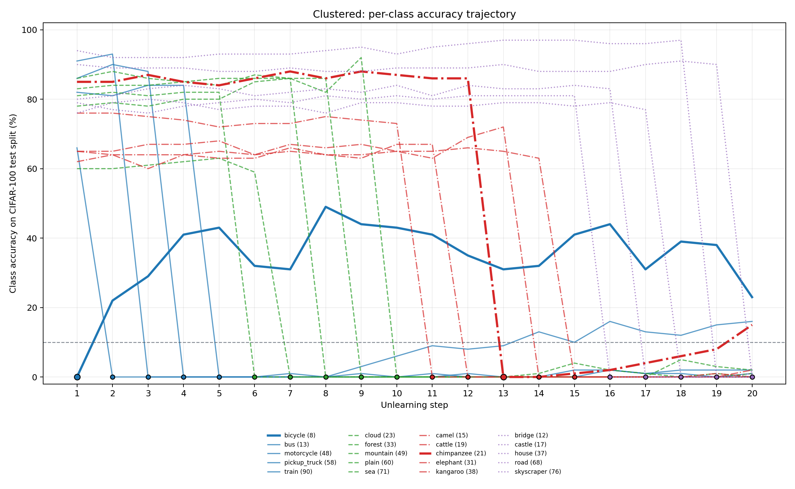
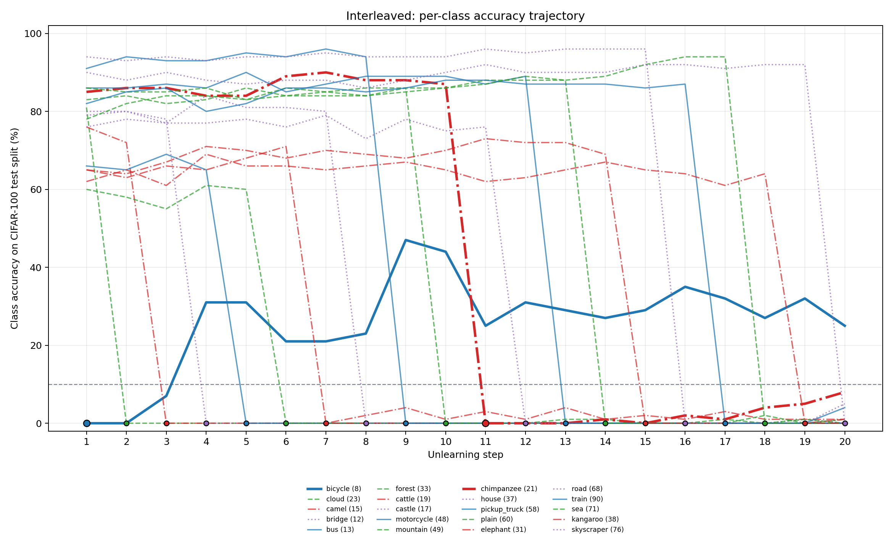
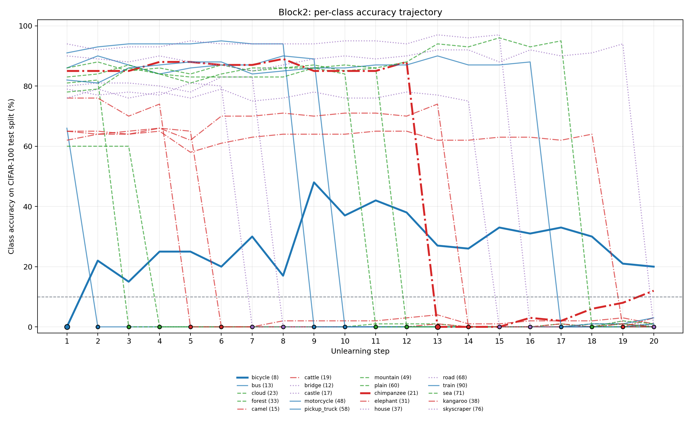

# 6_7 CIFAR-100 四大類 k20 No-Flowers Rebound Analysis

## 實驗設定

- Namespace：`sequential_four_coarse_no_flowers_cifar100_k20`
- Dataset：CIFAR-100 test split
- Seed：`1`
- Target：4 個 coarse superclasses，共 20 個 fine classes。
- 三條 order：`clustered`、`interleaved`、`block2`。
- Significant rebound：later accuracy `>= 10%`，且比 forget-step accuracy 高至少 `5pp`。

## Final metrics

| Order | Run ID | Progress | Eval CSVs | Final forget acc | Final UA | Final retain acc | Final full test acc | Bicycle final | Rebound rate |
| --- | --- | --- | --- | --- | --- | --- | --- | --- | --- |
| Clustered | four_coarse_clustered_seed1_k20 | success | 20 | 3.1% | 96.8% | 69.9% | 56.6% | 23.0% | 3/19 |
| Interleaved | four_coarse_interleaved_seed1_k20 | success | 20 | 2.2% | 97.8% | 69.7% | 56.2% | 25.0% | 1/19 |
| Block2 | four_coarse_block2_seed1_k20 | success | 20 | 2.1% | 97.9% | 69.8% | 56.2% | 20.0% | 2/19 |

小結：三條 run 完成狀態為 `3/3`；Clustered: forget 3.1%, UA 96.8%, retain 69.9%, full 56.6%, bicycle 23.0%；Interleaved: forget 2.2%, UA 97.8%, retain 69.7%, full 56.2%, bicycle 25.0%；Block2: forget 2.1%, UA 97.9%, retain 69.8%, full 56.2%, bicycle 20.0%

## 每 step / 每類別 accuracy 折線圖

每張圖是一條 order，20 條線對應 20 個 target classes；線上的黑框點標示該類別被忘的 step。藍色是 vehicles_1、綠色是大型自然場景、紅色是大型雜食/草食動物、紫色是大型人工戶外物；bicycle 與 chimpanzee 以較粗線條標示。

### Clustered

小結：Clustered final bicycle accuracy 為 `23.0%`；motorcycle `16.0%`、chimpanzee `15.0%`。大型自然場景 final 平均 `0.6%`，大型人工戶外物 final 平均 `0.2%`。 Significant rebound classes: bicycle (8), motorcycle (48), chimpanzee (21)。

### Interleaved

小結：Interleaved final bicycle accuracy 為 `25.0%`；motorcycle `4.0%`、chimpanzee `8.0%`。大型自然場景 final 平均 `0.2%`，大型人工戶外物 final 平均 `1.0%`。 Significant rebound classes: bicycle (8)。

### Block2

小結：Block2 final bicycle accuracy 為 `20.0%`；motorcycle `3.0%`、chimpanzee `12.0%`。大型自然場景 final 平均 `0.4%`，大型人工戶外物 final 平均 `0.0%`。 Significant rebound classes: bicycle (8), chimpanzee (21)。

## 順序影響分析

| Order | Final forget acc | Final UA | Vehicles_1 avg | Natural scenes avg | Large omni avg | Man-made avg | Bicycle final | Motorcycle final | Chimpanzee final | Rebound rate |
| --- | --- | --- | --- | --- | --- | --- | --- | --- | --- | --- |
| Clustered | 3.1% | 96.8% | 8.4% | 0.6% | 3.4% | 0.2% | 23.0% | 16.0% | 15.0% | 3/19 |
| Interleaved | 2.2% | 97.8% | 5.8% | 0.2% | 2.0% | 1.0% | 25.0% | 4.0% | 8.0% | 1/19 |
| Block2 | 2.1% | 97.9% | 4.8% | 0.4% | 3.2% | 0.0% | 20.0% | 3.0% | 12.0% | 2/19 |

- `clustered` 的 vehicles_1 final 平均最高，為 `8.4%`，高於 `interleaved` 的 `5.8%` 與 `block2` 的 `4.8%`；這表示同一 coarse group 連續遺忘時，車輛相關 residual/rebound 較明顯。
- `interleaved` 的整體 final forget acc 為 `2.2%`，低於 clustered 的 `3.1%`，但 bicycle final 反而最高：`25.0%`。也就是說，交錯順序能壓低整體 target 平均，但無法消除 bicycle residual。
- `block2` 的 final forget acc 最低，為 `2.1%`，UA 最高為 `97.9%`；它在整體 forgetting 上最好，但 bicycle final 仍有 `20.0%`。
- `motorcycle (48)` 對順序較敏感：clustered final `16.0%`，但 interleaved/block2 只剩 `4.0%` / `3.0%`。這和 bicycle 不同，bicycle 在三種順序都維持 `23.0%` / `25.0%` / `20.0%`。
- `chimpanzee (21)` 也受順序影響：clustered `15.0%`、interleaved `8.0%`、block2 `12.0%`；它不像 bicycle 三條都超過 20%，但在 clustered/block2 有超過 10% residual。
- 結論：順序會改變 residual/rebound 的強度與集中位置，但不是 bicycle rebound 的唯一原因；bicycle 在三種順序都殘留，代表它比其他 target class 更穩定地抗拒完全遺忘。

## 詳細總結分析

| Order | Bicycle final | Motorcycle final | Chimpanzee final | Natural scenes final avg | Man-made outdoor final avg | Significant rebound classes |
| --- | --- | --- | --- | --- | --- | --- |
| Clustered | 23.0% | 16.0% | 15.0% | 0.6% | 0.2% | bicycle (8), motorcycle (48), chimpanzee (21) |
| Interleaved | 25.0% | 4.0% | 8.0% | 0.2% | 1.0% | bicycle (8) |
| Block2 | 20.0% | 3.0% | 12.0% | 0.4% | 0.0% | bicycle (8), chimpanzee (21) |

- `bicycle (8)` final accuracy 範圍為 `20.0%` 到 `25.0%`，三條 order 都高於 10% residual 門檻；這表示 bicycle residual / rebound 不只出現在 single-coarse vehicles_1，也延伸到 mixed 20-class sequential unlearning。
- `bicycle (8)` 是三條 order 中最穩定的 residual case：final 分別為 `23.0% / 25.0% / 20.0%`，而且三條都超過 10% residual 門檻。
- `motorcycle (48)` 只在 clustered 最後明顯殘留到 `16.0%`，interleaved 和 block2 final 只有 `4.0% / 3.0%`；這表示車輛類別的 rebound 不完全平均，bicycle 更穩定。
- `chimpanzee (21)` 在 clustered / block2 分別 final `15.0% / 12.0%`，interleaved 為 `8.0%`；它有部分 rebound，但穩定性低於 bicycle。
- 大型自然場景 final 平均為 `0.4%`，大型人工戶外物 final 平均為 `0.4%`；`bridge (12)` 與 `road (68)` 在三條 final eval 都是 `0.0%`，比 bicycle 更容易被壓低。
- 從折線圖看，自然場景與人工戶外物多數類別在被忘後貼近 0%，沒有像 bicycle 一樣長時間回升；因此目前最合理的解讀是：rebound 主要集中在少數類別，而不是所有 coarse group 的普遍現象。
- 本報告保留 final metrics 與三張 step/class 折線圖；完整逐類數字可看同名 `wide`、`long`、`target_trajectory` CSV。

## Notes

- Accuracy 來自 CIFAR-100 test split；每個 fine class 有 100 張 test images，所以 1% 約等於 1 張圖。
- 本分析固定 `seed=1`，結論應視為機制探索，不主張跨 seed 普遍性。