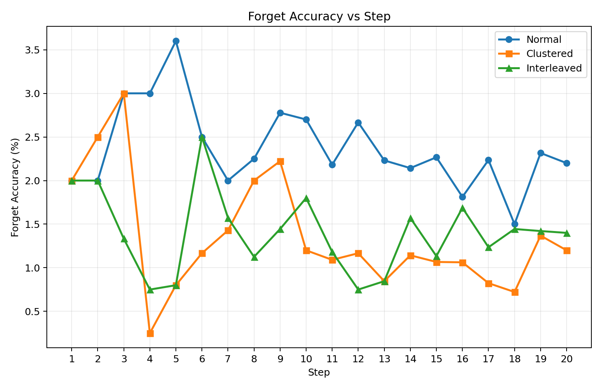
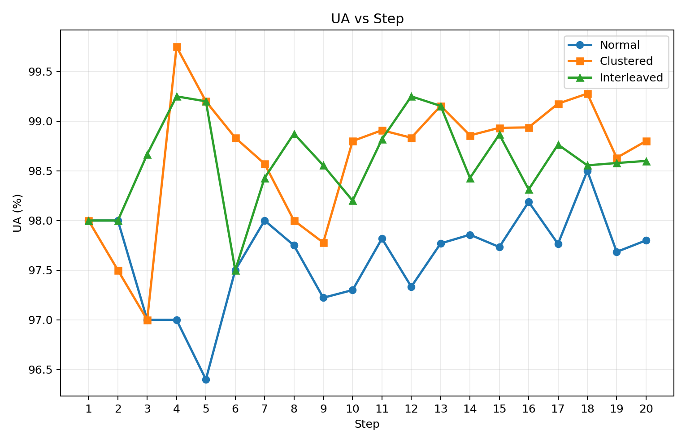
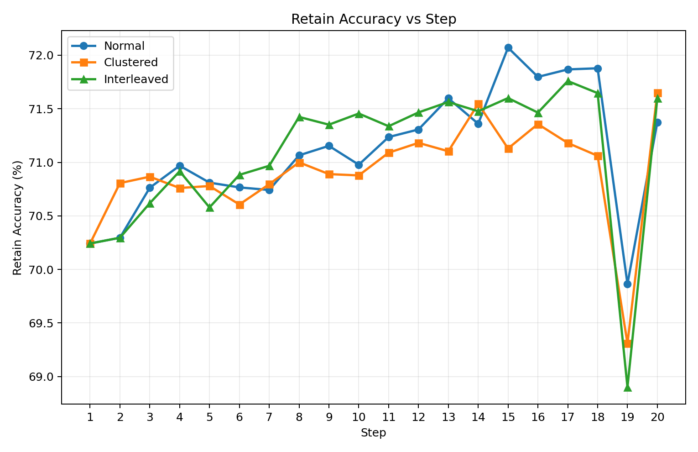
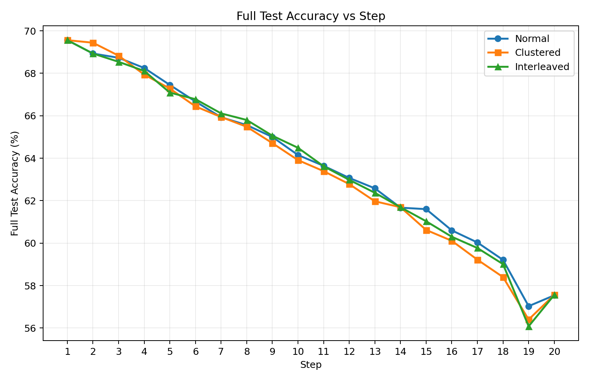
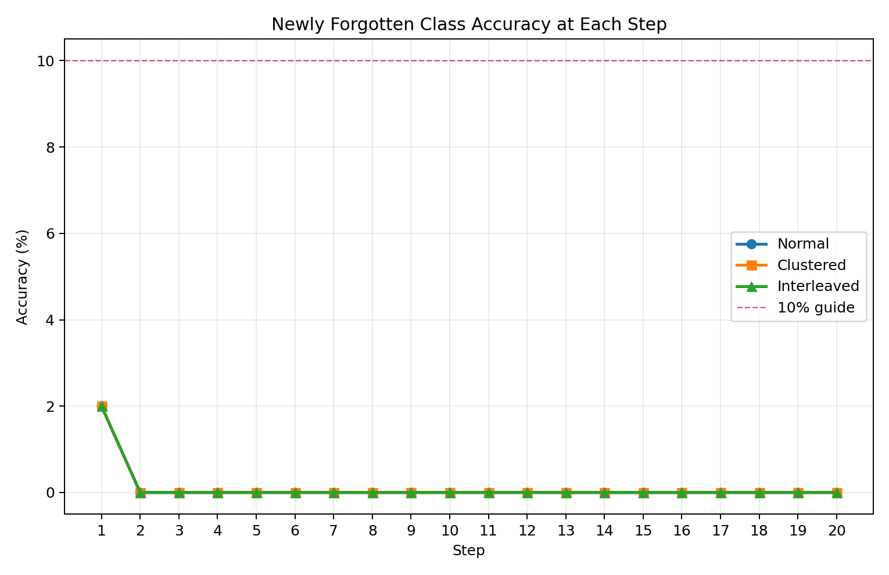
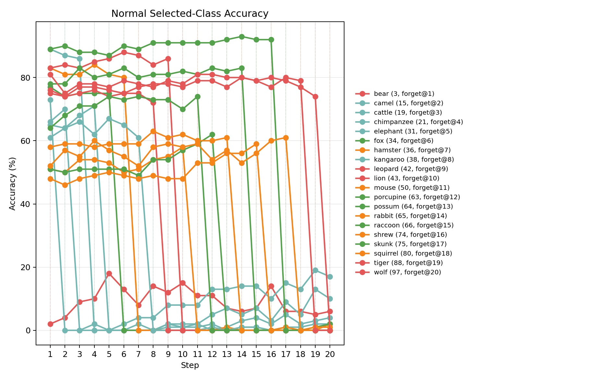
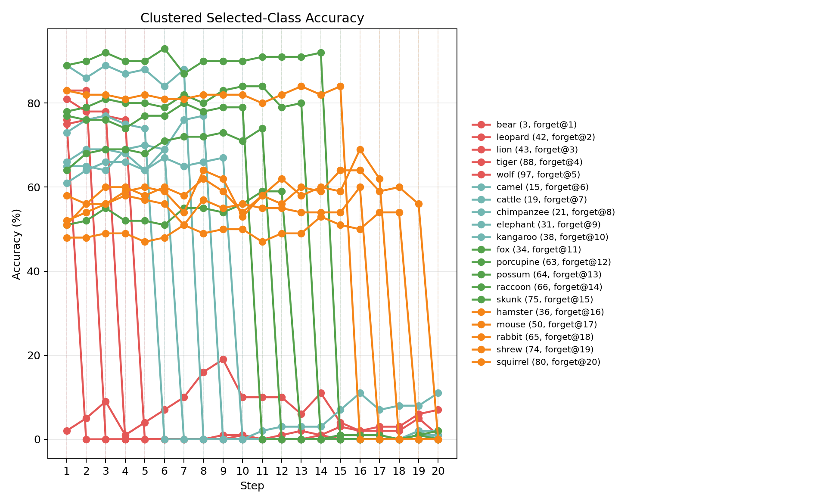
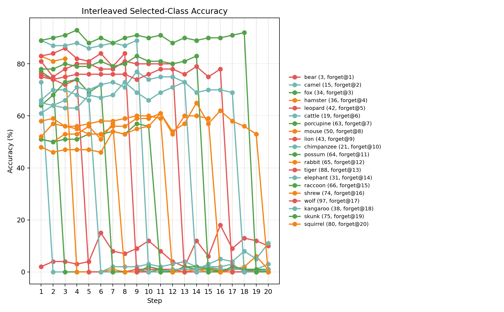
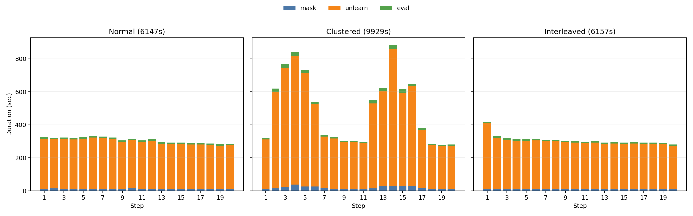

# CIFAR-100 Sequential Incremental Ordered Pilot Analysis

## 1. Experiment Summary

This report analyzes the CIFAR-100 `sequential_incremental_ordered_cifar100_pilot` line under the correct incremental data flow:

- each step only trains on the newly forgotten class
- older forgotten classes are permanently excluded from future train loaders
- cumulative forgotten classes are only used in evaluation
- failure is defined as newly forgotten class accuracy remaining above `10%` at the same step

The pilot uses a fixed 20-class high-confusion animal subset and compares three orders:

- `Normal`
- `Clustered`
- `Interleaved`

## 2. Smoke Summary

| Order | Run ID | Status |
| --- | --- | --- |
| Normal | smoke_incremental_cifar100_normal_seed1_k2 | success |
| Clustered | smoke_incremental_cifar100_clustered_animals_seed1_k2 | success |
| Interleaved | smoke_incremental_cifar100_interleaved_animals_seed1_k2 | success |

## 3. Final Metrics

| Order | Forget acc | UA | Retain acc | Full test acc | Runtime (s) |
| --- | --- | --- | --- | --- | --- |
| Normal | 2.20 | 97.80 | 71.38 | 57.54 | 6147 |
| Clustered | 1.20 | 98.80 | 71.65 | 57.56 | 9929 |
| Interleaved | 1.40 | 98.60 | 71.60 | 57.56 | 6157 |

## 4. Lag Summary

| Order | Lag steps (>10%) | Worst newly forgotten acc |
| --- | --- | --- |
| Normal | 0 | 2.0 |
| Clustered | 0 | 2.0 |
| Interleaved | 0 | 2.0 |

## 5. Selected-Class Trajectories

## 6. Runtime

## 7. Top Lag Steps

### Normal top lag steps

| Step | Class | Group | Accuracy | >10% |
| --- | --- | --- | --- | --- |
| 1 | bear (3) | large_carnivores | 2.0 | no |
| 2 | camel (15) | large_omnivores_and_herbivores | 0.0 | no |
| 3 | cattle (19) | large_omnivores_and_herbivores | 0.0 | no |
| 4 | chimpanzee (21) | large_omnivores_and_herbivores | 0.0 | no |
| 5 | elephant (31) | large_omnivores_and_herbivores | 0.0 | no |
### Clustered top lag steps

| Step | Class | Group | Accuracy | >10% |
| --- | --- | --- | --- | --- |
| 1 | bear (3) | large_carnivores | 2.0 | no |
| 2 | leopard (42) | large_carnivores | 0.0 | no |
| 3 | lion (43) | large_carnivores | 0.0 | no |
| 4 | tiger (88) | large_carnivores | 0.0 | no |
| 5 | wolf (97) | large_carnivores | 0.0 | no |
### Interleaved top lag steps

| Step | Class | Group | Accuracy | >10% |
| --- | --- | --- | --- | --- |
| 1 | bear (3) | large_carnivores | 2.0 | no |
| 2 | camel (15) | large_omnivores_and_herbivores | 0.0 | no |
| 3 | fox (34) | medium_mammals | 0.0 | no |
| 4 | hamster (36) | small_mammals | 0.0 | no |
| 5 | leopard (42) | large_carnivores | 0.0 | no |
