# CIFAR-100 Sequential Incremental Ordered Pilot 詳細分析報告

## 0. 大綱

1. Executive summary：先給結論，這次沒有 immediate forgetting lag，但有少數 final residual / rebound。
2. Experiment setup：說明 CIFAR-100、ResNet-18、seed 1、20-class animal pilot 與正確 incremental data flow。
3. Baseline comparison：比較 CIFAR-10 與 CIFAR-100 baseline accuracy，說明為什麼 CIFAR-100 更適合 failure hunting。
4. Ordered comparison：比較 Normal、Clustered、Interleaved 三種順序設計。
5. Aggregate metrics：用 final metrics 和 step-wise curves 檢查整體 forgetting / retain tradeoff。
6. Immediate lag analysis：用 newly forgotten class 當步 accuracy 判斷是否有當步遺忘失效。
7. Residual / rebound analysis：檢查 old forgotten classes 後續是否回升，重點分析 class 21。
8. Class-wise trajectories：看 20 個 pilot classes 的逐類變化。
9. Group-wise trajectories：看 4 個 semantic groups 的平均變化。
10. Retain-class impact analysis：和 CIFAR-100 baseline 比較，分析 unlearning 是否影響其他 80 類原本準確率。
11. Runtime and smoke gate：確認 smoke-first queue 成功與 runtime 成本。
12. Additional tables：補充 top rebound / per-class 表格。
13. Conclusion：整理本次 CIFAR-100 pilot 對後續實驗設計的意義。

## 1. Executive Summary

本次 CIFAR-100 ordered pilot 的主要結論是：**沒有觀察到 immediate forgetting lag 型遺忘失效，但觀察到少數 old forgotten class 的 final residual / rebound 訊號**。

若採用原先定義的 failure 標準，也就是 newly forgotten class 在當步 accuracy `>10%`，三條 order 都沒有 failure。`Normal / Clustered / Interleaved` 的 lag steps 都是 `0`，worst newly forgotten class accuracy 都只有 `2.0%`。這表示當某個 class 被指定 forget 的那一步，SalUn / RL unlearning 幾乎都能立即把該 class 壓到接近 0。

但若用更嚴格的 final per-class 檢查，`class 21` 在三條 order 最後仍高於或接近 `10%`：`Normal=17.0%`、`Clustered=11.0%`、`Interleaved=11.0%`。因此本次真正看到的不是「當步忘不掉」，而是「已忘 class 在後續 sequential steps 中被 shared representation / decision boundary 漂移帶回一點」的 rebound / residual 現象。

同時，若把三條 order 的 final checkpoint 和 CIFAR-100 original baseline 做 per-class 對照，80 個未被指定 forget 的 retain classes 沒有出現整體崩壞：平均 final retain accuracy 比 baseline 約高 `+0.58 ~ +0.85` 個百分點。不過逐類檢查仍看到少數 transient interference：部分 retain classes 在 20-step 過程中的最低 accuracy 曾比 baseline 低超過 `10pp`，但 final 多數會恢復。因此 retain-side 風險比較像「局部、短暫、class-specific 的震盪」，不是全面 accuracy collapse。

## 2. Experiment Setup

本次實驗使用 `CIFAR-100 / ResNet-18 / seed 1`，以 20 個 animal fine classes 作為 pilot subset。選擇 CIFAR-100 的原因是 fine-grained classes 較多，動物類別之間也更容易共享特徵，因此比 CIFAR-10 更容易放大 sequential unlearning 中的邊界漂移或 class rebound。

CIFAR-100 和 CIFAR-10 最大的差異不是影像大小，而是 label granularity。兩者都是 `32x32` 彩色影像，但 CIFAR-10 只有 10 個 broad classes，CIFAR-100 則有 100 個 fine classes，且官方同時提供 20 個 coarse superclasses。這代表 CIFAR-100 的單一 fine class 每類測試樣本較少、類別邊界較細，也更常出現「不同 fine classes 共享局部外觀或語義特徵」的情況。對 unlearning 來說，這會讓 class-wise forgetting 更有挑戰，因為模型可能不是只用單一 class-specific neuron 記住某個類別，而是把多個相近類別放在共享 backbone representation 裡一起判別。

本次 20-class pilot 刻意選擇 animal-heavy subset，而不是平均抽樣 CIFAR-100。這樣設計的用意是提高類別間共享特徵的比例，例如毛色、身形、臉部輪廓、四足姿態、自然背景等。若 sequential unlearning 會出現 failure，這種高混淆 subset 比隨機 class subset 更容易暴露「當步忘不乾淨」或「舊 class 後續回升」。

Pilot subset 依語義群整理如下，括號中的數字是 CIFAR-100 fine-class id：

| Group | Fine classes |
| --- | --- |
| large carnivores | bear / 熊 (3), leopard / 豹 (42), lion / 獅子 (43), tiger / 老虎 (88), wolf / 狼 (97) |
| large omnivores/herbivores | camel / 駱駝 (15), cattle / 牛 (19), chimpanzee / 黑猩猩 (21), elephant / 大象 (31), kangaroo / 袋鼠 (38) |
| medium mammals | fox / 狐狸 (34), porcupine / 豪豬 (63), possum / 負鼠 (64), raccoon / 浣熊 (66), skunk / 臭鼬 (75) |
| small mammals | hamster / 倉鼠 (36), mouse / 老鼠 (50), rabbit / 兔子 (65), shrew / 鼩鼱 (74), squirrel / 松鼠 (80) |

需要特別注意的是，這裡的 group 是為了實驗分析與 order design 使用的語義分組，並不是把模型訓練成 coarse classifier。實際 evaluation 仍然使用 CIFAR-100 的 100-way fine-class accuracy；因此 `chimpanzee / 黑猩猩 (21)` 的 residual 代表模型仍能在 100-way fine labels 中部分辨識 class 21，而不是只辨識到某個 animal coarse group。

正確 incremental data flow 固定如下：

- 每一步 `forget loader` 只包含當步 newly forgotten class。
- `retain loader` 只包含尚未被指定 forget 的 classes。
- 舊 forgotten classes 永久排除在後續 train loaders 外。
- 舊 forgotten classes 只會出現在 cumulative evaluation，不會回到 training。

這個設定很重要，因為它讓後續 class accuracy 的回升不能被解讀成資料重新訓練造成的 recovery，而比較像是 shared model parameters 被後續 unlearning 間接改動後的 rebound。

## 3. Baseline Comparison

在目前 `ResNet-18 / seed 1` 設定下，CIFAR-10 baseline 的 full test accuracy 為 `94.52%`，CIFAR-100 baseline 的 full test accuracy 為 `70.47%`；CIFAR-100 約低 `24.05` 個百分點。這個差距代表 CIFAR-100 本身分類難度明顯更高，也更適合用來測試 sequential forgetting 是否會出現脆弱點。

目前不建議為了追求更高 CIFAR-100 baseline 而中止重訓，因為這次目標是 failure hunting / lag observation，不是刷新 CIFAR-100 accuracy。`70.47%` 已足以表示模型具備有效分類能力，而 final forgetting metrics 也能清楚顯示 unlearning 是否真正壓低目標類別。

## 4. Ordered Comparison

三條 ordered variants 使用同一組 20 classes，只改 forget order。

`Normal`

```text
3,15,19,21,31,34,36,38,42,43,50,63,64,65,66,74,75,80,88,97
```

`Clustered`

```text
3,42,43,88,97,15,19,21,31,38,34,63,64,66,75,36,50,65,74,80
```

`Interleaved`

```text
3,15,34,36,42,19,63,50,43,21,64,65,88,31,66,74,97,38,75,80
```

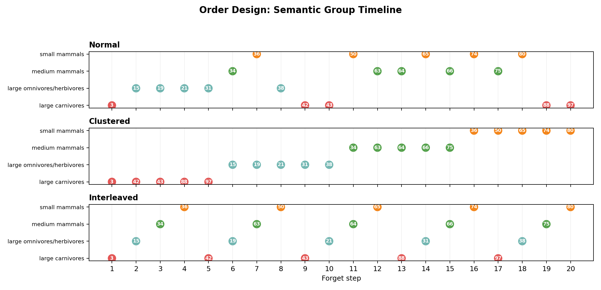

這張圖把每一步忘掉的 class 依 semantic group 標出。`Clustered` 會連續處理同一語義群，因此同群 shared features 受到連續壓力；`Interleaved` 則在不同語義群間切換，較適合觀察 heterogeneous steps 是否會讓已忘 class 回彈。`Normal` 則作為固定順序 baseline，讓我們確認這組 subset 在一般排列下是否已經容易失效。

## 5. Aggregate Metrics

| Order | Forget acc | UA | Retain acc | Full test acc | Runtime (min) |
| --- | --- | --- | --- | --- | --- |
| Normal | 2.20 | 97.80 | 71.38 | 57.54 | 102.5 |
| Clustered | 1.20 | 98.80 | 71.65 | 57.56 | 165.5 |
| Interleaved | 1.40 | 98.60 | 71.60 | 57.56 | 102.6 |

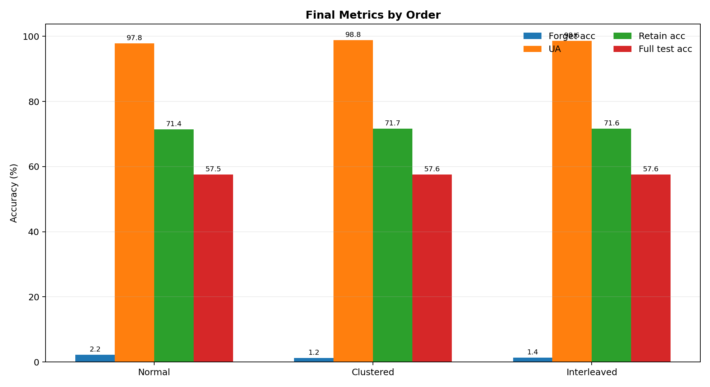

這張 grouped bar 圖濃縮 final endpoint。三條 order 的 final forget accuracy 都非常低：`Normal=2.20%`、`Clustered=1.20%`、`Interleaved=1.40%`，對應 UA 都高於 `97%`。這表示從 cumulative forgetting 的角度看，三條路線最後都成功把 20 個 forgotten classes 壓到很低。

Retain accuracy 則維持在約 `71.38% ~ 71.65%`，三條 order 差距很小。這點很重要，因為它說明 final forgetting 並不是靠整個模型崩壞達成；retain side 仍然保有和 CIFAR-100 baseline 相近的有效分類能力。

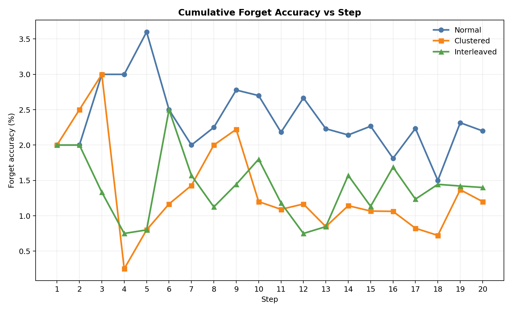

`forget_accuracy` 是 cumulative forgotten set 的平均 accuracy。這張圖主要看「已經被指定忘掉的集合」是否隨 step 增加而維持低值。三條 order 整體都維持在很低區間，表示 cumulative forgetting 沒有隨著 step 變多而明顯失控。

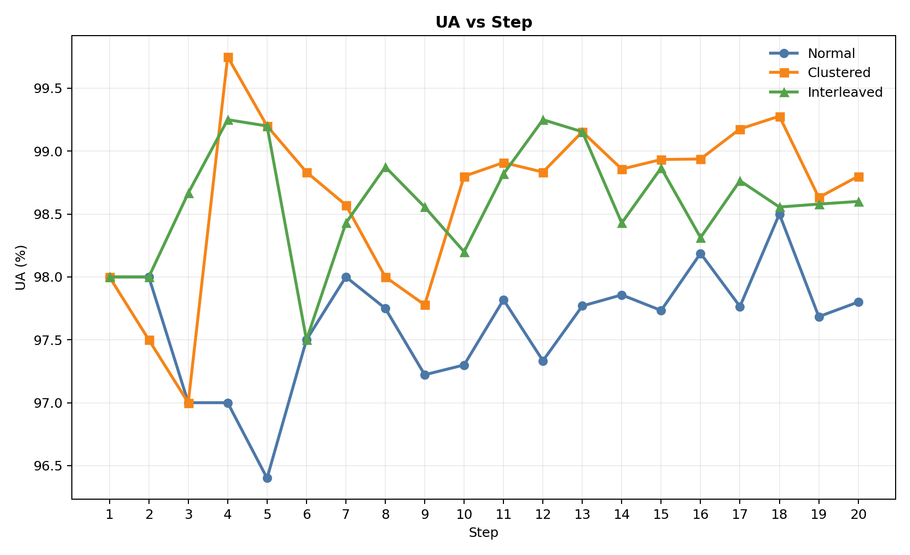

UA 是 `100 - forget_accuracy`。因為 forget accuracy 很低，所以 UA 幾乎全程維持高值。這張圖和 forget accuracy 是互補視角，能直觀看出三條 order 的 forgetting side 都很強。

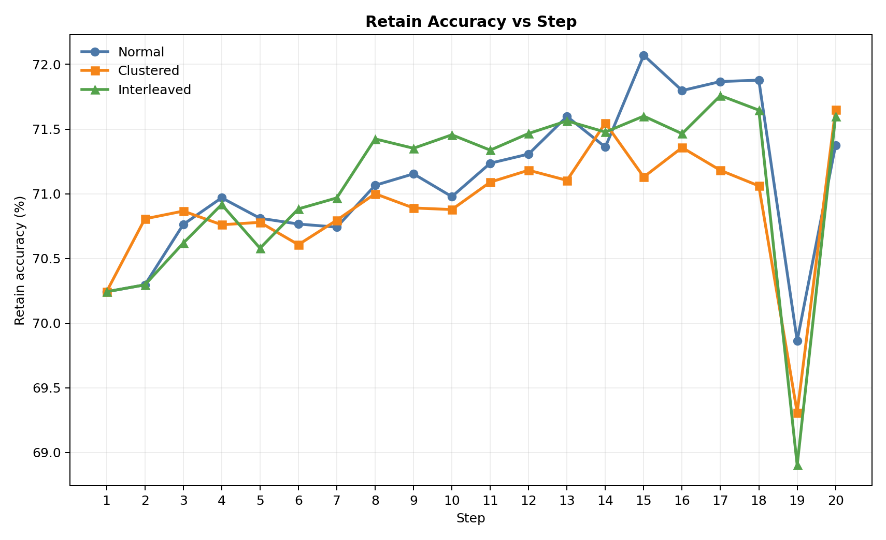

retain accuracy 用來檢查 unlearning 是否犧牲太多 non-forgotten classes。三條曲線都沒有一路崩掉，代表方法在多步忘卻下仍保留相當的 retain 能力。這使得後面看到的 class 21 residual 更像局部 rebound，而不是整體模型不穩定。

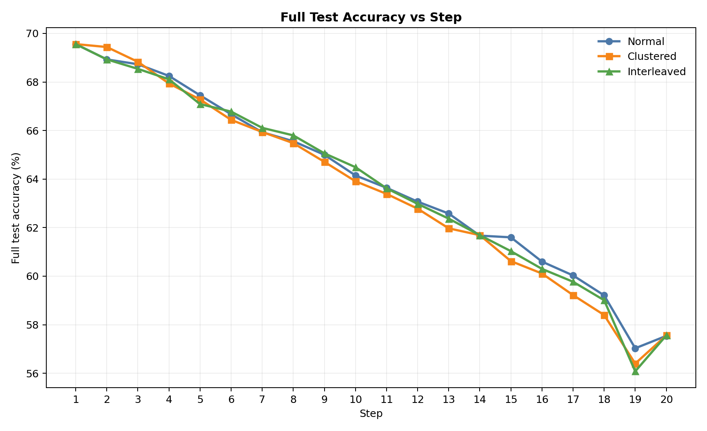

full test accuracy 會隨著 forgotten set 增加而下降，這是合理現象，因為 evaluation 仍包含已被刻意遺忘的 classes。三條 order 的 final full test accuracy 幾乎一致，表示 order 對 final endpoint 的影響不大，差異主要會出現在 class-wise trajectory 與 residual pattern。

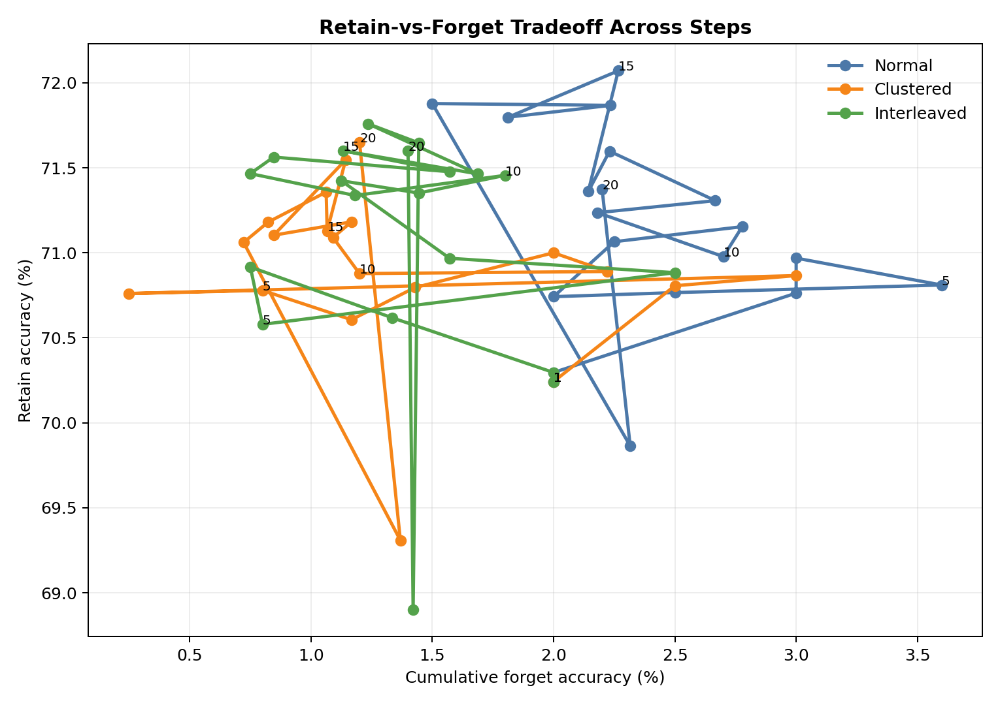

這張圖把每一步放在 retain accuracy 與 cumulative forget accuracy 的二維平面上。理想方向是左上角：forget accuracy 低、retain accuracy 高。本次三條 order 都集中在低 forget accuracy 區間，顯示主要 tradeoff 不是「能不能忘」，而是少數 class 在後續 step 是否會局部回升。

## 6. Immediate Forgetting Lag Analysis

本節使用原先定義的 failure 標準：newly forgotten class 在當步 evaluation accuracy `>10%`，視為 immediate forgetting lag / 遺忘失效。

| Order | Lag steps (>10%) | Worst class | Worst newly forgotten acc |
| --- | --- | --- | --- |
| Normal | 0 | bear / 熊 (3) | 2.0 |
| Clustered | 0 | bear / 熊 (3) | 2.0 |
| Interleaved | 0 | bear / 熊 (3) | 2.0 |

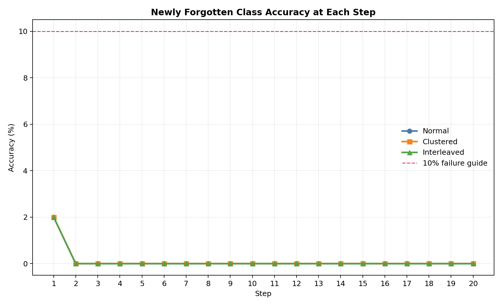

這張圖只看「當步新指定 forget 的 class」在當步 evaluation 的 accuracy。三條線都遠低於 `10%` guide line，最大值只有 step 1 的 `bear / 熊 (3)=2.0%`。因此，若把 failure 定義為 immediate forgetting lag，本次 CIFAR-100 pilot 並沒有出現失效。

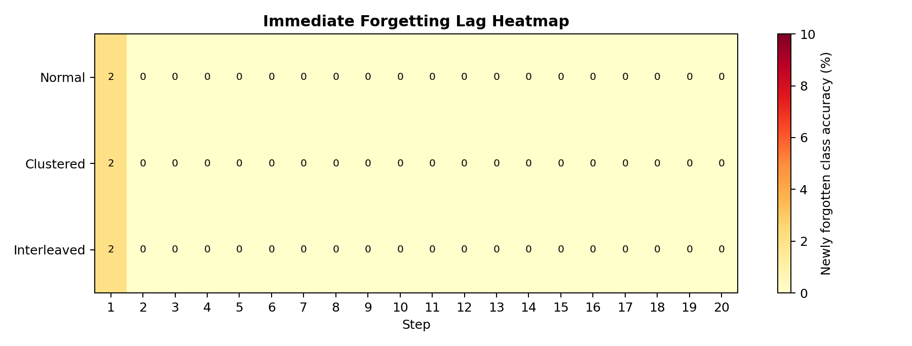

heatmap 更直接地顯示每條 order、每一步的新忘 class accuracy。圖中幾乎全是 `0` 或接近 `0`，說明單步施力對 newly forgotten class 非常有效。這也呼應先前 CIFAR-10 single-class forgetting 的觀察：單一類別被指定忘掉時，方法通常能很快壓低該 class。

## 7. Final Residual / Rebound Analysis

Immediate lag 沒有發生，但 final per-class 檢查揭露了另一種更細的問題：old forgotten class 在後續 steps 中可能回升。這種現象不是 recovery data flow，因為舊 forgotten classes 沒有被放回 training；比較合理的解讀是後續 unlearning 其他 classes 時，同一套 shared backbone / decision boundary 發生漂移，讓少數舊 class 的判別能力局部恢復。

| Order | Residual count | Class | Final acc |
| --- | --- | --- | --- |
| Normal | 1 | chimpanzee / 黑猩猩 (21) | 17.0 |
| Clustered | 1 | chimpanzee / 黑猩猩 (21) | 11.0 |
| Interleaved | 1 | chimpanzee / 黑猩猩 (21) | 11.0 |

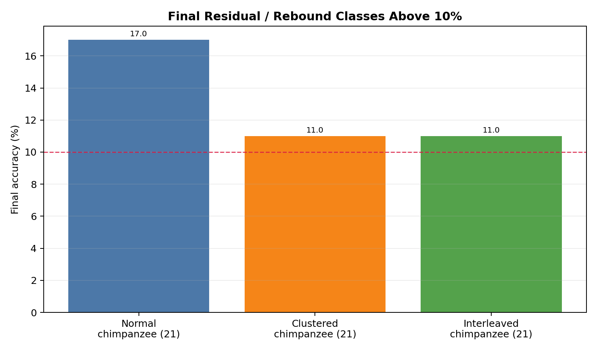

這張圖只列 final accuracy 高於 `10%` 的 forgotten classes。主要殘留集中在 `class 21 (chimpanzee / 黑猩猩)`：Normal 最後回到 `17.0%`，Clustered 與 Interleaved 都是 `11.0%`。這不是大規模 forgetting failure，因為 cumulative forget accuracy 仍只有 `1.2% ~ 2.2%`；但它是一個值得報告的 residual signal。

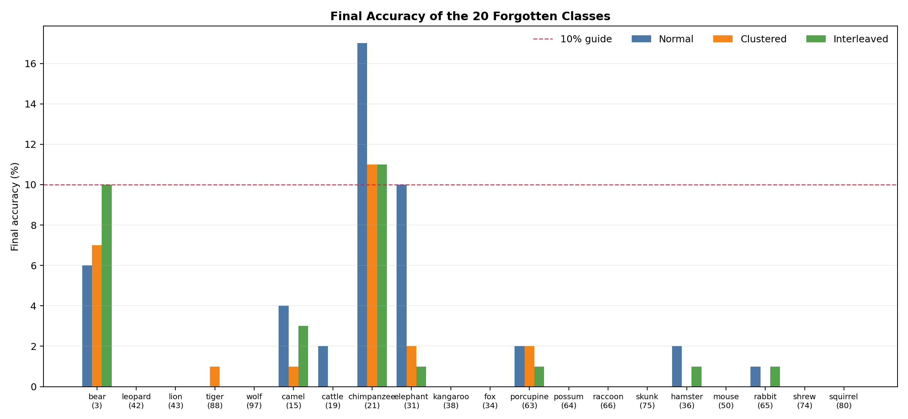

這張圖把 20 個 pilot classes 在 final checkpoint 的 accuracy 全部列出。大部分 class 都停在 `0% ~ 2%` 左右，只有少數 class 接近或超過 `10%`。因此 final forgetting 整體很好，但不是所有 class 都被同等程度地壓到完全 0。

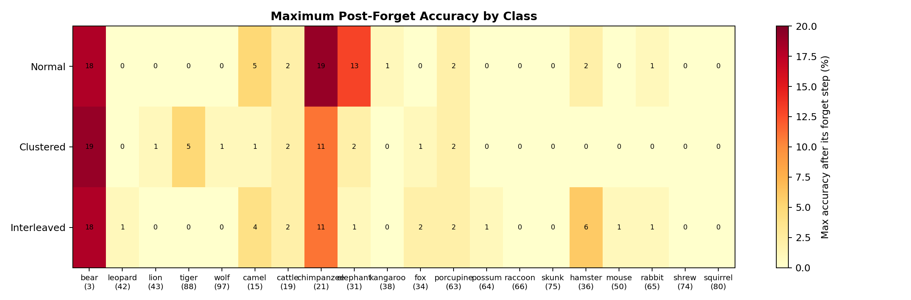

這張 heatmap 看每個 class 在「被忘掉之後」曾經回升到的最大 accuracy，因此比 final-only 更敏感。它能回答：某個 class 即使最後不高，中間是否曾 rebound。圖中可以看到 `class 21` 與部分早期 class 曾出現較高 post-forget value，表示 sequential updates 對 old forgotten classes 的影響不是單調下降。

### 7.1 Non-zero Post-Forget Rebound

如果把 post-forget rebound 的門檻從 `>10%` 放寬成「只要不是 `0%` 就算有殘留訊號」，觀察會更細。這個標準比較敏感，因此不應直接等同於嚴重 failure；它比較適合用來看 forgotten class 在後續 steps 中是否完全維持 0，或是否有任何局部回升。

| Order | Classes with non-zero post-forget | Total non-zero cells | Most frequent non-zero | Largest rebound |
| --- | --- | --- | --- | --- |
| Normal | 9 / 20 | 81 | bear / 熊 (3): 20 steps | chimpanzee / 黑猩猩 (21): 19.0% |
| Clustered | 10 / 20 | 57 | bear / 熊 (3): 20 steps | bear / 熊 (3): 19.0% |
| Interleaved | 12 / 20 | 81 | bear / 熊 (3): 20 steps | bear / 熊 (3): 18.0% |

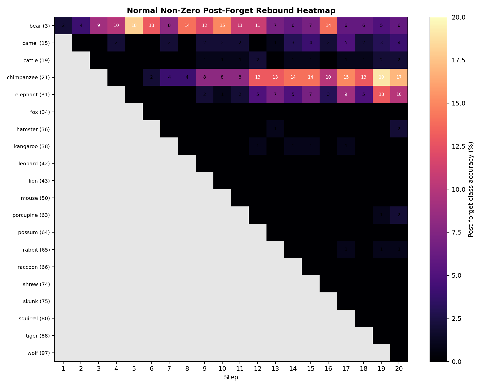

Normal 的 non-zero heatmap 顯示，雖然 newly forgotten class 當步幾乎都能被壓到 `0%`，但部分早期 forgotten classes 在後續 steps 會零星回升。最明顯的是 `chimpanzee / 黑猩猩 (21)`，它不只是偶發非零，而是在後段多次維持非零並超過 `10%`；`bear / 熊 (3)` 和 `elephant / 大象 (31)` 也曾在中途回升，但最後沒有形成同樣明顯的 final residual。

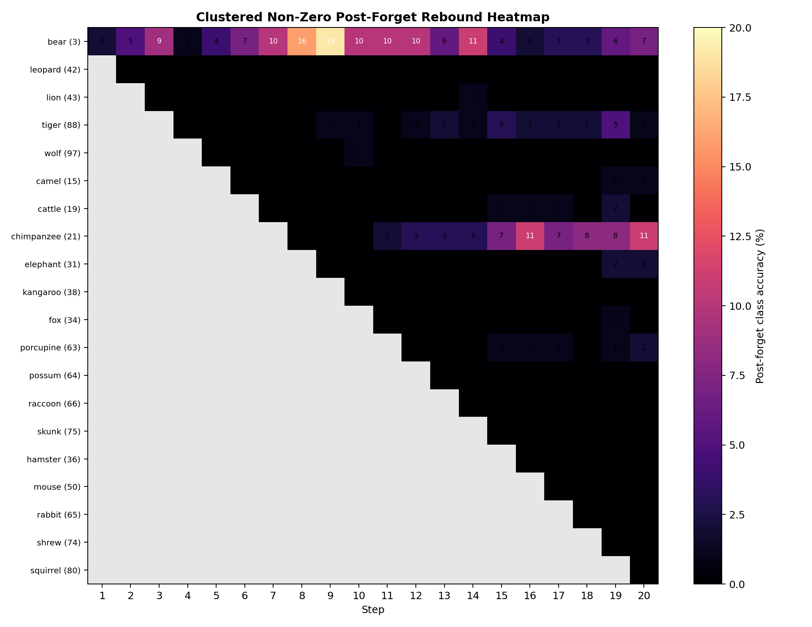

Clustered 的 heatmap 可以看到同語義群連續 forget 後，多數 class 被壓得很低，但 early forgotten class 仍可能在後續 steps 中短暫非零。這說明 clustered order 雖然 final forget accuracy 最好，仍不是把每個 class 永久鎖在 `0%`；它比較像是降低 rebound 幅度，而不是完全消除 rebound。

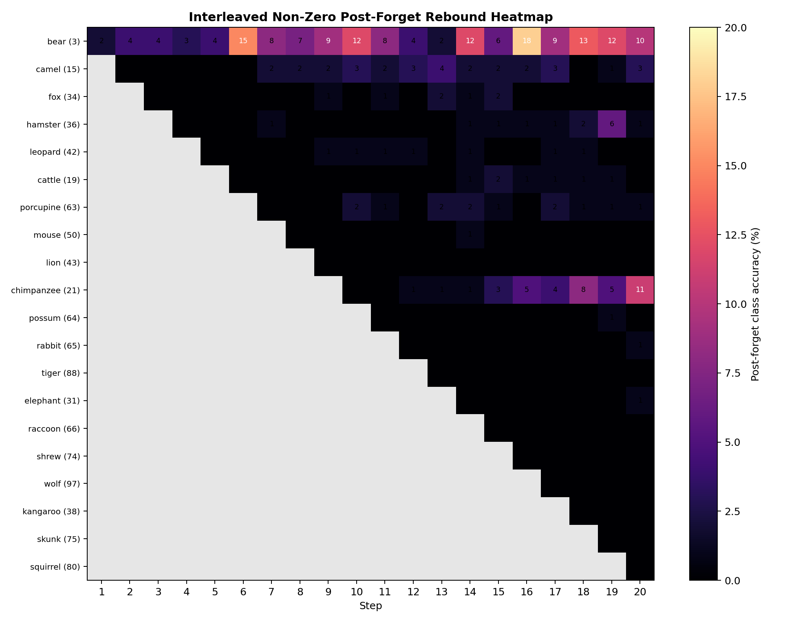

Interleaved 的 non-zero pattern 較分散，因為它在不同語義群間切換。即使如此，final residual 仍主要集中在 `chimpanzee / 黑猩猩 (21)`，而不是所有 class 都普遍回升。這表示 heterogeneous order 沒有造成大規模遺忘崩潰，但會讓某些 shared-feature class 在後續 step 出現小幅殘留。

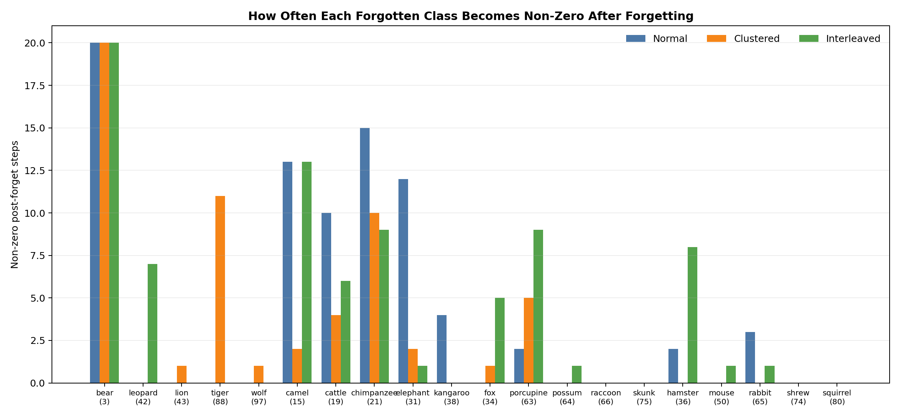

這張圖統計每個 class 在被忘之後有多少個 observation steps accuracy 不是 `0%`。它回答的是「哪個 class 最常回升」，不是「哪個 class 回升最大」。因此它比 final residual 更能揭露長尾小幅 rebound。若某 class non-zero count 高但 final 不高，代表它有中途震盪；若 non-zero count 高且 final 也高，才是比較值得警覺的 residual。

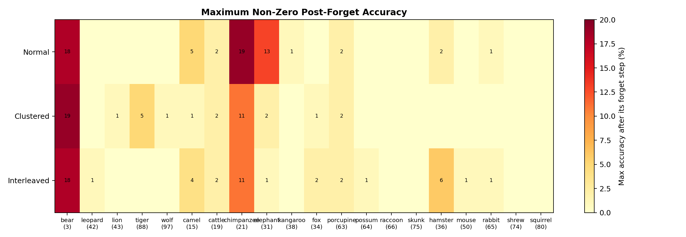

這張圖則看每個 class 在被忘後曾經達到的最大 accuracy。和 non-zero count 搭配看，可以區分兩種情況：一種是頻繁但幅度小的殘留，另一種是次數少但幅度大的 rebound。本次 `class 21` 同時具備後段持續非零與較高 max value，因此比單純中途跳動的 class 更重要。

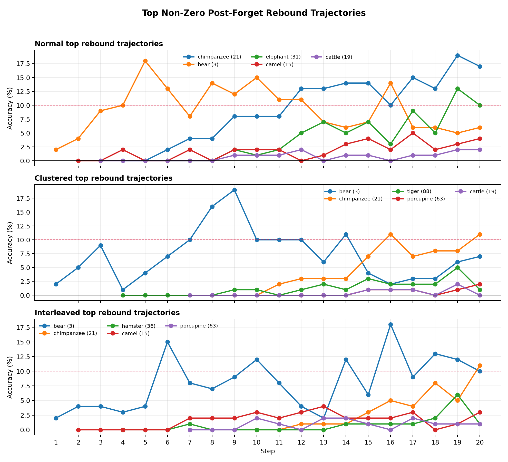

這張圖把每條 order 中 post-forget 最大值較高的 classes 抽出來畫軌跡。它比 heatmap 更容易看出「回升是在某幾個 step 突然發生，還是逐步累積」。Normal 的 `class 21` 呈現較明顯的逐步回升；`class 3` 則比較像中途震盪，最後又降下來。

| Order | Class | Forget step | Non-zero / observed | Max acc | Final acc |
| --- | --- | --- | --- | --- | --- |
| Normal | chimpanzee / 黑猩猩 (21) | 4 | 15 / 17 | 19.0 | 17.0 |
| Normal | bear / 熊 (3) | 1 | 20 / 20 | 18.0 | 6.0 |
| Normal | elephant / 大象 (31) | 5 | 12 / 16 | 13.0 | 10.0 |
| Normal | camel / 駱駝 (15) | 2 | 13 / 19 | 5.0 | 4.0 |
| Normal | cattle / 牛 (19) | 3 | 10 / 18 | 2.0 | 2.0 |
| Normal | hamster / 倉鼠 (36) | 7 | 2 / 14 | 2.0 | 2.0 |
| Clustered | bear / 熊 (3) | 1 | 20 / 20 | 19.0 | 7.0 |
| Clustered | chimpanzee / 黑猩猩 (21) | 8 | 10 / 13 | 11.0 | 11.0 |
| Clustered | tiger / 老虎 (88) | 4 | 11 / 17 | 5.0 | 1.0 |
| Clustered | porcupine / 豪豬 (63) | 12 | 5 / 9 | 2.0 | 2.0 |
| Clustered | cattle / 牛 (19) | 7 | 4 / 14 | 2.0 | 0.0 |
| Clustered | elephant / 大象 (31) | 9 | 2 / 12 | 2.0 | 2.0 |
| Interleaved | bear / 熊 (3) | 1 | 20 / 20 | 18.0 | 10.0 |
| Interleaved | chimpanzee / 黑猩猩 (21) | 10 | 9 / 11 | 11.0 | 11.0 |
| Interleaved | hamster / 倉鼠 (36) | 4 | 8 / 17 | 6.0 | 1.0 |
| Interleaved | camel / 駱駝 (15) | 2 | 13 / 19 | 4.0 | 3.0 |
| Interleaved | porcupine / 豪豬 (63) | 7 | 9 / 14 | 2.0 | 1.0 |
| Interleaved | cattle / 牛 (19) | 6 | 6 / 15 | 2.0 | 0.0 |

這張表把 non-zero post-forget 訊號列成數字。用這個標準時，`class 21` 不是唯一有 rebound 的 class；`class 3` 和 `class 31` 也有中途非零或短暫回升。不過 `class 21` 是唯一在三條 order 的 final checkpoint 都仍高於 `10%` 的 class，所以它仍是最重要的 residual case。

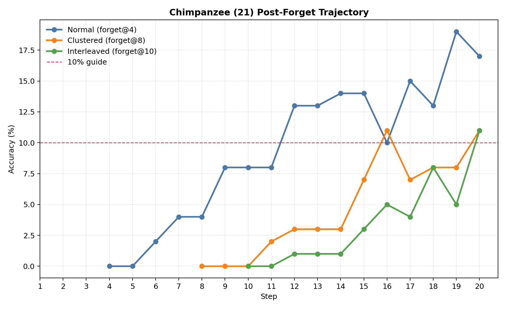

`class 21 (chimpanzee / 黑猩猩)` 是本次最重要的 rebound case。三條 order 中，它在被忘當下都接近 `0%`，但後續逐步回升。Normal 軌跡為：

```text
0 -> 0 -> 2 -> 4 -> 4 -> 8 -> 8 -> 8 -> 13 -> 13 -> 14 -> 14 -> 10 -> 15 -> 13 -> 19 -> 17
```

Clustered 軌跡為：

```text
0 -> 0 -> 0 -> 2 -> 3 -> 3 -> 3 -> 7 -> 11 -> 7 -> 8 -> 8 -> 11
```

Interleaved 軌跡為：

```text
0 -> 0 -> 1 -> 1 -> 1 -> 3 -> 5 -> 4 -> 8 -> 5 -> 11
```

這個模式支持一個比較謹慎的結論：方法對當步 class 的直接 unlearning 很有效，但 sequential setting 下，舊 forgotten class 仍可能被後續 decision boundary drift 間接影響。這是「rebound residual」，不是「當步忘不掉」。

### 7.2 Why Post-Forget Rebound Happens

Post-forget rebound 比較合理的解讀不是資料回灌，也不是 immediate forgetting failure，而是 sequential unlearning 在共享參數空間中反覆更新後，讓少數舊 class 的 decision margin 局部回升。這裡仍應把原因寫成 evidence-supported hypothesis，而不是已經被直接證明的 causal claim；若要進一步證明，需要追加 logit margin、confusion matrix、feature embedding 或 per-step gradient/update overlap 分析。

第一個機制是 shared mammal features。本次 subset 刻意選 animal-heavy classes，許多類別會共用毛髮紋理、臉部輪廓、四足或直立姿態、自然背景、近景動物構圖等特徵。Unlearning 某一個 fine class 時，方法可以把該 class 的當步 accuracy 壓到接近 `0%`，但 shared backbone 中仍可能保留服務其他 mammal classes 的特徵。後續 steps 繼續更新這些共享特徵時，舊 forgotten class 可能重新落回可被正確分類的區域。

第二個機制是 no post-forget constraint。正確 incremental data flow 會把舊 forgotten classes 永久排除在後續 train loaders 外，這能排除 recovery training 的解釋；但它同時也代表後續 optimization 沒有直接約束「已忘 class 必須維持低 accuracy」。因此當後續 step 為了新 forget class 與 retain set 調整參數時，只要沒有再次看到舊 forgotten examples，就不會直接懲罰舊 class 的 logit margin 回升。

第三個機制是 decision boundary drift。每一步 RL-SalUn 都會在 forget objective 和 retain objective 之間重新平衡分類邊界。即使舊 class 的 training samples 不再出現，和它相近的 retain / newly forgotten classes 仍會推動 classifier head 與 backbone representation。若這些更新讓舊 class 對原本 label 的 logit 相對於競爭 labels 上升，per-class accuracy 就可能從 `0%` 回到非零，甚至在少數 cases 超過 `10%`。

第四個機制是 incremental mask/update interference。每一步 mask 與 unlearning update 主要針對當步 newly forgotten class 產生，並不是針對所有歷史 forgotten classes 做全域約束。後續 step 的 mask 可能落在不同參數區域，也可能為了 retain performance 改寫部分先前被壓制的 shared features。這不代表前一步 unlearning 失效，而是表示 sequential local updates 之間可能互相干擾，使舊 class 的抑制效果不是單調不可逆。

第五個機制是 order / exposure effect。越早被忘掉的 class，越長時間暴露在後續 unlearning steps 的邊界漂移之下，因此更容易出現中途 rebound。`class 3 (bear / 熊)` 三條 order 都在 step 1 被忘，non-zero count 很高，正符合 exposure effect；但它 final residual 不如 `class 21` 明顯，表示 exposure 只是一個條件，不是充分原因。真正值得警覺的是 exposure、shared features、以及後段 margin 回升同時出現的 class。

這個解讀也能說明為什麼 `class 21 (chimpanzee / 黑猩猩)` 是本次最重要的 rebound case。它不是單純「很難忘」，因為它在 Normal 的 forget step 4、Clustered 的 forget step 8、Interleaved 的 forget step 10 當下都掉到 `0%`。更準確的說法是：class 21 被忘掉後，比較容易被後續 sequential updates 局部帶回。

`class 21` 在本 subset 中像一個 semantic bridge。它被歸在 `large_omnivores_and_herbivores`，但視覺上同時可能和大型哺乳類、小型/中型哺乳類、靈長類臉部與肢體姿態、毛髮質地、自然背景等特徵共享 representation。當後續 steps 繼續 unlearn elephant / 大象、kangaroo / 袋鼠、fox / 狐狸、porcupine / 豪豬、possum / 負鼠、raccoon / 浣熊、skunk / 臭鼬、small mammals 等類別時，模型可能反覆調整與 mammal recognition 相關的共享方向，間接讓 class 21 的 logit margin 回升。

三條 order 的差異也支持這個假設。Normal 中 class 21 在 step 4 就被忘，後續還有 16 個 animal classes 會推動 shared representation，因此它從 step 11 後多次超過 `10%`，最後停在 `17%`。Clustered 中 class 21 到 step 8 才被忘，而且同群大型雜食/草食動物被連續處理，可能較集中地壓低相關 shared features，所以 final residual 降到 `11%`，但沒有完全消失。Interleaved 中 class 21 到 step 10 才被忘，後續 exposure 更短，final 也是 `11%`；這說明 heterogeneous order 沒有造成大規模失效，但仍可能留下局部 residual。

最後需要注意 interpretation guardrail。CIFAR-100 每個 fine class 的 test samples 約為 100 張，所以 `1%` per-class accuracy 大約只對應 1 張圖；non-zero post-forget cell 很適合用來看細微 rebound 痕跡，但不應直接等同嚴重 failure。本報告比較保守地把 `>10%` final residual 視為較值得警覺的訊號，因為它代表約 10 張以上測試圖在 final checkpoint 仍被正確辨識。以這個標準看，本次核心結論仍是：immediate lag 沒有發生，post-forget rebound 是少數 class 的局部 residual，而且目前原因分析仍需後續 logit / margin / confusion evidence 驗證。

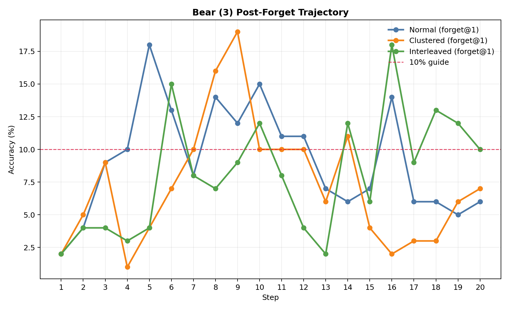

`class 3 (bear / 熊)` 是三條 order 的第一個 forget class，因此它暴露在最多後續 unlearning steps 之下。它不像 class 21 一樣 final residual 明顯，但中間也曾在部分 order 回升到 `10%` 以上。這張圖說明早期 forgotten class 更容易受到後續多步更新累積影響。

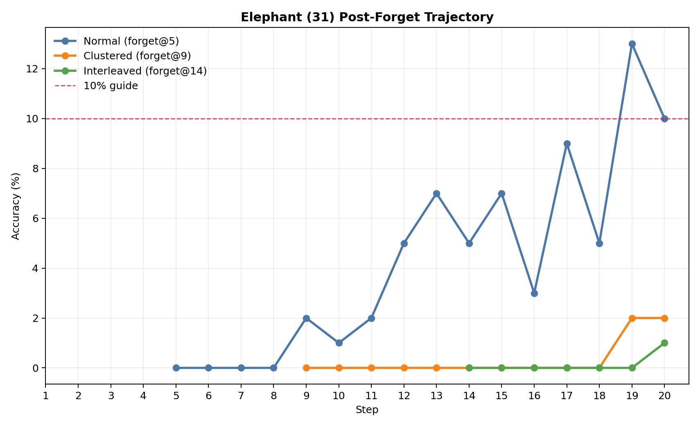

`class 31 (elephant / 大象)` 則是 Normal 中較明顯的中途 rebound case。它在 Normal 後段曾達到 `13%`，但 final 回到 `10%`，沒有超過 final residual threshold。這個例子提醒我們：若只看 final checkpoint，會漏掉一些中途回升；若只看 non-zero rebound，又可能把短暫震盪和持續 failure 混在一起。因此報告中需要同時呈現 immediate lag、non-zero rebound、final residual 三種層次。

## 8. Class-Wise Trajectories

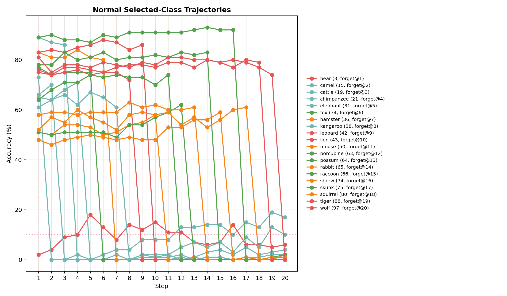

Normal trajectory 顯示，大多數 class 在被忘之後立即掉到接近 0。比較值得注意的是早期 forgotten classes 後續仍可能有小幅震盪，尤其 `class 21` 在後段回升較明顯。這表示 Normal 沒有 immediate lag，但有少數 old class residual。

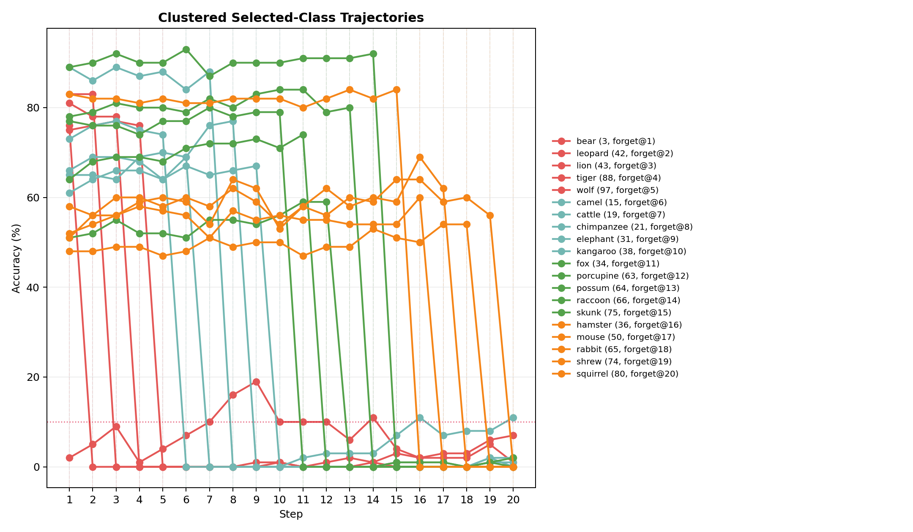

Clustered trajectory 的特色是同群 classes 連續被忘，shared semantic features 會被連續壓制。final forgetting 最好的是 Clustered，forget accuracy 只有 `1.20%`、UA `98.80%`。不過它仍未完全消除 class 21 residual，表示 clustered pressure 有幫助但不是保證所有 class final 皆為 0。

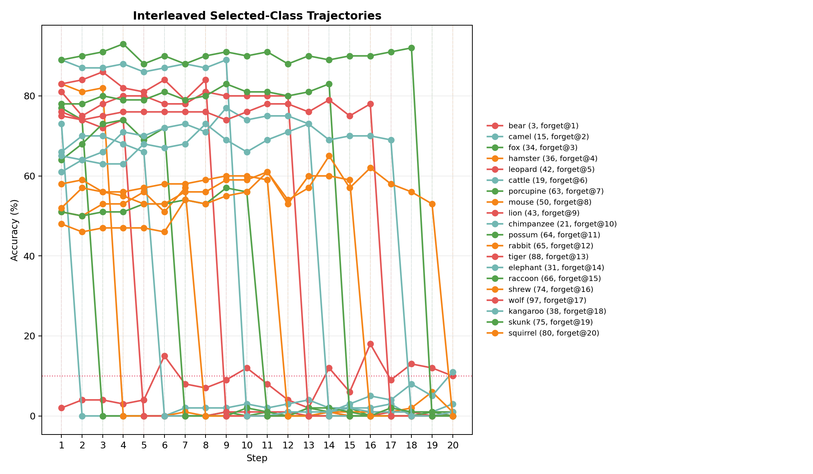

Interleaved 在不同 groups 之間切換，原本預期可能更容易拖長 immediate lag；但結果顯示 newly forgotten class 當步仍能被快速壓低。它的 final residual 也主要集中在 class 21，沒有形成多 class 大規模失效。

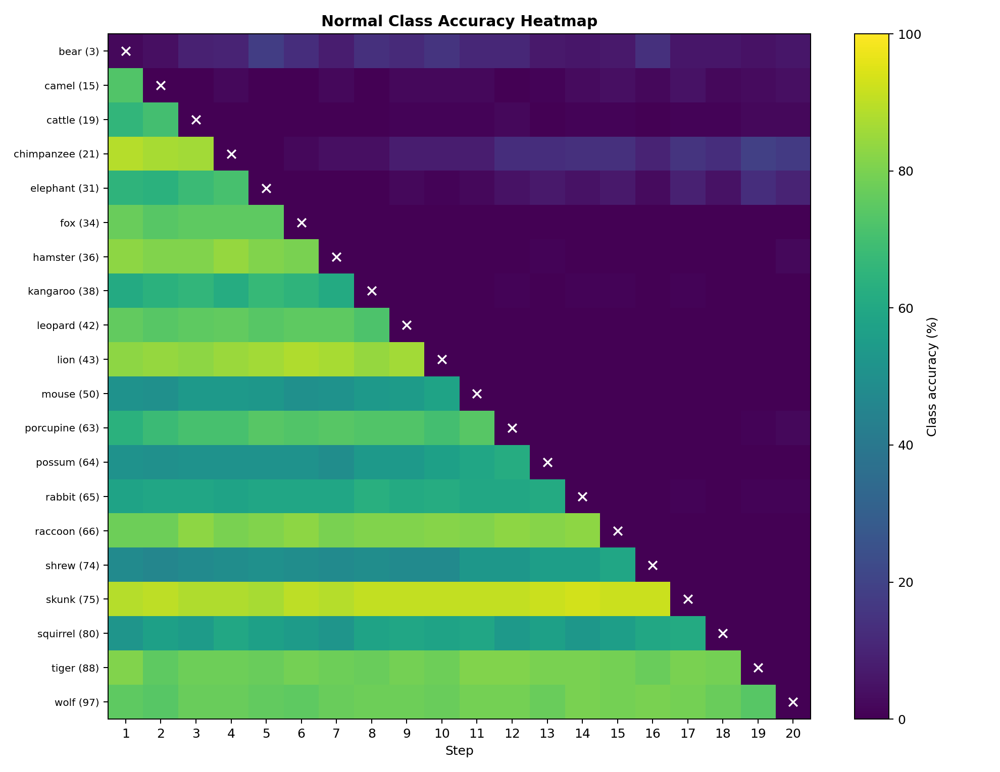

Normal heatmap 用顏色顯示 20 個 pilot classes 在 20 steps 中的 accuracy。白色叉號代表該 class 被指定 forget 的 step。大部分 class 在叉號後顏色迅速變暗，代表 accuracy 被壓低；少數 class 在後段變亮，代表 rebound。

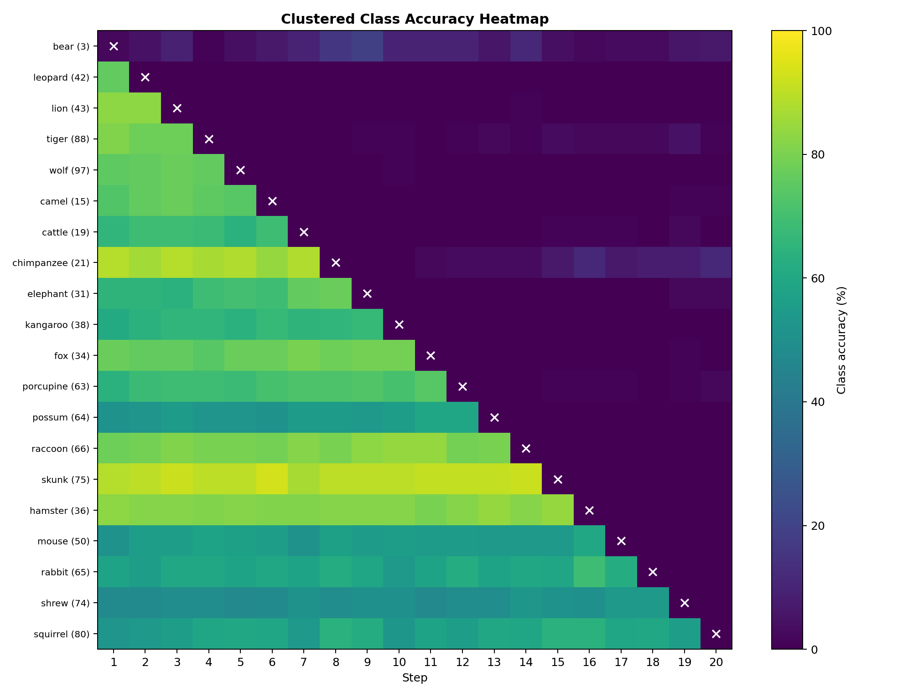

Clustered heatmap 更能看出語義群連續 forget 的效果。同群連續施壓後，多數 class 在被忘後維持低值。這支持 clustered order 對 cumulative forgetting 較穩的觀察，但 class 21 的殘留仍顯示 shared representation 不是完全不可逆地被刪除。

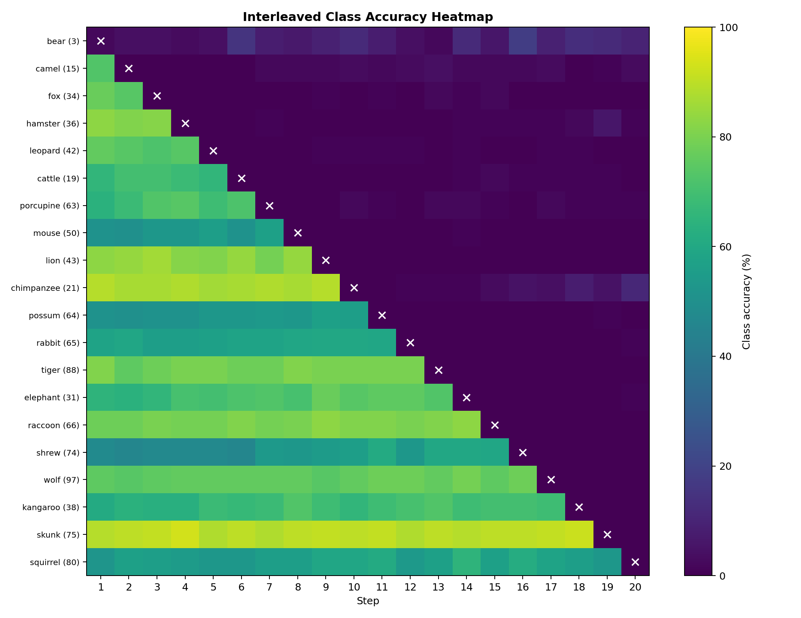

Interleaved heatmap 則用來檢查 heterogeneous order 是否導致更明顯 rebound。結果看起來沒有導致 immediate lag，也沒有造成 final 大規模失敗；但 class 21 和 class 3 的局部回升仍提醒我們，order 會改變 rebound 出現的位置與幅度。

## 9. Group-Wise Trajectories

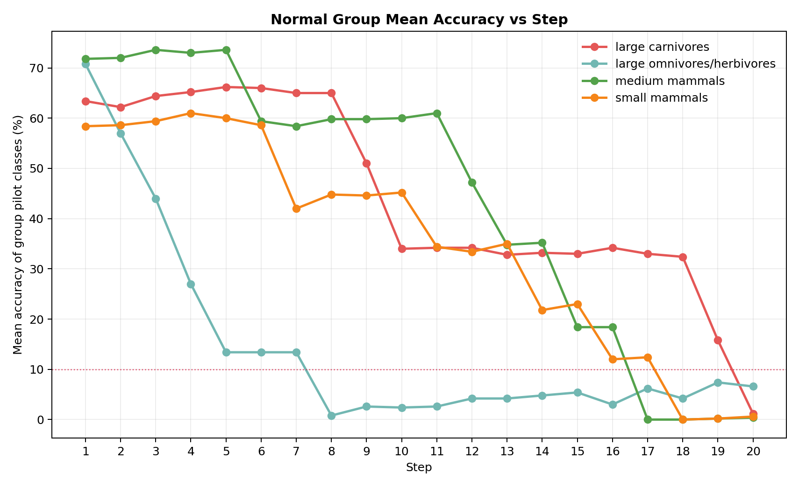

這張圖把 20 classes 依 coarse group 聚合，觀察各 group 的平均 accuracy。Normal 下不同 groups 被逐步拉低，顯示 forgetting pressure 不是只作用於單一群。若某 group 在後段回升，代表該群 shared features 可能被後續 retain / forget boundary 間接恢復。

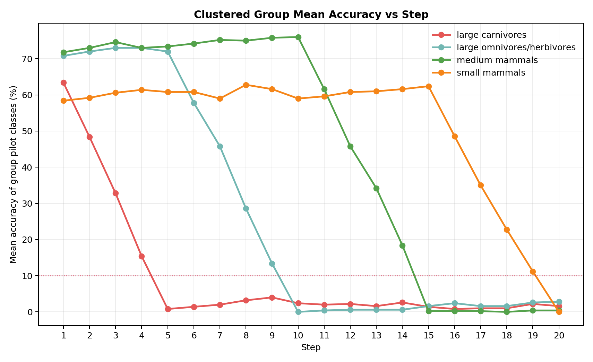

Clustered 的 group mean 最能呈現「同語義群連續施壓」效果。某個 group 被連續 forget 時，其平均 accuracy 會快速下降。這也是 Clustered final forget accuracy 最低的可能原因之一。

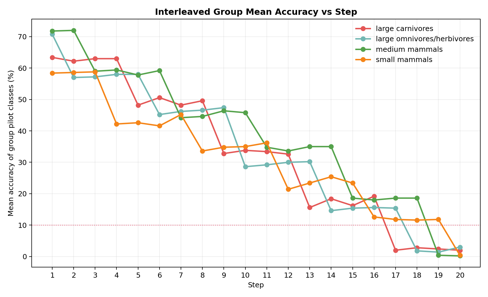

Interleaved 的 group mean 較分散，因為每個 group 的 forget pressure 被拆開。即使如此，newly forgotten class 仍能被有效壓低，代表目前超參下 immediate forgetting 能力足夠強，沒有被 heterogeneous order 明顯破壞。

## 10. Retain-Class Impact vs Original Baseline

本節回答另一個問題：在 unlearning 20 個 animal classes 的過程中，模型是否傷到「其他原本不該忘的類別」？分析方式是把 `CIFAR-100 original baseline` 的每個 class accuracy 當作參考點，和三條 order 的每一步 per-class accuracy 比較。

這裡分成兩個指標。`final delta` 是 final checkpoint accuracy 減 baseline accuracy，用來看最後是否留下 retain-side 損傷。`worst transient delta` 是 20 steps 過程中該 class 的最低 accuracy 減 baseline accuracy，用來看中途是否曾被 unlearning 暫時干擾。因為 CIFAR-100 每個 fine class test set 約 100 張圖，所以 `1pp` 大約就是 1 張圖；因此小於 `3pp` 的變化不宜過度解讀，`>=10pp` 的 drop 才比較值得標記。

### 10.1 Retain-Side Summary

| Order | Baseline retain mean | Final retain mean | Final delta | Worst-step retain mean | Worst-step delta | Final drop >=5pp | Final drop >=10pp | Any-step drop >=10pp | Final gain >=5pp |
| --- | --- | --- | --- | --- | --- | --- | --- | --- | --- |
| Normal | 70.80 | 71.38 | +0.58 | 66.74 | -4.06 | 3 | 0 | 4 | 10 |
| Clustered | 70.80 | 71.65 | +0.85 | 66.66 | -4.14 | 2 | 0 | 8 | 9 |
| Interleaved | 70.80 | 71.60 | +0.80 | 66.34 | -4.46 | 6 | 0 | 4 | 9 |

這張表顯示，80 個未被指定 forget 的 retain classes 在 final checkpoint 並沒有整體崩壞。三條 order 的 final retain mean 都略高於 baseline retain mean，表示 final endpoint 的 retain side 仍穩定。這和前面的 aggregate retain accuracy 結論一致：unlearning 不是靠把整個模型弄壞來達成 forgetting。

但 `worst-step delta` 提醒我們，過程中仍有 class-specific transient interference。Normal 有 4 個 retain classes 曾在某一步低於 baseline `10pp` 以上，Clustered 有 8 個，Interleaved 有 4 個。這些 case 多數 final 會回到接近 baseline，因此不應被解讀成 persistent retain failure；它們更像 sequential updates 造成的短期邊界震盪。

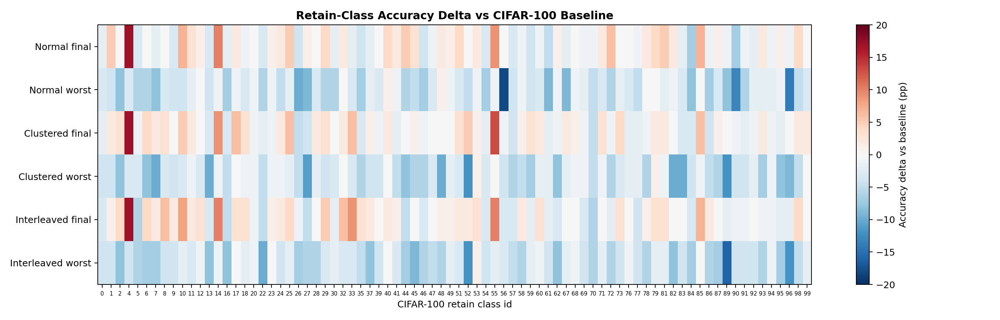

這張 heatmap 把 80 個 retain classes 的 final delta 與 worst transient delta 放在一起看。若只看 final rows，顏色大多接近中性，代表最後 retain side 沒有系統性下降；若看 worst rows，可以看到少數 class 在某些 order 中短暫變暗，表示中途曾有較明顯 accuracy drop。

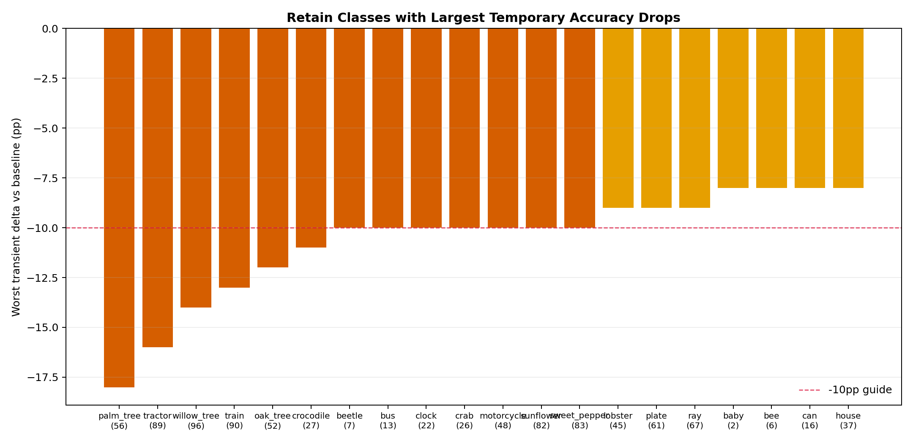

這張 bar chart 列出 transient drop 最大的 retain classes。最明顯的例子包括 `palm_tree (56)`、`tractor (89)`、`willow_tree (96)`、`train (90)` 等；它們不是本次 forget target，但在某些 step 會被 shared representation / classifier boundary drift 暫時影響。需要注意的是，這些類別 final delta 通常沒有同等幅度的下降，代表大多是 temporary interference。

### 10.2 Retain Classes with Largest Temporary Drops

| Class | Baseline | Worst order | Worst transient delta | Normal final delta | Clustered final delta | Interleaved final delta |
| --- | --- | --- | --- | --- | --- | --- |
| palm_tree (56) | 88.0 | Normal | -18.0 | +0.0 | -1.0 | -3.0 |
| tractor (89) | 85.0 | Interleaved | -16.0 | -1.0 | +0.0 | -2.0 |
| willow_tree (96) | 63.0 | Normal | -14.0 | -1.0 | +0.0 | -2.0 |
| train (90) | 85.0 | Normal | -13.0 | -7.0 | -1.0 | -1.0 |
| oak_tree (52) | 66.0 | Clustered | -12.0 | +0.0 | +5.0 | +2.0 |
| crocodile (27) | 56.0 | Clustered | -11.0 | +1.0 | -4.0 | -5.0 |
| beetle (7) | 77.0 | Clustered | -10.0 | -2.0 | +2.0 | +2.0 |
| bus (13) | 67.0 | Clustered | -10.0 | -3.0 | -3.0 | -3.0 |
| clock (22) | 68.0 | Interleaved | -10.0 | -3.0 | -2.0 | -5.0 |
| crab (26) | 64.0 | Normal | -10.0 | -4.0 | -5.0 | -1.0 |
| motorcycle (48) | 91.0 | Clustered | -10.0 | +2.0 | +0.0 | +1.0 |
| sunflower (82) | 90.0 | Clustered | -10.0 | +2.0 | +0.0 | +0.0 |
| sweet_pepper (83) | 68.0 | Clustered | -10.0 | -2.0 | -3.0 | +0.0 |
| lobster (45) | 64.0 | Interleaved | -9.0 | +3.0 | +1.0 | +0.0 |
| plate (61) | 65.0 | Normal | -9.0 | -5.0 | -2.0 | -2.0 |
| ray (67) | 57.0 | Normal | -9.0 | -2.0 | +2.0 | +0.0 |
| baby (2) | 61.0 | Normal | -8.0 | +0.0 | +3.0 | +4.0 |
| bee (6) | 82.0 | Clustered | -8.0 | +0.0 | +4.0 | +4.0 |
| can (16) | 78.0 | Interleaved | -8.0 | -2.0 | -3.0 | -5.0 |
| house (37) | 77.0 | Interleaved | -8.0 | -2.0 | +1.0 | +2.0 |

這張表把「過程中曾掉最多」的 retain classes 抽出來看。它回答的是：即使 final retain accuracy 看起來穩，哪些類別在 sequential unlearning 過程中曾被短暫傷到？例如 `palm_tree (56)` 在 Normal 中 worst transient delta 達到 `-18pp`，但 final delta 是 `0pp`；`tractor (89)` 在 Interleaved 中 worst transient delta 達到 `-16pp`，但 final delta 只有 `-2pp`。這種 pattern 支持「短期 boundary drift」而不是「永久 retain forgetting」的解讀。

### 10.3 Detailed Retain-Class Table

| Class | Role | Baseline | Normal final | N final Δ | N worst Δ | Clustered final | C final Δ | C worst Δ | Interleaved final | I final Δ | I worst Δ | Status |
| --- | --- | --- | --- | --- | --- | --- | --- | --- | --- | --- | --- | --- |
| apple (0) | retain | 89.0 | 87.0 | -2.0 | -3.0 | 87.0 | -2.0 | -4.0 | 86.0 | -3.0 | -4.0 | stable |
| aquarium_fish (1) | retain | 81.0 | 86.0 | +5.0 | -4.0 | 83.0 | +2.0 | -4.0 | 82.0 | +1.0 | -4.0 | final gain |
| baby (2) | retain | 61.0 | 61.0 | +0.0 | -8.0 | 64.0 | +3.0 | -8.0 | 65.0 | +4.0 | -8.0 | stable |
| beaver (4) | retain | 60.0 | 77.0 | +17.0 | -3.0 | 77.0 | +17.0 | -3.0 | 77.0 | +17.0 | -4.0 | final gain |
| bed (5) | retain | 73.0 | 70.0 | -3.0 | -6.0 | 72.0 | -1.0 | -3.0 | 67.0 | -6.0 | -6.0 | mild final drop |
| bee (6) | retain | 82.0 | 82.0 | +0.0 | -6.0 | 86.0 | +4.0 | -8.0 | 86.0 | +4.0 | -7.0 | stable |
| beetle (7) | retain | 77.0 | 75.0 | -2.0 | -8.0 | 79.0 | +2.0 | -10.0 | 79.0 | +2.0 | -7.0 | transient drop |
| bicycle (8) | retain | 83.0 | 83.0 | +0.0 | -3.0 | 86.0 | +3.0 | -3.0 | 89.0 | +6.0 | -4.0 | final gain |
| bottle (9) | retain | 80.0 | 77.0 | -3.0 | -4.0 | 80.0 | +0.0 | -4.0 | 82.0 | +2.0 | -4.0 | stable |
| bowl (10) | retain | 45.0 | 52.0 | +7.0 | -4.0 | 50.0 | +5.0 | -3.0 | 53.0 | +8.0 | -2.0 | final gain |
| boy (11) | retain | 45.0 | 48.0 | +3.0 | -2.0 | 47.0 | +2.0 | -1.0 | 47.0 | +2.0 | -3.0 | stable |
| bridge (12) | retain | 79.0 | 80.0 | +1.0 | +0.0 | 79.0 | +0.0 | -3.0 | 82.0 | +3.0 | -1.0 | stable |
| bus (13) | retain | 67.0 | 64.0 | -3.0 | -4.0 | 64.0 | -3.0 | -10.0 | 64.0 | -3.0 | -8.0 | transient drop |
| butterfly (14) | retain | 55.0 | 65.0 | +10.0 | -1.0 | 64.0 | +9.0 | -1.0 | 65.0 | +10.0 | -1.0 | final gain |
| can (16) | retain | 78.0 | 76.0 | -2.0 | -7.0 | 75.0 | -3.0 | -5.0 | 73.0 | -5.0 | -8.0 | mild final drop |
| castle (17) | retain | 79.0 | 81.0 | +2.0 | -1.0 | 85.0 | +6.0 | +0.0 | 82.0 | +3.0 | +0.0 | final gain |
| caterpillar (18) | retain | 62.0 | 61.0 | -1.0 | -3.0 | 65.0 | +3.0 | -1.0 | 65.0 | +3.0 | -2.0 | stable |
| chair (20) | retain | 86.0 | 86.0 | +0.0 | -1.0 | 85.0 | -1.0 | -1.0 | 85.0 | -1.0 | -1.0 | stable |
| clock (22) | retain | 68.0 | 65.0 | -3.0 | -6.0 | 66.0 | -2.0 | -5.0 | 63.0 | -5.0 | -10.0 | transient drop |
| cloud (23) | retain | 80.0 | 81.0 | +1.0 | -1.0 | 79.0 | -1.0 | -1.0 | 81.0 | +1.0 | +0.0 | stable |
| cockroach (24) | retain | 78.0 | 80.0 | +2.0 | -5.0 | 80.0 | +2.0 | -1.0 | 80.0 | +2.0 | -4.0 | stable |
| couch (25) | retain | 55.0 | 60.0 | +5.0 | -2.0 | 61.0 | +6.0 | -2.0 | 59.0 | +4.0 | -2.0 | final gain |
| crab (26) | retain | 64.0 | 60.0 | -4.0 | -10.0 | 59.0 | -5.0 | -5.0 | 63.0 | -1.0 | -7.0 | transient drop |
| crocodile (27) | retain | 56.0 | 57.0 | +1.0 | -9.0 | 52.0 | -4.0 | -11.0 | 51.0 | -5.0 | -6.0 | transient drop |
| cup (28) | retain | 75.0 | 75.0 | +0.0 | -3.0 | 77.0 | +2.0 | -2.0 | 75.0 | +0.0 | -6.0 | stable |
| dinosaur (29) | retain | 65.0 | 69.0 | +4.0 | -6.0 | 68.0 | +3.0 | -4.0 | 70.0 | +5.0 | -3.0 | final gain |
| dolphin (30) | retain | 67.0 | 65.0 | -2.0 | -6.0 | 67.0 | +0.0 | -3.0 | 65.0 | -2.0 | -2.0 | stable |
| flatfish (32) | retain | 61.0 | 63.0 | +2.0 | +0.0 | 63.0 | +2.0 | +0.0 | 67.0 | +6.0 | -3.0 | final gain |
| forest (33) | retain | 61.0 | 59.0 | -2.0 | -3.0 | 67.0 | +6.0 | -3.0 | 70.0 | +9.0 | -3.0 | final gain |
| girl (35) | retain | 52.0 | 48.0 | -4.0 | -7.0 | 49.0 | -3.0 | -6.0 | 55.0 | +3.0 | -5.0 | stable |
| house (37) | retain | 77.0 | 75.0 | -2.0 | -2.0 | 78.0 | +1.0 | -4.0 | 79.0 | +2.0 | -8.0 | stable |
| keyboard (39) | retain | 80.0 | 80.0 | +0.0 | -3.0 | 79.0 | -1.0 | -4.0 | 80.0 | +0.0 | -4.0 | stable |
| lamp (40) | retain | 57.0 | 61.0 | +4.0 | +1.0 | 59.0 | +2.0 | +0.0 | 59.0 | +2.0 | +0.0 | stable |
| lawn_mower (41) | retain | 87.0 | 89.0 | +2.0 | -1.0 | 85.0 | -2.0 | -5.0 | 88.0 | +1.0 | -3.0 | stable |
| lizard (44) | retain | 44.0 | 49.0 | +5.0 | -6.0 | 44.0 | +0.0 | -8.0 | 39.0 | -5.0 | -7.0 | final gain |
| lobster (45) | retain | 64.0 | 67.0 | +3.0 | -5.0 | 65.0 | +1.0 | -6.0 | 64.0 | +0.0 | -9.0 | stable |
| man (46) | retain | 51.0 | 47.0 | -4.0 | -7.0 | 50.0 | -1.0 | -6.0 | 48.0 | -3.0 | -6.0 | stable |
| maple_tree (47) | retain | 65.0 | 64.0 | -1.0 | -3.0 | 65.0 | +0.0 | -3.0 | 65.0 | +0.0 | -5.0 | stable |
| motorcycle (48) | retain | 91.0 | 93.0 | +2.0 | +1.0 | 91.0 | +0.0 | -10.0 | 92.0 | +1.0 | -6.0 | transient drop |
| mountain (49) | retain | 84.0 | 85.0 | +1.0 | -1.0 | 84.0 | +0.0 | -2.0 | 85.0 | +1.0 | -2.0 | stable |
| mushroom (51) | retain | 71.0 | 75.0 | +4.0 | -3.0 | 74.0 | +3.0 | -3.0 | 73.0 | +2.0 | -3.0 | stable |
| oak_tree (52) | retain | 66.0 | 66.0 | +0.0 | -5.0 | 71.0 | +5.0 | -12.0 | 68.0 | +2.0 | -12.0 | transient drop |
| orange (53) | retain | 88.0 | 90.0 | +2.0 | -1.0 | 89.0 | +1.0 | +1.0 | 91.0 | +3.0 | +1.0 | stable |
| orchid (54) | retain | 82.0 | 79.0 | -3.0 | -7.0 | 80.0 | -2.0 | -3.0 | 79.0 | -3.0 | -4.0 | stable |
| otter (55) | retain | 41.0 | 50.0 | +9.0 | -1.0 | 54.0 | +13.0 | +0.0 | 51.0 | +10.0 | -2.0 | final gain |
| palm_tree (56) | retain | 88.0 | 88.0 | +0.0 | -18.0 | 87.0 | -1.0 | -4.0 | 85.0 | -3.0 | -3.0 | transient drop |
| pear (57) | retain | 80.0 | 77.0 | -3.0 | -4.0 | 76.0 | -4.0 | -6.0 | 77.0 | -3.0 | -5.0 | stable |
| pickup_truck (58) | retain | 85.0 | 84.0 | -1.0 | -1.0 | 86.0 | +1.0 | -5.0 | 87.0 | +2.0 | -6.0 | stable |
| pine_tree (59) | retain | 71.0 | 67.0 | -4.0 | -4.0 | 74.0 | +3.0 | -7.0 | 69.0 | -2.0 | -2.0 | stable |
| plain (60) | retain | 86.0 | 85.0 | -1.0 | -3.0 | 88.0 | +2.0 | -2.0 | 89.0 | +3.0 | -1.0 | stable |
| plate (61) | retain | 65.0 | 60.0 | -5.0 | -9.0 | 63.0 | -2.0 | -2.0 | 63.0 | -2.0 | -4.0 | mild final drop |
| poppy (62) | retain | 81.0 | 82.0 | +1.0 | -1.0 | 80.0 | -1.0 | -8.0 | 78.0 | -3.0 | -8.0 | stable |
| ray (67) | retain | 57.0 | 55.0 | -2.0 | -9.0 | 59.0 | +2.0 | -2.0 | 57.0 | +0.0 | -2.0 | stable |
| road (68) | retain | 93.0 | 93.0 | +0.0 | -1.0 | 94.0 | +1.0 | -1.0 | 93.0 | +0.0 | -1.0 | stable |
| rocket (69) | retain | 79.0 | 78.0 | -1.0 | -2.0 | 78.0 | -1.0 | -1.0 | 76.0 | -3.0 | -4.0 | stable |
| rose (70) | retain | 73.0 | 72.0 | -1.0 | -5.0 | 68.0 | -5.0 | -5.0 | 67.0 | -6.0 | -6.0 | mild final drop |
| sea (71) | retain | 78.0 | 80.0 | +2.0 | -3.0 | 81.0 | +3.0 | -1.0 | 78.0 | +0.0 | -2.0 | stable |
| seal (72) | retain | 47.0 | 53.0 | +6.0 | -6.0 | 46.0 | -1.0 | -6.0 | 45.0 | -2.0 | -6.0 | final gain |
| shark (73) | retain | 56.0 | 56.0 | +0.0 | -2.0 | 60.0 | +4.0 | -3.0 | 59.0 | +3.0 | -4.0 | stable |
| skyscraper (76) | retain | 89.0 | 89.0 | +0.0 | -3.0 | 87.0 | -2.0 | -2.0 | 89.0 | +0.0 | -1.0 | stable |
| snail (77) | retain | 63.0 | 62.0 | -1.0 | -5.0 | 61.0 | -2.0 | -2.0 | 59.0 | -4.0 | -4.0 | stable |
| snake (78) | retain | 60.0 | 62.0 | +2.0 | +0.0 | 59.0 | -1.0 | -6.0 | 61.0 | +1.0 | -6.0 | stable |
| spider (79) | retain | 70.0 | 74.0 | +4.0 | +0.0 | 72.0 | +2.0 | +1.0 | 73.0 | +3.0 | -2.0 | stable |
| streetcar (81) | retain | 71.0 | 76.0 | +5.0 | -2.0 | 73.0 | +2.0 | -1.0 | 74.0 | +3.0 | -2.0 | final gain |
| sunflower (82) | retain | 90.0 | 92.0 | +2.0 | -1.0 | 90.0 | +0.0 | -10.0 | 90.0 | +0.0 | -8.0 | transient drop |
| sweet_pepper (83) | retain | 68.0 | 66.0 | -2.0 | -3.0 | 65.0 | -3.0 | -10.0 | 68.0 | +0.0 | -4.0 | transient drop |
| table (84) | retain | 71.0 | 64.0 | -7.0 | -8.0 | 68.0 | -3.0 | -4.0 | 68.0 | -3.0 | -7.0 | mild final drop |
| tank (85) | retain | 71.0 | 78.0 | +7.0 | +0.0 | 77.0 | +6.0 | -1.0 | 78.0 | +7.0 | +0.0 | final gain |
| telephone (86) | retain | 70.0 | 69.0 | -1.0 | -7.0 | 66.0 | -4.0 | -5.0 | 72.0 | +2.0 | -6.0 | stable |
| television (87) | retain | 79.0 | 80.0 | +1.0 | -3.0 | 80.0 | +1.0 | -6.0 | 79.0 | +0.0 | -7.0 | stable |
| tractor (89) | retain | 85.0 | 84.0 | -1.0 | -8.0 | 85.0 | +0.0 | -12.0 | 83.0 | -2.0 | -16.0 | transient drop |
| train (90) | retain | 85.0 | 78.0 | -7.0 | -13.0 | 84.0 | -1.0 | -4.0 | 84.0 | -1.0 | -4.0 | transient drop |
| trout (91) | retain | 79.0 | 78.0 | -1.0 | -6.0 | 77.0 | -2.0 | -4.0 | 78.0 | -1.0 | -4.0 | stable |
| tulip (92) | retain | 60.0 | 58.0 | -2.0 | -2.0 | 59.0 | -1.0 | -2.0 | 60.0 | +0.0 | -4.0 | stable |
| turtle (93) | retain | 56.0 | 58.0 | +2.0 | -2.0 | 58.0 | +2.0 | -7.0 | 55.0 | -1.0 | -6.0 | stable |
| wardrobe (94) | retain | 91.0 | 90.0 | -1.0 | -2.0 | 90.0 | -1.0 | -1.0 | 90.0 | -1.0 | -1.0 | stable |
| whale (95) | retain | 73.0 | 74.0 | +1.0 | -1.0 | 71.0 | -2.0 | -8.0 | 71.0 | -2.0 | -7.0 | stable |
| willow_tree (96) | retain | 63.0 | 62.0 | -1.0 | -14.0 | 63.0 | +0.0 | -9.0 | 61.0 | -2.0 | -12.0 | transient drop |
| woman (98) | retain | 49.0 | 53.0 | +4.0 | -5.0 | 51.0 | +2.0 | -5.0 | 53.0 | +4.0 | -5.0 | stable |
| worm (99) | retain | 70.0 | 70.0 | +0.0 | -3.0 | 72.0 | +2.0 | +0.0 | 70.0 | +0.0 | -2.0 | stable |

這張表逐一列出所有 80 個非 target classes。`Status` 的判讀規則是：final 任一 order 低於 baseline `10pp` 以上標為 `final drop`；若 final 沒有明顯掉，但過程中曾低於 baseline `10pp` 以上，標為 `transient drop`；若 final 有 `>=5pp` 提升，標為 `final gain`；其餘則視為大致 stable。從這張表看，本次 retain-side 主要問題不是 final drop，而是少數 class 的 transient drop。

### 10.4 Forgotten Target Classes vs Baseline

| Class | Role | Baseline | Normal final | N final Δ | Clustered final | C final Δ | Interleaved final | I final Δ | Status |
| --- | --- | --- | --- | --- | --- | --- | --- | --- | --- |
| bear / 熊 (3) | forgotten target | 52.0 | 6.0 | -46.0 | 7.0 | -45.0 | 10.0 | -42.0 | mostly forgotten |
| leopard / 豹 (42) | forgotten target | 70.0 | 0.0 | -70.0 | 0.0 | -70.0 | 0.0 | -70.0 | intended forget |
| lion / 獅子 (43) | forgotten target | 85.0 | 0.0 | -85.0 | 0.0 | -85.0 | 0.0 | -85.0 | intended forget |
| tiger / 老虎 (88) | forgotten target | 79.0 | 0.0 | -79.0 | 1.0 | -78.0 | 0.0 | -79.0 | intended forget |
| wolf / 狼 (97) | forgotten target | 77.0 | 0.0 | -77.0 | 0.0 | -77.0 | 0.0 | -77.0 | intended forget |
| camel / 駱駝 (15) | forgotten target | 75.0 | 4.0 | -71.0 | 1.0 | -74.0 | 3.0 | -72.0 | intended forget |
| cattle / 牛 (19) | forgotten target | 63.0 | 2.0 | -61.0 | 0.0 | -63.0 | 0.0 | -63.0 | intended forget |
| chimpanzee / 黑猩猩 (21) | forgotten target | 85.0 | 17.0 | -68.0 | 11.0 | -74.0 | 11.0 | -74.0 | intended forget |
| elephant / 大象 (31) | forgotten target | 66.0 | 10.0 | -56.0 | 2.0 | -64.0 | 1.0 | -65.0 | intended forget |
| kangaroo / 袋鼠 (38) | forgotten target | 65.0 | 0.0 | -65.0 | 0.0 | -65.0 | 0.0 | -65.0 | intended forget |
| fox / 狐狸 (34) | forgotten target | 76.0 | 0.0 | -76.0 | 0.0 | -76.0 | 0.0 | -76.0 | intended forget |
| porcupine / 豪豬 (63) | forgotten target | 67.0 | 2.0 | -65.0 | 2.0 | -65.0 | 1.0 | -66.0 | intended forget |
| possum / 負鼠 (64) | forgotten target | 53.0 | 0.0 | -53.0 | 0.0 | -53.0 | 0.0 | -53.0 | intended forget |
| raccoon / 浣熊 (66) | forgotten target | 80.0 | 0.0 | -80.0 | 0.0 | -80.0 | 0.0 | -80.0 | intended forget |
| skunk / 臭鼬 (75) | forgotten target | 91.0 | 0.0 | -91.0 | 0.0 | -91.0 | 0.0 | -91.0 | intended forget |
| hamster / 倉鼠 (36) | forgotten target | 83.0 | 2.0 | -81.0 | 0.0 | -83.0 | 1.0 | -82.0 | intended forget |
| mouse / 老鼠 (50) | forgotten target | 53.0 | 0.0 | -53.0 | 0.0 | -53.0 | 0.0 | -53.0 | intended forget |
| rabbit / 兔子 (65) | forgotten target | 58.0 | 1.0 | -57.0 | 0.0 | -58.0 | 1.0 | -57.0 | intended forget |
| shrew / 鼩鼱 (74) | forgotten target | 50.0 | 0.0 | -50.0 | 0.0 | -50.0 | 0.0 | -50.0 | intended forget |
| squirrel / 松鼠 (80) | forgotten target | 55.0 | 0.0 | -55.0 | 0.0 | -55.0 | 0.0 | -55.0 | intended forget |

這張表把 20 個 target classes 也放回 baseline 對照。這些類別的 large negative delta 是預期行為，代表 unlearning 成功壓低原本分類能力；因此不能和 retain classes 的 drop 混在一起解讀。比較值得注意的是 `chimpanzee / 黑猩猩 (21)`：它相對 baseline 仍大幅下降，但 final accuracy 沒有像多數 forgotten classes 一樣接近 `0%`，所以它同時屬於「有被忘」和「有 residual / rebound」的 case。

## 11. Runtime and Smoke Gate

Smoke gate 結果如下：

| Order | Smoke run ID | Status |
| --- | --- | --- |
| Normal | smoke_incremental_cifar100_normal_seed1_k2 | success |
| Clustered | smoke_incremental_cifar100_clustered_animals_seed1_k2 | success |
| Interleaved | smoke_incremental_cifar100_interleaved_animals_seed1_k2 | success |

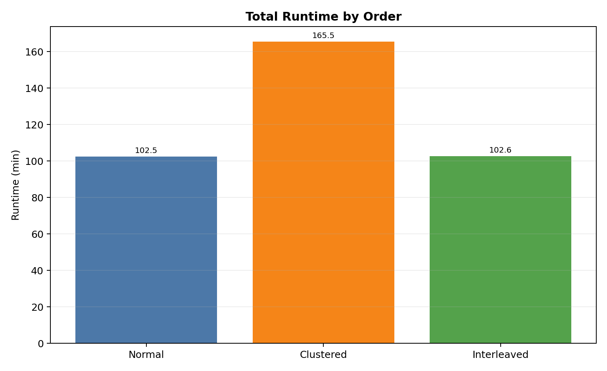

總 runtime 顯示 Clustered 明顯較久，主要是因為該 run 曾 resume，中間包含較長的 wall-clock 成本。Normal 和 Interleaved runtime 接近，表示 full 20-step pilot 在目前 `BATCH_SIZE=2048` 下成本可控。

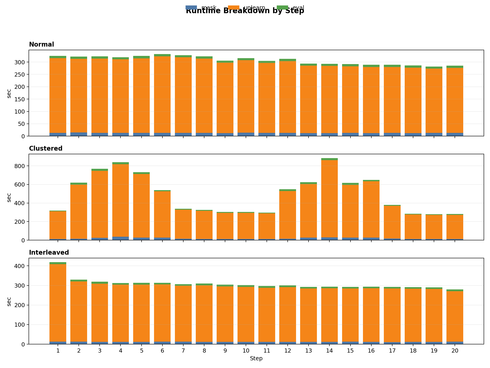

stacked runtime 圖顯示每一步主要成本來自 unlearn stage，mask 和 eval 相對很短。這對後續擴大實驗很有用：若要跑更多 seeds 或更多 classes，最佳化重點應該放在 unlearn training，而不是 evaluation。

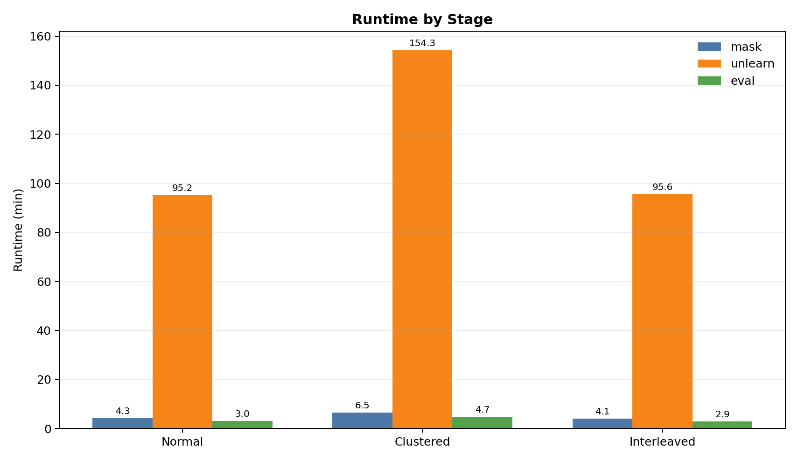

stage breakdown 進一步確認 unlearn 是主成本。由於 eval 已經使用較大 batch size，後續如果要縮短總時間，最有效的策略會是減少 unlearn epochs、調整 data loading，或只對特定 checkpoint 做更密集 eval。

## 12. Additional Tables

### Top post-forget maximum accuracy

| Order | Class | Max post-forget acc |
| --- | --- | --- |
| Normal | chimpanzee / 黑猩猩 (21) | 19.0 |
| Normal | bear / 熊 (3) | 18.0 |
| Normal | elephant / 大象 (31) | 13.0 |
| Normal | camel / 駱駝 (15) | 5.0 |
| Normal | cattle / 牛 (19) | 2.0 |
| Clustered | bear / 熊 (3) | 19.0 |
| Clustered | chimpanzee / 黑猩猩 (21) | 11.0 |
| Clustered | tiger / 老虎 (88) | 5.0 |
| Clustered | cattle / 牛 (19) | 2.0 |
| Clustered | elephant / 大象 (31) | 2.0 |
| Interleaved | bear / 熊 (3) | 18.0 |
| Interleaved | chimpanzee / 黑猩猩 (21) | 11.0 |
| Interleaved | hamster / 倉鼠 (36) | 6.0 |
| Interleaved | camel / 駱駝 (15) | 4.0 |
| Interleaved | fox / 狐狸 (34) | 2.0 |

這張表列出每條 order 中被忘後曾經回升最高的 classes。它比 immediate lag 更敏感，因為它抓的是後續 rebound，而不是當步 forgetting。從這張表可以看出，本次 failure signal 主要不是 newly forgotten class 忘不掉，而是少數 old forgotten classes 在後續被間接帶回。

## 13. Conclusion

本次 CIFAR-100 20-step ordered pilot 沒有達到原先期待的 immediate forgetting lag failure：三條 order 的 newly forgotten class 當步 accuracy 全部低於 `10%`，而且 worst case 只有 `2.0%`。這說明在目前 `ResNet-18 / seed 1 / RL-SalUn` 設定下，單步 class forgetting 對 CIFAR-100 animal classes 仍然非常有效。

但本次仍然提供了有價值的 failure hunting 訊號：`class 21` 在三條 order 中都出現 final residual，Normal 最明顯。這表示 sequential unlearning 的風險不一定表現在「當步忘不掉」，也可能表現在「已忘 class 在後續更新中局部 rebound」。因此後續報告應把 failure 分成兩類：immediate lag failure 與 post-forget rebound / residual failure。

從 retain-side baseline impact 來看，本次沒有證據顯示 unlearning 會造成其他 80 類的 final accuracy 全面下降。三條 order 的 final retain mean 都和 CIFAR-100 original baseline 相近甚至略高；比較需要注意的是個別 retain classes 的 transient drop，代表 sequential updates 仍可能短暫擾動 non-target classes。若後續要更精確評估 retain safety，應把 final retain accuracy 和 worst-step per-class drop 同時納入，而不是只看 aggregate retain accuracy。

若後續要更明顯地放大 failure，可以考慮更長的 sequence、更高混淆的 class subset、更多 seeds，或調整 unlearning strength；但在這次 pilot 中，最準確的結論是：**final cumulative forgetting 很好，immediate lag 沒有發生，少數 old forgotten classes 有可觀察的 rebound residual。**
