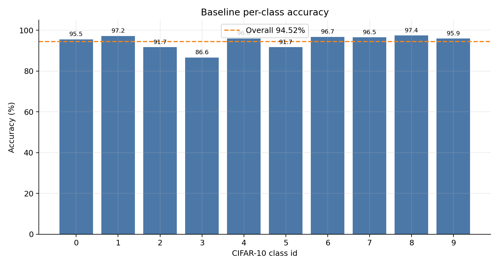
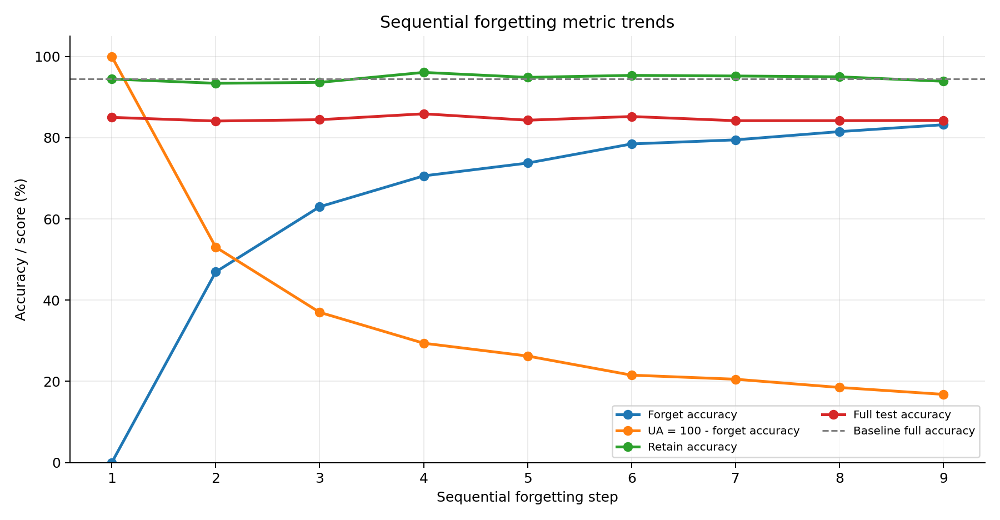
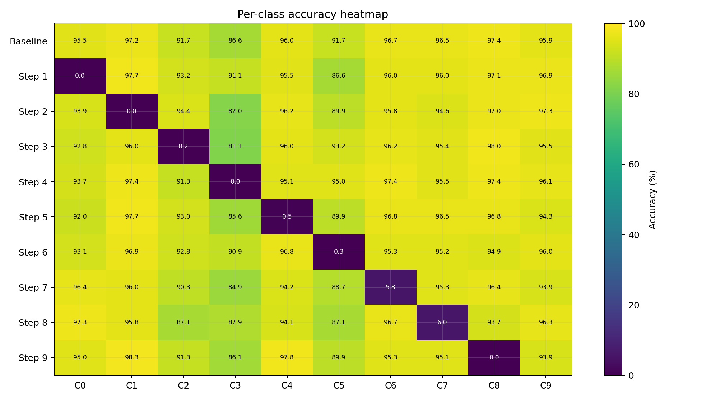
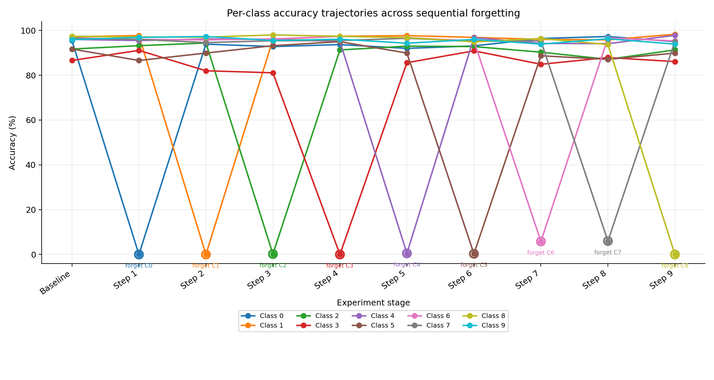
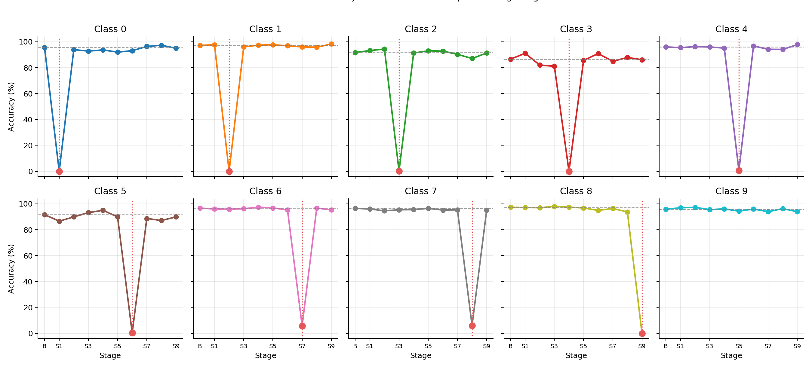
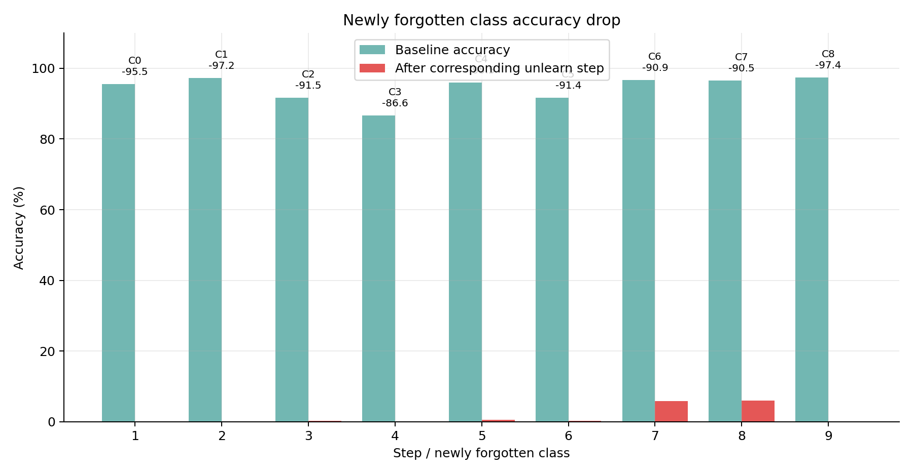
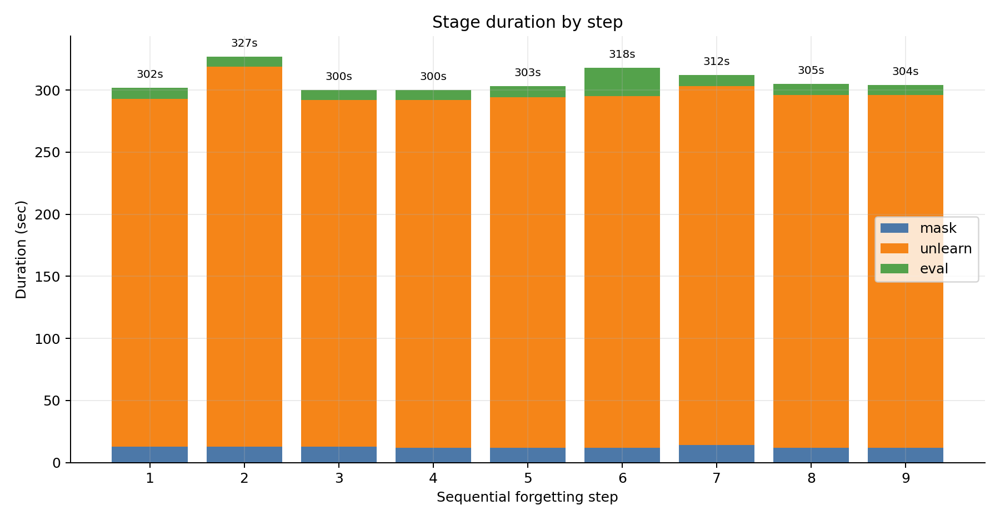
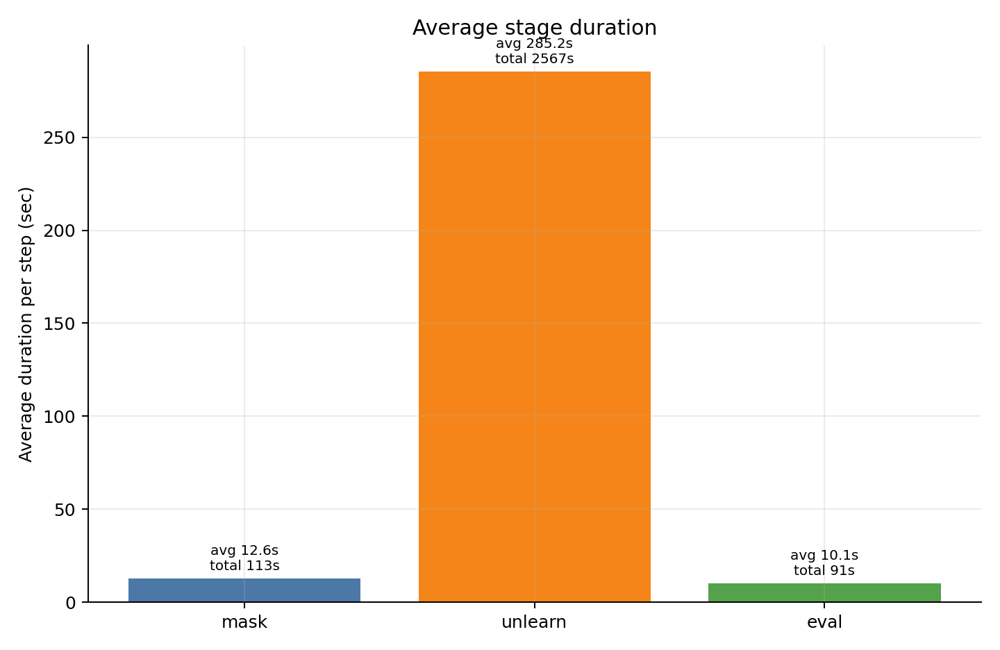

# CIFAR-10 ResNet-18 Sequential Class Forgetting 分析報告

## 1. 實驗摘要

本報告分析 `Unlearn-Saliency-original/Classification` 中完成的 `full_seed1_k9` sequential class forgetting 實驗。實驗使用 CIFAR-10、ResNet-18、seed 1，先訓練原始分類模型，再依序對 class `0` 到 class `8` 執行 SalUn/RL unlearning。每一步皆包含 `mask -> unlearn -> eval` 三個階段，並在該步結束後保存獨立 checkpoint 與評估 CSV。

本次實驗的 baseline 原始模型在 CIFAR-10 test set 上達到 `94.52%` full test accuracy。完整 sequential forgetting 共執行 9 個 step、27 個 stage，全部為 `success`。最後 step9 的模型累積忘記 class `0,1,2,3,4,5,6,7,8`，其 full test accuracy 為 `84.27%`，retain accuracy 為 `93.90%`，UA 為 `16.80%`。

需要特別注意的是，本實驗的 sequential 流程每一步是「接續上一個 checkpoint，針對新 class 產生 mask 並 unlearn」。評估中的 `forget_accuracy` 是目前所有 forgotten classes 的平均分類準確率。舊版流程的核心問題不是單步 unlearning 本身失效，而是資料流程設計沒有把已 forgotten data 永久排除在後續訓練之外，導致這些類別在後續 step 中又被模型重新學到。因此，累積 `forget_accuracy` 會上升、UA 會下降。這個現象是本次結果中最重要的觀察之一。

## 2. 實驗流程與可重現資訊

### 2.1 實驗設定

| 項目 | 設定 |
| --- | --- |
| Dataset | CIFAR-10 |
| Model | ResNet-18 |
| Seed | 1 |
| Unlearning method | RL / SalUn |
| Sequential steps | 9 |
| Forgotten class order | 0 -> 1 -> 2 -> 3 -> 4 -> 5 -> 6 -> 7 -> 8 |
| Mask epochs | 1 |
| Unlearn epochs per step | 10 |
| Batch size | 256 |
| GPU | 0 |

### 2.2 主要輸入與輸出路徑

| 類型 | 路徑 |
| --- | --- |
| 原始模型 best checkpoint | `results/original/cifar10_resnet18_seed1/0model_SA_best.pth.tar` |
| 原始模型訓練 log | `results/logs/original/train_seed1_182.log` |
| Baseline eval CSV | `results/eval/original/seed1_baseline.csv` |
| Baseline eval log | `results/logs/original/eval_seed1_baseline.log` |
| Sequential console log | `results/logs/sequential/full_seed1_k9/console.log` |
| Sequential summary log | `results/logs/sequential/full_seed1_k9/summary.log` |
| Sequential progress CSV | `results/logs/sequential/full_seed1_k9/progress.csv` |
| GPU monitor CSV | `results/logs/sequential/full_seed1_k9/gpu_monitor.csv` |
| 最終 step9 checkpoint | `results/unlearn/sequential/seed1/step9_forgot_0_1_2_3_4_5_6_7_8/RLcheckpoint.pth.tar` |
| 最終 step9 eval CSV | `results/eval/sequential/seed1_step9_forgot_0_1_2_3_4_5_6_7_8.csv` |

### 2.3 Sequential 流程

每個 step 執行三個 stage：

1. `mask`：依據目前模型與新目標 class 產生 saliency mask。
2. `unlearn`：使用 `main_random.py --unlearn RL` 進行 10 epochs unlearning。
3. `eval`：使用 evaluation script 對當前 checkpoint 做累積 forgotten classes 與 retain classes 的測試集評估。

每一步均保存獨立 checkpoint，例如：

```text
results/unlearn/sequential/seed1/step1_forgot_0/RLcheckpoint.pth.tar
results/unlearn/sequential/seed1/step2_forgot_0_1/RLcheckpoint.pth.tar
...
results/unlearn/sequential/seed1/step9_forgot_0_1_2_3_4_5_6_7_8/RLcheckpoint.pth.tar
```

## 3. Baseline 分析

原始模型 full test accuracy 為 `94.52%`。各類別 accuracy 如下：

| Class | Baseline accuracy (%) |
| --- | --- |
| class 0 | 95.5 |
| class 1 | 97.2 |
| class 2 | 91.7 |
| class 3 | 86.6 |
| class 4 | 96.0 |
| class 5 | 91.7 |
| class 6 | 96.7 |
| class 7 | 96.5 |
| class 8 | 97.4 |
| class 9 | 95.9 |



Baseline 中 class 3 與 class 5 的準確率相對較低，分別為 `86.6%` 與 `91.7%`；class 8、class 1、class 6 則相對較高。此 baseline 可作為後續判斷「是否因 unlearning 造成額外保留類別損傷」的比較基準。

## 4. Sequential Forgetting 整體趨勢

下表整理 step1 到 step9 的主要評估指標：

| Step | Forgotten classes | Forget acc (%) | UA (%) | Retain acc (%) | Full test acc (%) |
| --- | --- | --- | --- | --- | --- |
| 1 | 0 | 0.00 | 100.00 | 94.46 | 85.01 |
| 2 | 0,1 | 46.95 | 53.05 | 93.40 | 84.11 |
| 3 | 0,1,2 | 63.00 | 37.00 | 93.63 | 84.44 |
| 4 | 0,1,2,3 | 70.60 | 29.40 | 96.08 | 85.89 |
| 5 | 0,1,2,3,4 | 73.76 | 26.24 | 94.86 | 84.31 |
| 6 | 0,1,2,3,4,5 | 78.47 | 21.53 | 95.35 | 85.22 |
| 7 | 0,1,2,3,4,5,6 | 79.47 | 20.53 | 95.20 | 84.19 |
| 8 | 0,1,2,3,4,5,6,7 | 81.50 | 18.50 | 95.00 | 84.20 |
| 9 | 0,1,2,3,4,5,6,7,8 | 83.20 | 16.80 | 93.90 | 84.27 |



### 4.1 Retain accuracy

Retain accuracy 在多數 step 中維持於 `93%` 到 `96%` 區間，最高出現在 step 4，為 `96.08%`。這表示 sequential unlearning 並未明顯破壞尚未被納入 forgotten set 的類別辨識能力。最後 step9 retain set 只剩 class 9，retain accuracy 仍為 `93.90%`，相對 baseline class 9 accuracy `95.9%` 下降約 `2.0%`。

### 4.2 Full test accuracy

Full test accuracy 從 baseline `94.52%` 下降至 step9 `84.27%`。這個下降是預期現象，因為 full test set 仍包含被遺忘類別；當被遺忘類別越多，整體 accuracy 會被 forgotten set 的低準確率拉低。整體最低 full test accuracy 出現在 step 2，為 `84.11%`。

### 4.3 UA 與 cumulative forget accuracy

step1 的 UA 為 `100.00%`，代表 class 0 在第一步後幾乎完全無法被正確分類。然而，隨著後續 step 依序遺忘新 class，累積 forgotten classes 的 `forget_accuracy` 逐步上升，UA 逐步下降。這表示早期 forgotten classes 並未在後續訓練中被持續壓制；更精確地說，舊版流程的資料設計又把已 forgotten data 帶回後續訓練，使模型在後續 step 中出現對先前 forgotten class 的 recovery。

因此，本次 sequential setting 的結果不應只看 step9 的 UA，也應看每一步 newly forgotten class 在當步是否成功下降，以及早期 forgotten class 在後續是否恢復。

## 5. 每類別準確率分析

下圖顯示 baseline 與每個 step 後 class 0 到 class 9 的 accuracy heatmap。深色低值區塊對應當步新遺忘 class 的 accuracy 下降。




除了 heatmap 之外，下圖將每一個類別的 accuracy 畫成隨實驗階段變化的軌跡。橫軸從 baseline 開始，接著是 step1 到 step9；圖中的空心標記表示該類別第一次被指定為 forgotten class 的位置。這張圖更直接呈現「當步下降」與「後續 recovery」兩個現象。



為了避免 10 條線重疊造成閱讀負擔，下面也提供每個 class 獨立小圖。紅色垂直線表示該 class 被遺忘的 step；灰色虛線表示 baseline accuracy。



### 5.1 Newly forgotten class 的當步下降

| Step | Newly forgotten class | Baseline acc (%) | After-step acc (%) | Drop (%) |
| --- | --- | --- | --- | --- |
| 1 | class 0 | 95.5 | 0.0 | 95.5 |
| 2 | class 1 | 97.2 | 0.0 | 97.2 |
| 3 | class 2 | 91.7 | 0.2 | 91.5 |
| 4 | class 3 | 86.6 | 0.0 | 86.6 |
| 5 | class 4 | 96.0 | 0.5 | 95.5 |
| 6 | class 5 | 91.7 | 0.3 | 91.4 |
| 7 | class 6 | 96.7 | 5.8 | 90.9 |
| 8 | class 7 | 96.5 | 6.0 | 90.5 |
| 9 | class 8 | 97.4 | 0.0 | 97.4 |



從 newly forgotten class 的角度看，每一步皆能讓新目標 class 的 accuracy 大幅下降到接近 0%。例如 class 0 在 step1 從 `95.5%` 降至 `0.0%`，class 3 在 step4 從 `86.6%` 降至 `0.0%`，class 8 在 step9 從 `97.4%` 降至 `0.0%`。這說明單步針對新 class 的 unlearning 是有效的。

### 5.2 早期 forgotten class 的 recovery 現象

| Class | Accuracy at forgotten step (%) | Final step9 accuracy (%) | Max after forgotten (%) | Final - immediate (%) |
| --- | --- | --- | --- | --- |
| class 0 | 0.0 | 95.0 | 97.3 | 95.0 |
| class 1 | 0.0 | 98.3 | 98.3 | 98.3 |
| class 2 | 0.2 | 91.3 | 93.0 | 91.1 |
| class 3 | 0.0 | 86.1 | 90.9 | 86.1 |
| class 4 | 0.5 | 97.8 | 97.8 | 97.3 |
| class 5 | 0.3 | 89.9 | 89.9 | 89.6 |
| class 6 | 5.8 | 95.3 | 96.7 | 89.5 |
| class 7 | 6.0 | 95.1 | 95.1 | 89.1 |
| class 8 | 0.0 | 0.0 | 0.0 | 0.0 |

上表顯示，許多早期 forgotten classes 在後續 step 中恢復到高 accuracy。例如 class 0 在 step1 被降至 `0.0%`，但 final step9 回到 `95.0%`；class 1 在 step2 被降至 `0.0%`，final step9 回到 `98.3%`。這不只是因為「每一步只針對新 class 產生 mask 並 unlearn」，更關鍵的是舊版流程沒有把已 forgotten data 永久排除，後續 step 又把它們放回訓練 / retain 流程，導致對先前 forgotten classes 的遺忘約束被抵消。

這個現象也解釋了為什麼 cumulative `forget_accuracy` 會從 step1 的 `0.0%` 上升到 step9 的 `83.20%`。最後 step9 的 `forgotten_classes` 包含 0 到 8，但其中 class 8 是當步新遺忘目標，accuracy 為 `0.0%`；其他早期 forgotten classes 多數已恢復到高 accuracy，因此累積平均 forget accuracy 仍高達 `83.20%`。

### 5.3 Retain class 9

class 9 在整個 sequential run 中從未被納入 forgotten set，因此可作為 retain 類別參考。baseline class 9 accuracy 為 `95.9%`，step9 class 9 accuracy 為 `93.9%`。兩者差距約 `2.0%`，表示最終保留類別仍維持接近原始模型的分類能力。

## 6. 執行時間與效率分析

本次 sequential forgetting 共 27 個 stage，全部 success。總耗時 `2771 秒`，約 `46.18 分鐘`；平均每個 step 約 `307.89 秒`。

### 6.1 每步耗時

| Step | Mask (sec) | Unlearn (sec) | Eval (sec) | Total (sec) |
| --- | --- | --- | --- | --- |
| 1 | 13 | 280 | 9 | 302 |
| 2 | 13 | 306 | 8 | 327 |
| 3 | 13 | 279 | 8 | 300 |
| 4 | 12 | 280 | 8 | 300 |
| 5 | 12 | 282 | 9 | 303 |
| 6 | 12 | 283 | 23 | 318 |
| 7 | 14 | 289 | 9 | 312 |
| 8 | 12 | 284 | 9 | 305 |
| 9 | 12 | 284 | 8 | 304 |



### 6.2 Stage 類型耗時

| Stage | Total duration (sec) | Average per step (sec) | Share (%) |
| --- | --- | --- | --- |
| mask | 113 | 12.56 | 4.1 |
| unlearn | 2567 | 285.22 | 92.6 |
| eval | 91 | 10.11 | 3.3 |



從耗時分布可見，`unlearn` 是主要成本，占整體執行時間約 `92.6%`。相較之下，mask 產生平均每步約 `12.56 秒`，eval 平均每步約 `10.11 秒`，兩者皆遠小於 unlearn。因此後續若要改善實驗效率，最主要的優化方向會是 unlearn epochs、learning rate schedule、或資料載入與 GPU utilization，而非 eval 或 mask 階段。

## 7. 結論

本次實驗可以得到三個主要結論：

1. 單步 class forgetting 有效：每個 newly forgotten class 在對應 step 後都被大幅壓低，通常接近 `0%` accuracy。
2. Retain 能力大致穩定：未被遺忘的類別在各 step 後大多維持 `93%` 到 `96%` retain accuracy，final retain class 9 也仍有 `93.90%`。
3. Sequential cumulative forgetting 不穩定：早期 forgotten classes 在後續 step 中明顯 recovery，使 cumulative forget accuracy 上升、UA 下降。final step9 的 UA 僅 `16.80%`，主要原因不是當步 class 8 遺忘失敗，而是舊版資料流程又把先前已 forgotten data 帶回後續訓練，使 class 0 到 class 7 多數恢復高 accuracy。

因此，若研究目標是「每一步只忘掉最新 class，且允許前面 class 恢復」，目前流程可視為成功；但若目標是「累積忘記所有先前 requested classes」，那麼舊版 sequential 的資料流程設計就是錯的，因為它沒有把已 forgotten data 永久排除。此時 sequential 策略需要修改，例如在每一步 unlearning 時同時納入所有已 forgotten classes、維持歷史 forget set 的約束，或直接採用不再讓舊 forgotten data 回到後續訓練的設計。

## 8. 限制與後續建議

本報告有以下限制：

- 目前只有 single seed，缺乏跨 seed 平均與變異分析。
- 評估只有 accuracy 類指標，沒有 confusion matrix 或 sample-level prediction，無法分析模型把 forgotten class 錯分到哪些類別。
- 目前只分析 RL / SalUn，沒有與 retrain、FT、GA、wfisher 等方法比較。
- 現有 sequential 流程每一步針對新 class unlearn，並未顯式維持歷史 forgotten classes 的遺忘狀態。

後續建議：

- 增加 multi-seed 實驗，報告平均值與標準差。
- 增加 cumulative-forget training objective，讓每一步同時壓制所有已 forgotten classes。
- 補上 confusion matrix 或 prediction dump，以分析 forgotten class recovery 的錯誤模式。
- 與 retrain、FT、GA、wfisher 等 baseline 做相同 sequential setting 比較。
- 補 MIA 或 SVC-MIA 指標，評估資料層面的忘卻效果。

## 9. 附錄：重要檔案清單

| 類型 | 路徑 |
| --- | --- |
| 本報告 | `full_seed1_k9_analysis.md` |
| 圖表目錄 | `full_seed1_k9_analysis_figures/` |
| Baseline CSV | `results/eval/original/seed1_baseline.csv` |
| Final step CSV | `results/eval/sequential/seed1_step9_forgot_0_1_2_3_4_5_6_7_8.csv` |
| Progress CSV | `results/logs/sequential/full_seed1_k9/progress.csv` |
| Summary log | `results/logs/sequential/full_seed1_k9/summary.log` |
| Console log | `results/logs/sequential/full_seed1_k9/console.log` |
| Final checkpoint | `results/unlearn/sequential/seed1/step9_forgot_0_1_2_3_4_5_6_7_8/RLcheckpoint.pth.tar` |
