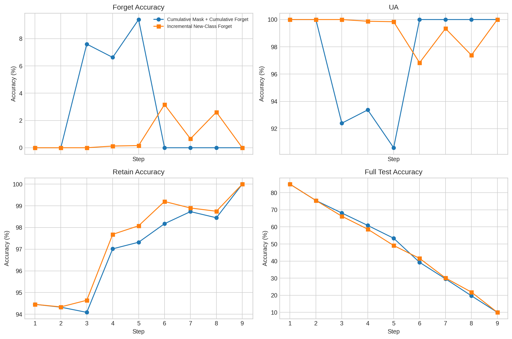
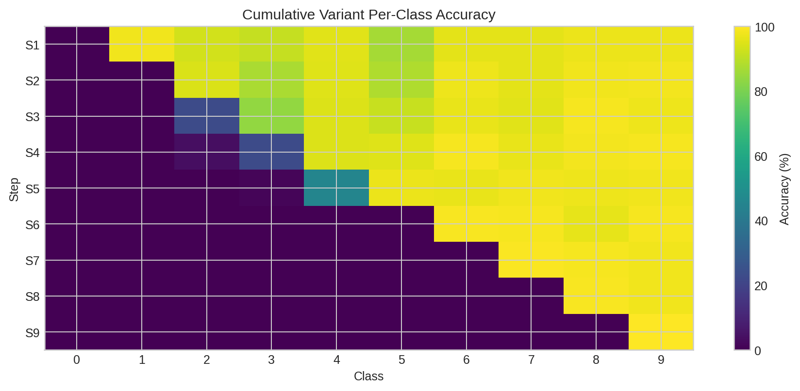
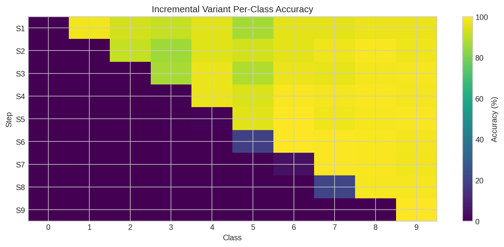
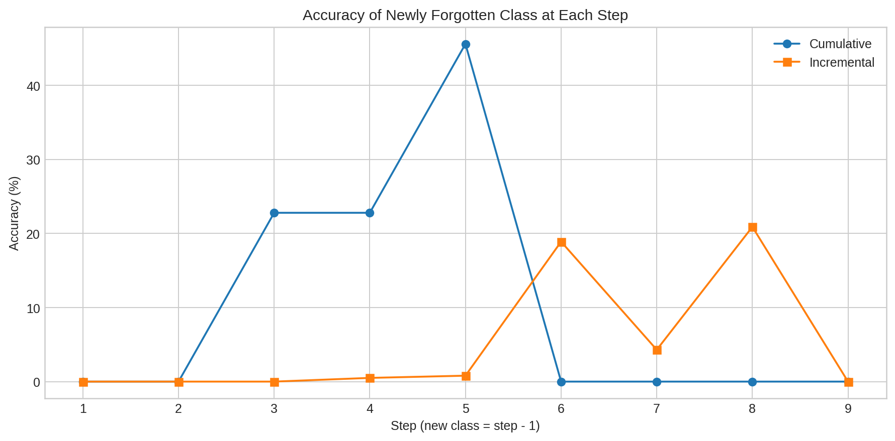
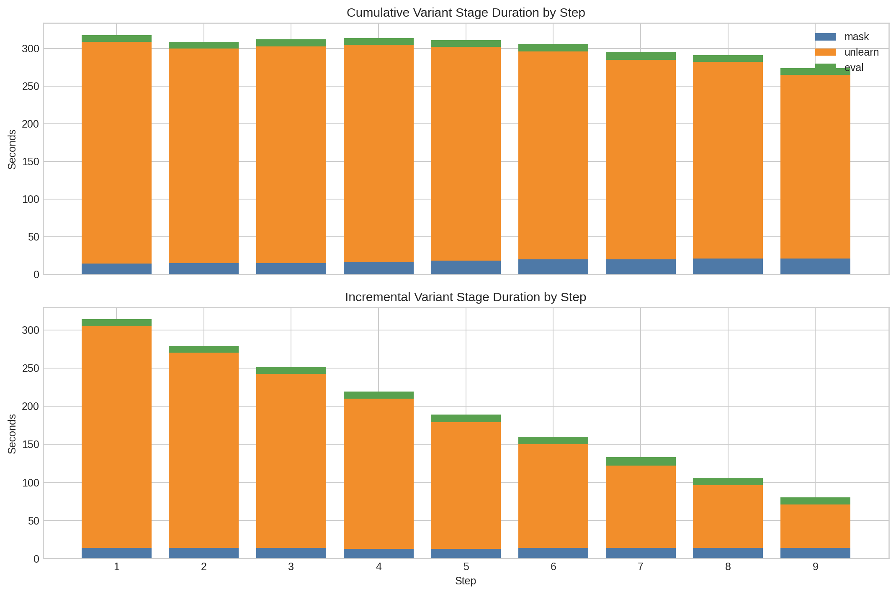
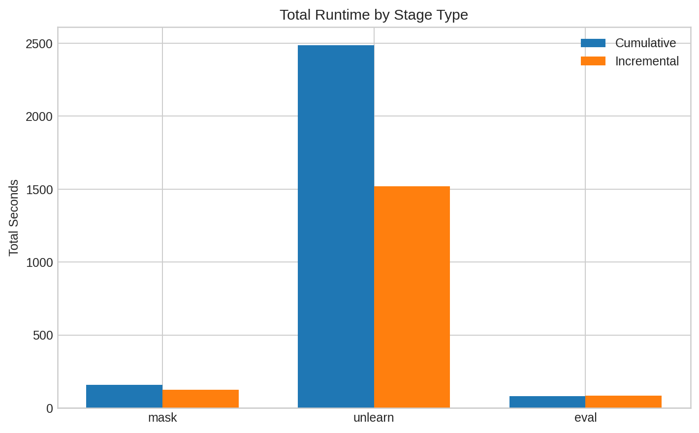
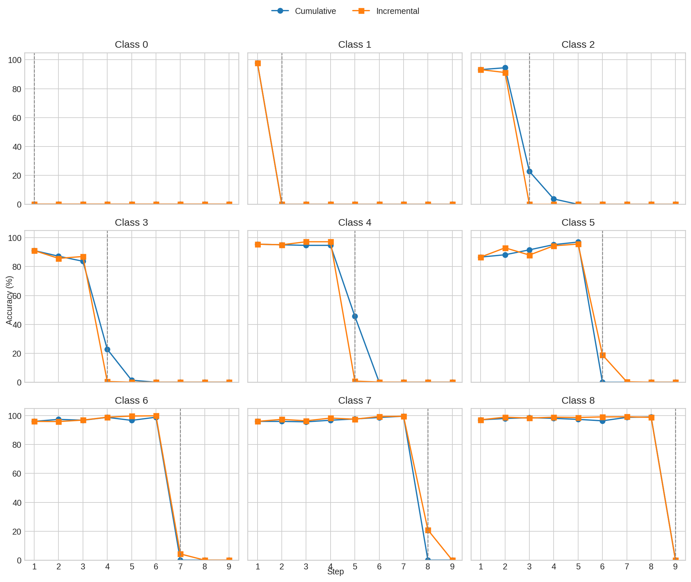
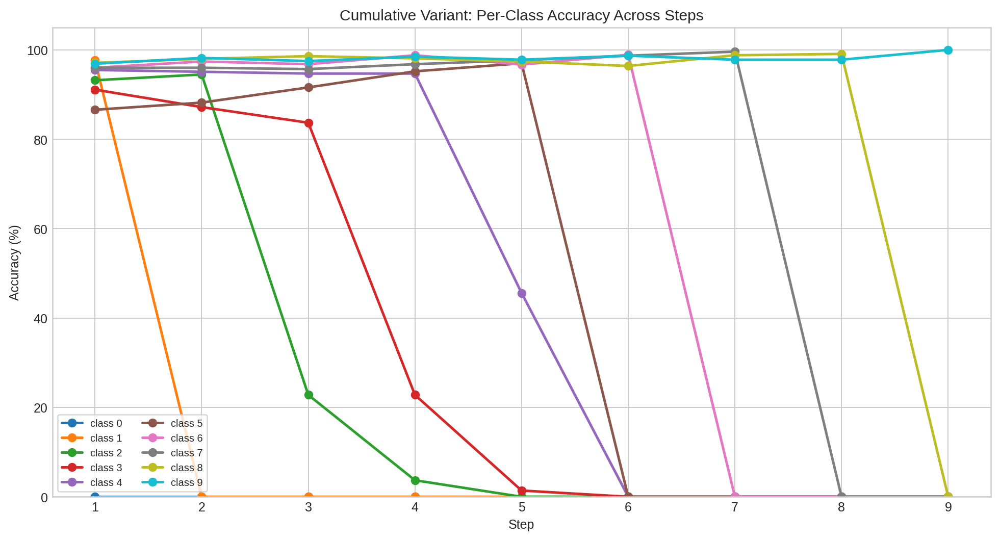
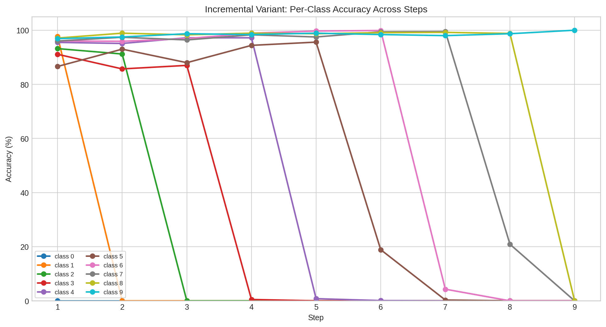

# Sequential Forgetting 修正版實驗比較報告

## 1. 報告目的

本報告比較剛完成的兩個修正版 sequential class forgetting 實驗：

1. `cumulative_mask_seed1_k9`
2. `incremental_newclass_seed1_k9`

兩者都以同一個 baseline 模型為起點：

- baseline model: `results/original/cifar10_resnet18_seed1/0model_SA_best.pth.tar`
- baseline eval: `results/eval/original/seed1_baseline.csv`

本次比較的核心問題是：

- 在 sequential forgetting 過程中，舊 forgotten classes 是否會被後續步驟學回來？
- 如果修正這個問題，不同訓練策略在遺忘效果、保留能力與執行時間上有什麼差異？

## 2. 實驗設定

### 2.1 共同設定

- Dataset: CIFAR-10
- Architecture: ResNet-18
- Seed: 1
- `MAX_K=9`
- 每個 step 都執行：
  - `mask`
  - `unlearn`
  - `eval`
- `UNLEARN_EPOCHS=10`
- `MASK_EPOCHS=1`

### 2.2 實驗 A：Cumulative Mask + Cumulative Forget

- Run ID: `cumulative_mask_seed1_k9`
- Log: `results/logs/sequential_cumulative/cumulative_mask_seed1_k9/`
- Eval CSV: `results/eval/sequential_cumulative/cumulative/`

這個版本在每一步都把「目前累積 forgotten classes」放進 forget optimization 目標。

例如 step 4：

- forget set = `{0,1,2,3}`
- retain set = `{4,5,6,7,8,9}`

### 2.3 實驗 B：Incremental New-Class Forget

- Run ID: `incremental_newclass_seed1_k9`
- Log: `results/logs/sequential_incremental/incremental_newclass_seed1_k9/`
- Eval CSV: `results/eval/sequential_incremental/newclass_mask/`

這個版本是依照修正後的主線設計：

- 當步只對新 class 做 forget training
- 舊 forgotten classes 完全不再進入任何 train loader
- 評估仍採 cumulative evaluation

例如 step 4：

- forget set = `{3}`
- retain set = `{4,5,6,7,8,9}`
- excluded old forgotten = `{0,1,2}`

這正是為了避免舊版流程中「舊 forgotten classes 被重新放回訓練資料」的問題。

## 3. 主要結論

### 3.1 兩個修正版都成功修掉了舊版的 relearning 問題

舊版 `full_seed1_k9` 的問題，是 step 2 之後舊 forgotten classes 會被重新放回 retain/train，因此 class 0、class 1 會被學回來。

這次兩個修正版都沒有出現這個現象。

尤其在 incremental 版本中：

- step 2 後 `class_0_accuracy = 0.0`
- step 3 後 `class_0/1/2_accuracy = 0.0`

代表舊 forgotten classes 沒有因為後續步驟而恢復。

### 3.2 若只看遺忘強度，cumulative 版本通常更穩、更乾淨

cumulative 版本會在後續步驟持續對所有 forgotten classes 施壓，因此中後期的 cumulative `forget_accuracy` 更容易直接壓到 `0.0`。

例如：

- step 6: cumulative `forget_accuracy = 0.0`
- step 7: cumulative `forget_accuracy = 0.0`
- step 8: cumulative `forget_accuracy = 0.0`

incremental 版本則會出現少量殘留：

- step 6: incremental `forget_accuracy = 3.17`
- step 7: incremental `forget_accuracy = 0.66`
- step 8: incremental `forget_accuracy = 2.61`

這是合理的，因為 incremental 設計本來就不會再回頭訓練舊 forgotten classes。

### 3.3 若只看效率與是否符合需求，incremental 版本更適合作為主線方案

incremental 版本最大的優勢是：

1. 完全符合「舊 forgotten classes 不再參與後續訓練」的設計要求
2. 執行時間顯著較短

總耗時比較：

- cumulative: `2730s`，約 `45.50 分鐘`
- incremental: `1731s`，約 `28.85 分鐘`

也就是 incremental 大約少了：

- `999s`
- 約 `16.65 分鐘`
- 約 `36.6%` 的總時間

### 3.4 step 9 的最終結果不能只看 full accuracy

在 step 9 時，retained class 只剩下 `class 9`。

因此：

- `retain_accuracy = 100.0`
- `full_test_accuracy = 10.0`

這不是模型「壞掉」，而是因為測試集裡有 10 個類別，而其中 9 個已被設計為 forgotten classes。  
所以最終 `full_test_accuracy` 幾乎必然接近 `10%`。

## 4. 指標總覽

### 4.1 baseline 參考

- baseline `full_test_accuracy = 94.52`
- baseline `class_9_accuracy = 95.9`

### 4.2 各 step 關鍵指標比較

| Step | Cum Forget Acc | Inc Forget Acc | Cum UA | Inc UA | Cum Retain Acc | Inc Retain Acc | Cum Full Acc | Inc Full Acc |
|---|---:|---:|---:|---:|---:|---:|---:|---:|
| 1 | 0.00 | 0.00 | 100.00 | 100.00 | 94.46 | 94.46 | 85.01 | 85.01 |
| 2 | 0.00 | 0.00 | 100.00 | 100.00 | 94.33 | 94.34 | 75.46 | 75.47 |
| 3 | 7.60 | 0.00 | 92.40 | 100.00 | 94.09 | 94.64 | 68.14 | 66.25 |
| 4 | 6.62 | 0.12 | 93.38 | 99.88 | 97.02 | 97.68 | 60.86 | 58.66 |
| 5 | 9.40 | 0.16 | 90.60 | 99.84 | 97.32 | 98.08 | 53.36 | 49.12 |
| 6 | 0.00 | 3.17 | 100.00 | 96.83 | 98.18 | 99.20 | 39.27 | 41.58 |
| 7 | 0.00 | 0.66 | 100.00 | 99.34 | 98.73 | 98.90 | 29.62 | 30.13 |
| 8 | 0.00 | 2.61 | 100.00 | 97.39 | 98.45 | 98.75 | 19.69 | 21.84 |
| 9 | 0.00 | 0.00 | 100.00 | 100.00 | 100.00 | 100.00 | 10.00 | 10.00 |

觀察上可以分成兩段：

- `step 1-5`：incremental 的 forget accuracy 幾乎都更低
- `step 6-8`：cumulative 開始顯示更強的「持續壓制舊 forgotten classes」能力

## 5. 圖表分析

### 5.1 指標趨勢總覽

圖 1 可以看到：

- 兩個版本在 step 1、2 幾乎相同
- incremental 在 step 3、4、5 的 forgetting 指標更漂亮
- cumulative 在 step 6、7、8 反而更穩，forget accuracy 直接回到 `0`
- retain accuracy 兩者都維持很高，且後期都上升到接近 `100`
- full test accuracy 隨 step 遞減，這是 cumulative forgetting 設計下的正常結果

### 5.2 cumulative 版本的 per-class heatmap

這張圖最清楚的特徵是：

- 已 forgotten 的 class 在後續 step 中會持續被壓低
- 到 step 6 之後，前面 forgotten classes 幾乎全部變成 `0`

換句話說，cumulative 版本靠「反覆處理舊 forgotten classes」換來更徹底的 forgetting。

### 5.3 incremental 版本的 per-class heatmap

這張圖則展示另一種行為：

- 已 forgotten 的 class 大多數時候不會恢復
- 但某些 class 會留下少量殘值，再到更後面的步驟才被完全壓到 `0`

例如：

- step 6 時 `class 5` 還有 `18.9`
- step 8 時 `class 7` 還有 `20.9`

這正反映 incremental 設計的本質：它不會重新優化舊 forgotten classes，因此不會像 cumulative 那樣每一步都持續把舊 class 往下壓。

### 5.4 每一步新 forgotten class 的立即效果

這張圖只看「當步新 class」的 accuracy。

結論是：

- 兩個版本在新 class 的當步遺忘都很有效
- incremental 在多數步驟上更快把新 class 壓到接近 `0`
- cumulative 在中段某些步驟會保留較多殘值，例如 step 3 到 step 5

這說明 cumulative 並不是每一步對「新 class」都更強，它的優勢主要體現在「累積 forgotten classes 的整體維持」。

### 5.5 執行時間比較

可以很直接地看到：

- 最花時間的永遠是 `unlearn`
- `mask` 和 `eval` 的成本都很小
- incremental 版本在 step 越往後時會越快，因為 retain set 持續縮小

總時間：

- cumulative `45.50 分鐘`
- incremental `28.85 分鐘`

其中 `unlearn` 本身就差了約：

- cumulative `41.45 分鐘`
- incremental `25.35 分鐘`

### 5.6 各類別軌跡比較

這張圖最值得看的是：

- 每個子圖中的灰色虛線，表示該 class 被指定為當步新 forgotten class 的時刻
- incremental 版本在灰線附近通常會很快下降
- cumulative 版本在某些類別上下降較慢，但一旦進入更後段，會持續把舊類別壓到更接近 `0`

所以兩者的差異不是「誰有沒有忘掉」，而是：

- incremental：忘得快，而且不重新使用舊 forgotten data
- cumulative：忘得更反覆、更徹底，但成本更高

### 5.7 你要的圖：x 軸是 step，y 軸是各 class 準確率

下面這兩張圖都是同一種讀法：

- x 軸：`step 1 ~ step 9`
- y 軸：`accuracy (%)`
- 每一條線：一個 class 的準確率變化

#### Cumulative 版本

這張圖適合看 cumulative 版本中，舊 forgotten classes 是如何被持續往下壓。  
例如 class 0、1、2 在前幾步下降後，後續基本維持在接近 `0` 的位置。

#### Incremental 版本

這張圖則更適合看 incremental 版本的特性：

- 當步新 class 會快速下降
- 舊 forgotten classes 不會明顯回彈
- 但某些 class 可能在中後段保留一點殘值，之後再掉到接近 `0`

如果你只是想快速看「每個 class 在每個 step 的準確率怎麼變」，這兩張圖會比 heatmap 更直觀。

## 6. 執行時間與資源成本

### 6.1 總耗時

| Experiment | Total Time (sec) | Total Time (min) |
|---|---:|---:|
| Cumulative | 2730 | 45.50 |
| Incremental | 1731 | 28.85 |

### 6.2 stage 耗時

| Experiment | Mask (sec) | Unlearn (sec) | Eval (sec) |
|---|---:|---:|---:|
| Cumulative | 160 | 2487 | 83 |
| Incremental | 124 | 1521 | 86 |

### 6.3 解讀

- `eval` 幾乎一樣，因為兩者都要跑同一個 cumulative evaluation
- `mask` 差異不大
- 主要差異來自 `unlearn`
- incremental 因 retain set 持續縮小，所以後期步驟非常快

## 7. 如何解讀兩個版本的優劣

### 7.1 若重點是「嚴格遵守設計要求」

應該選 **incremental**。

原因：

- 舊 forgotten classes 完全不再進 train loader
- 完全符合你原先要求的流程定義
- 不會發生舊版那種 obvious relearning 問題
- 執行速度更快

### 7.2 若重點是「把累積 forgotten classes 壓到最乾淨」

應該選 **cumulative**。

原因：

- 會反覆對舊 forgotten classes 進行優化
- 在 step 6 到 step 8 對 cumulative forgetting 的維持更穩
- 中後段 cumulative `forget_accuracy` 更容易維持在 `0.0`

### 7.3 實際建議

如果你的研究問題是：

> 每一步之後，舊 forgotten classes 不應再參與後續訓練。

那主線應該明確採用 **incremental new-class forget**，因為它和問題定義一致。

如果你的研究問題是：

> 如何讓累積 forgotten classes 在整個 sequential pipeline 裡維持最低 possible accuracy。

那 cumulative 版本會是更強的對照組。

## 8. 結論

這次兩個修正版實驗都成功修掉了舊版 sequential forgetting 的核心 bug：舊 forgotten classes 不再被後續步驟學回來。

但兩者的行為有明顯差異：

- **Cumulative**
  - 對累積 forgotten classes 的壓制更穩、更徹底
  - 時間成本較高
  - 不符合「舊 forgotten data 不再參與訓練」的最嚴格版本

- **Incremental**
  - 完全符合新的訓練規範
  - 計算成本顯著較低
  - forgetting 效果已經很好，但中後期對舊 forgotten classes 的 residual accuracy 略高於 cumulative

若後續要選一個版本當主報告主線，我會建議：

- **主線實驗：incremental**
- **輔助對照：cumulative**

這樣論述最完整，也最符合你一開始提出的問題意識。

## 9. 相關檔案路徑

### 9.1 Cumulative

- Logs: `results/logs/sequential_cumulative/cumulative_mask_seed1_k9/`
- Eval CSV: `results/eval/sequential_cumulative/cumulative/`
- Final CSV: `results/eval/sequential_cumulative/cumulative/seed1_step9_forgot_0_1_2_3_4_5_6_7_8.csv`

### 9.2 Incremental

- Logs: `results/logs/sequential_incremental/incremental_newclass_seed1_k9/`
- Eval CSV: `results/eval/sequential_incremental/newclass_mask/`
- Final CSV: `results/eval/sequential_incremental/newclass_mask/seed1_step9_forgot_0_1_2_3_4_5_6_7_8.csv`

### 9.3 圖表

- `sequential_comparison_analysis_figures/fig1_metric_trends_comparison.png`
- `sequential_comparison_analysis_figures/fig2_per_class_heatmap_cumulative.png`
- `sequential_comparison_analysis_figures/fig3_per_class_heatmap_incremental.png`
- `sequential_comparison_analysis_figures/fig4_newly_forgotten_accuracy_comparison.png`
- `sequential_comparison_analysis_figures/fig5_runtime_by_step_comparison.png`
- `sequential_comparison_analysis_figures/fig6_total_runtime_by_stage.png`
- `sequential_comparison_analysis_figures/fig7_class_trajectory_comparison.png`
- `sequential_comparison_analysis_figures/fig8_cumulative_class_accuracy_lines.png`
- `sequential_comparison_analysis_figures/fig9_incremental_class_accuracy_lines.png`
