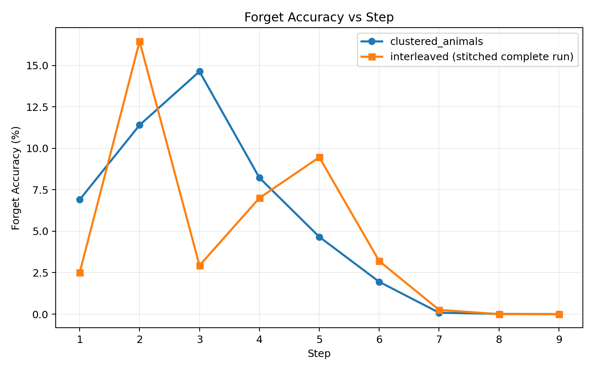
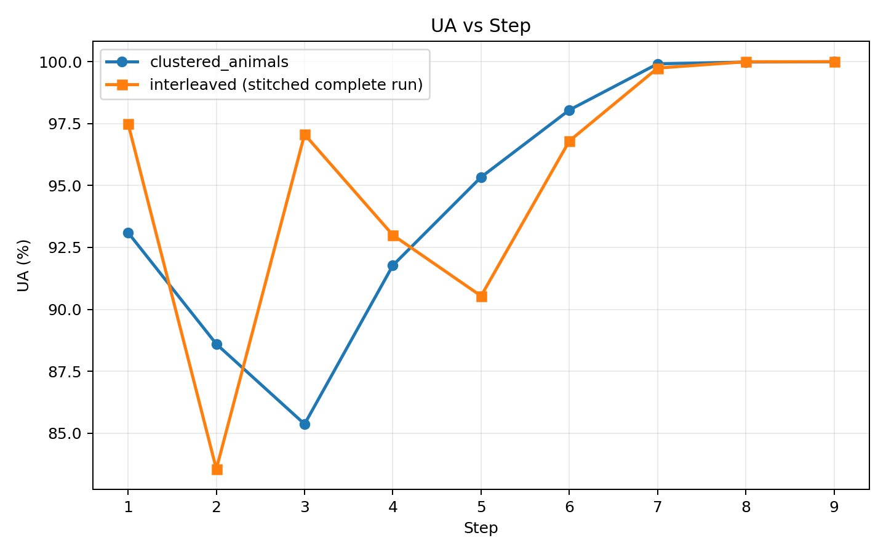
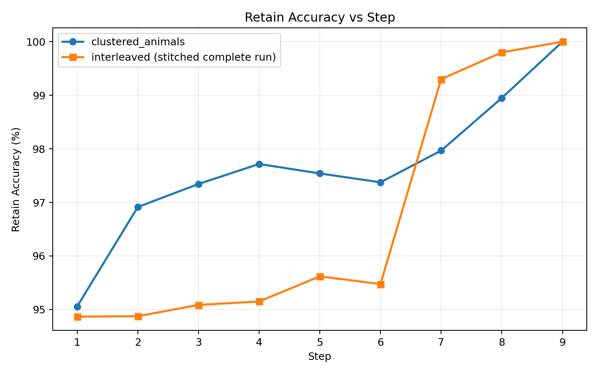
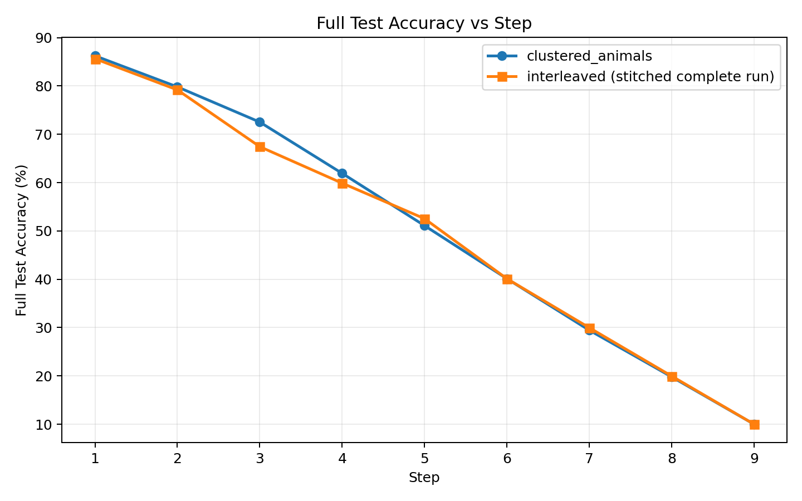
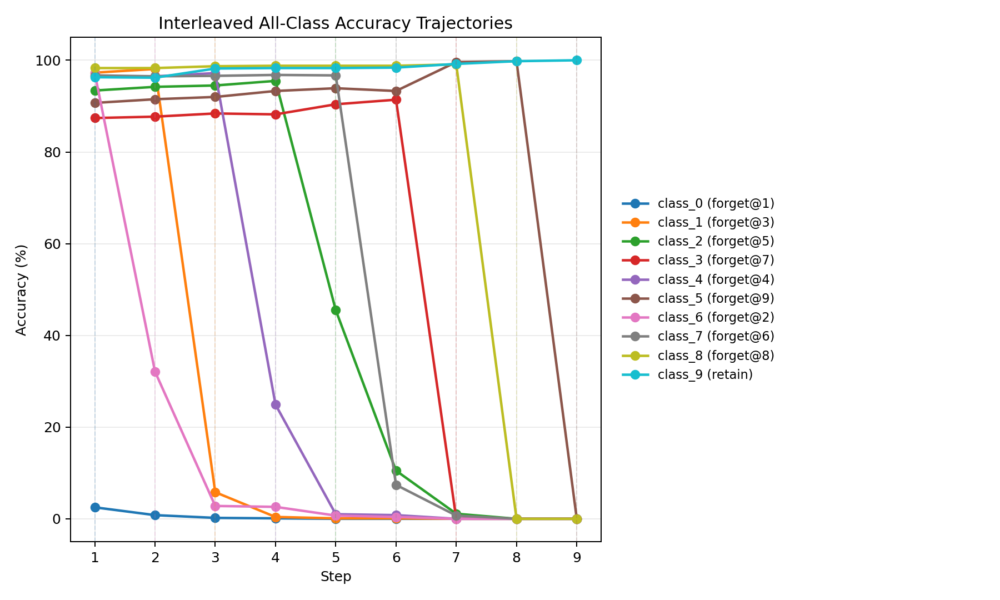
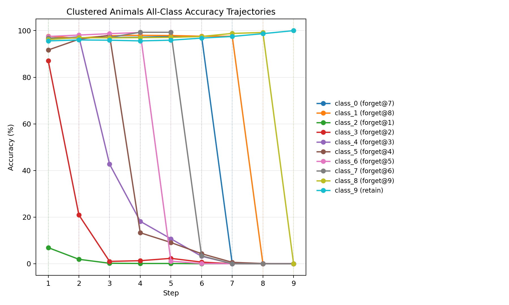
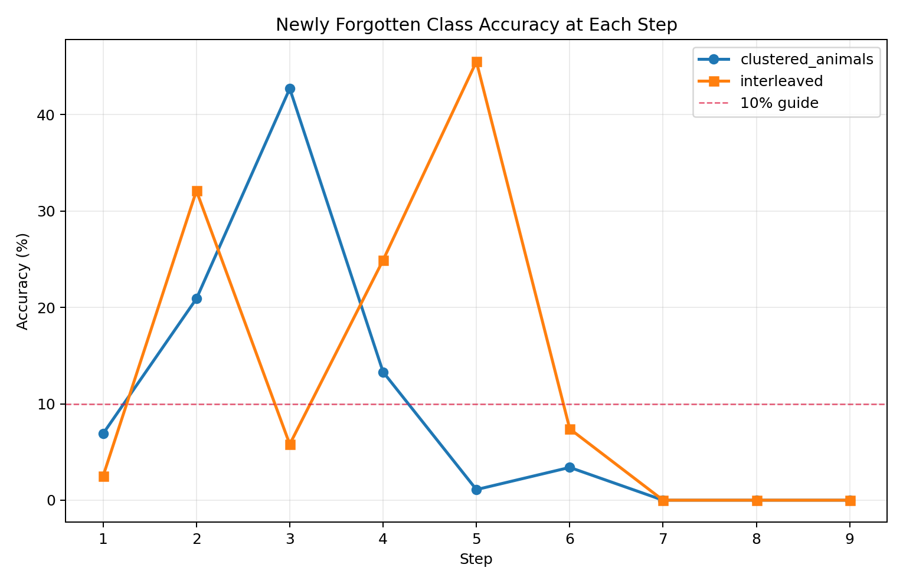
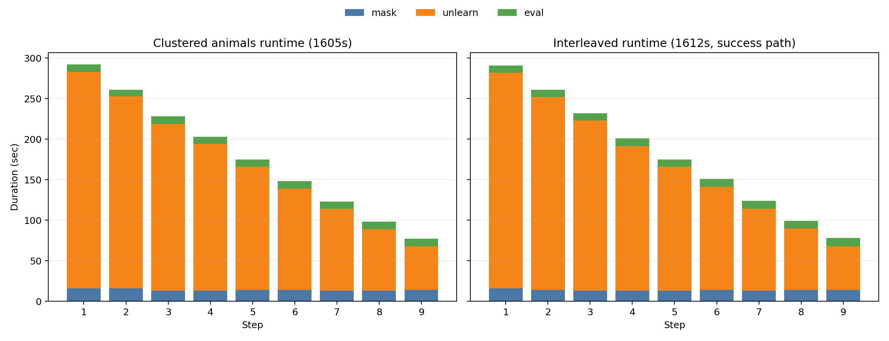

# Sequential Incremental Ordered 實驗分析

## 1. 實驗摘要

這份報告分析 `sequential_incremental_ordered` 主線下的兩個 forget order：

- `incremental_clustered_animals_seed1_k9`
- `incremental_interleaved_seed1_k9`

兩個 run 都沿用 `sequential_incremental` 的正確資料流程：

- 每一步只對當步新的 class 做 forget
- 舊 forgotten classes 不再回到後續 train loader
- evaluator 以 cumulative forgotten set 計算 `forget_accuracy`、`UA`、`retain_accuracy`、`full_test_accuracy`

和上一版不同的是，這次 `interleaved` 已經透過 `incremental_interleaved_seed1_k9_resume_from_step6` 補齊 `step6-9`。因此本報告採用 stitched complete trajectory：

- `step1-5`：來自原始 `sequential_incremental_ordered` run
- `step6-9`：來自 `sequential_incremental_ordered_resume` 補跑結果

本次要回答的問題是：

1. 在正確 incremental data flow 下，`clustered_animals` 和 `interleaved` 的完整 forgetting trajectory 有什麼差異？
2. 兩個 order 是否都能收斂到最終完整 forgetting？
3. 和主線的正常順序 incremental 相比，這兩個 ordered variants 到底改善了什麼、又失去了什麼？
4. 它們的 trade-off 主要落在 forgetting 收斂型態，還是 retain / runtime？

## 2. 分析對象、實驗流程與差異

### 2.1 分析對象

- `incremental_clustered_animals_seed1_k9`
  - log: `results/logs/sequential_incremental_ordered/incremental_clustered_animals_seed1_k9/`
  - eval: `results/eval/sequential_incremental_ordered/seed1_step1_forgot_2.csv` 到 `seed1_step9_forgot_2_3_4_5_6_7_0_1_8.csv`
  - 狀態：原始 run 完整完成 `step1-9`

- `incremental_interleaved_seed1_k9`
  - 原始 log: `results/logs/sequential_incremental_ordered/incremental_interleaved_seed1_k9/`
  - 原始 eval: `results/eval/sequential_incremental_ordered/seed1_step1_forgot_0.csv` 到 `seed1_step5_forgot_0_6_1_4_2.csv`
  - resume log: `results/logs/sequential_incremental_ordered_resume/incremental_interleaved_seed1_k9_resume_from_step6/`
  - resume eval: `results/eval/sequential_incremental_ordered_resume/seed1_step6_forgot_0_6_1_4_2_7.csv` 到 `seed1_step9_forgot_0_6_1_4_2_7_3_8_5.csv`
  - 狀態：已透過 resume 補齊 `step6-9`

### 2.2 每個實驗的共通流程

兩個實驗每一步都走同一條 pipeline，只是 forget order 不同：

1. 從前一步 checkpoint 載入目前模型。
2. 針對當步新的 forget class 產生 saliency mask。
3. 執行 unlearn。
   這裡只把「當步新的 class」當作 forget training target；舊 forgotten classes 不再回到 train loader。
4. 用 cumulative forgotten set 做 evaluation。
   也就是到 `step k` 時，`forget_accuracy` 會對「前 `k` 個已忘 classes」一起算，而不是只看當步新 class。

所以這兩條線的真正差異，不是資料流程或 evaluator 定義，而是：

- 每一步先忘哪一個 class
- 某些 class 彼此的排列順序
- 這種順序差異會不會影響 immediate forgetting 的難度

### 2.3 兩個實驗的 forget order 與差異

`clustered_animals` 的 forgetting 順序是：

- `2 -> 3 -> 4 -> 5 -> 6 -> 7 -> 0 -> 1 -> 8`

它的特徵是把一串動物類別放在前段，再把非動物類別放到後段。換句話說，前半段的 forgetting target 在語義上更集中。

`interleaved` 的 forgetting 順序是：

- `0 -> 6 -> 1 -> 4 -> 2 -> 7 -> 3 -> 8 -> 5`

它的特徵是把不同性質的類別交錯安排，前中段會反覆在不同類型的 class 之間切換，順序更分散。

因此，這裡真正要比較的是：

- 語義較集中、較 clustered 的 order
- 語義較交錯、較 interleaved 的 order

在相同 incremental data flow 下，哪一種 order 的 forgetting 會更快、更穩，尤其是「當步新忘 class 是否能立刻被壓低到接近 0」。

### 2.4 resume 背景

`interleaved` 原始 run 在 `2026-04-24 11:04:51` 的 `step6 / unlearn` 因 device mismatch 中斷：

`Expected all tensors to be on the same device, but found at least two devices, cuda:0 and cuda:1!`

之後從 `step5` checkpoint 重新接續：

- resume run: `incremental_interleaved_seed1_k9_resume_from_step6`
- start time: `2026-04-24 11:45:02`
- finish time: `2026-04-24 11:52:34`

正式分析時，`interleaved` 一律使用 stitched complete trajectory，不再把原始失敗的 `step6` 當成主結果的一部分。

### 2.5 本報告使用的資料

- `results/eval/sequential_incremental_ordered/`
- `results/eval/sequential_incremental_ordered_resume/`
- `results/eval/sequential_incremental/newclass_mask/`
- `results/logs/sequential_incremental_ordered/incremental_clustered_animals_seed1_k9/progress.csv`
- `results/logs/sequential_incremental_ordered/incremental_interleaved_seed1_k9/progress.csv`
- `results/logs/sequential_incremental_ordered_resume/incremental_interleaved_seed1_k9_resume_from_step6/progress.csv`
- `results/logs/sequential_incremental_ordered_resume/incremental_interleaved_seed1_k9_resume_from_step6/summary.log`
- `results/logs/sequential_incremental_ordered_resume/incremental_interleaved_seed1_k9_resume_from_step6/commands.log`
- `results/logs/sequential_incremental/incremental_newclass_seed1_k9/progress.csv`

要特別注意的是：

- `interleaved` 的指標圖使用 stitched eval，已完整延伸到 `step9`
- runtime 主比較採 success path accounting：
  - `step1-5` 用原始 run 的成功 stage
  - `step6-9` 用 resume run 的成功 stage
  - 不把原始 `step6` 失敗 overhead 納入正式 runtime 比較
- 報告裡新增的「正常順序」比較，對應的是主線 `incremental_newclass_seed1_k9`：
  - forgetting order = `0 -> 1 -> 2 -> 3 -> 4 -> 5 -> 6 -> 7 -> 8`
  - 這條線和本報告的 ordered 實驗一樣，都屬於同一種 incremental new-class data flow
  - 差別只在 forget order，不在 evaluator、訓練規則或總 step 數

## 3. Step-wise Forgetting 指標比較

### 3.1 Forget Accuracy

定義：

- `forget_accuracy` 是在當前 step 的 cumulative forgotten set 上計算的平均分類正確率。
- 例如到 `step5` 時，這個指標不是只看第 5 步新忘的 class，而是一起看前 5 個已 forgotten classes。
- 對 unlearning 來說，這個值越低越好；理想狀態是接近 `0`，代表被指定遺忘的 classes 幾乎都不再能被正確辨識。

觀察：

- `clustered_animals` 前段不是單調下降，`step3` 一度升到 `14.63`，但之後快速收斂，`step9 = 0.0`
- `interleaved` 前中段波動更明顯：
  - `step2 = 16.45`
  - `step3 = 2.93`
  - `step4 = 7.00`
  - `step5 = 9.46`
  - `step6 = 3.2`
  - `step7 = 0.2571`
  - `step8 = 0.0`
  - `step9 = 0.0`
- 這代表 `interleaved` 的 early/mid-stage forgetting 難度確實較高，但在補跑完成後，後段仍能成功把 cumulative forgotten classes 全部壓到 `0`

### 3.2 UA

定義：

- `UA` 是 unlearning accuracy，在這裡採用 `UA = 100 - forget_accuracy`。
- 它和 `forget_accuracy` 是完全對應的互補指標，只是把「越低越好」轉成「越高越好」的視角。
- 因此 `UA` 越接近 `100`，代表 cumulative forgotten set 被忘得越乾淨。

因為 `UA = 100 - forget_accuracy`，這張圖和上圖互相對照。

觀察：

- `clustered_animals` 在中後段快速逼近 `100`
- `interleaved` 前段起伏較大，但 `step7` 已達 `99.7429`
- 到 `step8` 與 `step9`，`interleaved` 也達到 `100.0`

換句話說，order 會影響 forgetting 的收斂型態與穩定度，但不妨礙 `interleaved` 最終收斂到完整 forgetting。

### 3.3 Retain Accuracy

定義：

- `retain_accuracy` 是在目前仍屬於 retain set 的 classes 上計算的平均分類正確率。
- 到 `step k` 時，retain set 會隨著 forgotten classes 累積而縮小，這個指標反映的是「模型對尚未被要求遺忘的類別，還保留了多少辨識能力」。
- 對 unlearning 來說，這個值越高越好；若 `forget_accuracy` 下降但 `retain_accuracy` 同時大幅崩掉，通常代表 forgetting 是靠整體模型退化換來的。

觀察：

- 兩條線的 `retain_accuracy` 全程都維持在高檔
- `clustered_animals` 後段依序為：
  - `step7 = 97.97`
  - `step8 = 98.95`
  - `step9 = 100.0`
- `interleaved` 在 resume 後不但沒有崩掉，反而持續上升：
  - `step6 = 95.475`
  - `step7 = 99.3`
  - `step8 = 99.8`
  - `step9 = 100.0`

因此目前看到的主要差異仍然不是 retain side 崩潰，而是 forgetting side 在前中段的收斂品質不同。

### 3.4 Full Test Accuracy

定義：

- `full_test_accuracy` 是在整個 test set 上計算的整體分類正確率，不區分 forgotten classes 和 retain classes。
- 它提供的是全域視角，用來看模型在整體任務上的剩餘辨識能力。
- 在一般分類任務裡，這個值通常越高越好；但在 cumulative forgetting 設定下，如果大部分 classes 都被成功遺忘，這個值自然會下降，所以不能單獨拿來判定 unlearning 品質。

觀察：

- 兩條線都隨 step 持續下降
- `clustered_animals` 最後到 `10.0`
- `interleaved` 也從 `step5 = 52.54` 持續下降到：
  - `step6 = 40.11`
  - `step7 = 29.97`
  - `step8 = 19.96`
  - `step9 = 10.0`

這裡不能把低 `full_test_accuracy` 解讀成模型整體變差。  
在 cumulative forgetting 設定下，當 9 個 classes 都成功忘掉時，只剩最後保留 class 仍可辨識，`full_test_accuracy` 接近 `10%` 反而是符合預期的終點。

### 3.5 與正常順序 incremental 的 step-wise 比較

為了判斷 ordered variants 到底有沒有比主線更好，這裡把它們和正常順序 incremental 一起對照。

正常順序對應的 run 是：

- `incremental_newclass_seed1_k9`
- forgetting order: `0 -> 1 -> 2 -> 3 -> 4 -> 5 -> 6 -> 7 -> 8`

這條線和本報告的 `clustered_animals` / `interleaved` 一樣，都是：

- incremental new-class forget
- cumulative evaluation
- 相同 seed、dataset、architecture、step 數

所以這裡的比較可以直接解讀成「只改 forget order 之後，指標有沒有變化」。

#### 3.5.1 Forget Accuracy 三條線比較

| Step | Normal | Clustered | Interleaved |
| --- | ---: | ---: | ---: |
| 1 | `0.00` | `6.90` | `2.50` |
| 2 | `0.00` | `11.40` | `16.45` |
| 3 | `0.00` | `14.63` | `2.93` |
| 4 | `0.12` | `8.23` | `7.00` |
| 5 | `0.16` | `4.66` | `9.46` |
| 6 | `3.17` | `1.95` | `3.20` |
| 7 | `0.66` | `0.09` | `0.26` |
| 8 | `2.61` | `0.01` | `0.00` |
| 9 | `0.00` | `0.00` | `0.00` |

觀察：

- 如果只看 `step1-5` 的 cumulative `forget_accuracy`，正常順序其實是三條線裡最乾淨的一條。
- `clustered_animals` 前段反而最不穩，尤其 `step3 = 14.63`。
- `interleaved` 在前段的表現介於兩者之間，但 `step2` 和 `step5` 特別差。
- 到 `step6-8`，情勢反過來：`clustered_animals` 與 `interleaved` 開始追上甚至超過正常順序。
- 尤其 `step8`：
  - Normal = `2.61`
  - Clustered = `0.01`
  - Interleaved = `0.00`

這表示 ordered 版本的優勢不是前段 cumulative forgetting，而是中後段對累積 forgotten set 的收斂與維持。

#### 3.5.2 Retain / Full Test / Runtime 比較

三條線在 final endpoint 上其實很接近：

- final `UA` 都到 `100.0`
- final `retain_accuracy` 都到 `100.0`
- final `full_test_accuracy` 都到 `10.0`

因此更有區別度的是 runtime：

| Run | Total Runtime |
| --- | ---: |
| Normal incremental | `1731s` |
| Clustered animals | `1605s` |
| Interleaved | `1612s` |

觀察：

- 兩條 ordered variants 都比正常順序快。
- `clustered_animals` 比正常順序少 `126s`。
- `interleaved` 比正常順序少 `119s`。
- ordered 版本不是只改了 forgetting 曲線，也順手帶來了小幅 runtime 優勢。

所以如果把正常順序當 baseline，ordered 實驗的價值主要是：

- 中後段 cumulative forgetting 更乾淨
- runtime 稍快

但代價是：

- 前段不一定更好
- 某些 step 的 immediate forgetting 甚至會比正常順序更差

## 4. Class-wise 觀察

### 4.1 Interleaved All Classes

這張圖把 `interleaved` 的 10 個類別全部畫出來，圖例同時標出每個 class 的 forget step。虛線表示該 class 第一次被指定為新 forget class 的時點。

觀察：

- `class_0` 在 `step1` 就被壓到 `2.5`，是相對乾淨的開始。
- 但後面幾個 newly forgotten classes 並不一致：
  - `class_6` 在 `step2` 還有 `32.1`
  - `class_4` 在 `step4` 還有 `24.9`
  - `class_2` 在 `step5` 還有 `45.5`
  - `class_7` 在 `step6` 還有 `7.4`
- 這表示 `interleaved` 前中段確實出現了「當步該忘的 class 沒有立刻被壓到很低」的 forgetting lag。
- 不過後段修正得很乾淨：
  - `step7` 後 `class_3 = 0.0`
  - `step8` 後 `class_8 = 0.0`
  - `step8` 起，前面更早忘掉的 `class_0 / 6 / 1 / 4 / 2 / 7 / 3` 也都接近或等於 `0.0`

因此 `interleaved` 的問題不是 final forgetting 失敗，而是 early/mid-stage 的 immediate forgetting 比較不穩。

### 4.2 Clustered Animals All Classes

這張圖同樣把 `clustered_animals` 的 10 個類別全部畫出來，並標出各自的 forget step。

觀察：

- `clustered_animals` 也不是每一步都立刻忘得很乾淨：
  - `class_3` 在 `step2` 還有 `20.9`
  - `class_4` 在 `step3` 還有 `42.7`
  - `class_5` 在 `step4` 還有 `13.3`
- 但從 `step5` 開始就明顯轉乾淨：
  - `class_6` 在 `step5` 只剩 `1.1`
  - `class_7` 在 `step6` 剩 `3.4`
  - `class_0 / 1 / 8` 在各自被忘掉的當步都已經是 `0.0`
- 相比之下，`clustered_animals` 的收斂轉折點比 `interleaved` 更早出現。

這說明 `clustered_animals` 雖然前段也有 forgetting lag，但中段之後變得更平順，後段 immediate forgetting 幾乎沒有明顯殘留。

### 4.3 Newly Forgotten Class Accuracy 與遺忘錯誤檢查

這張圖只看一件事：  
在 `step k` 被指定為新 forget target 的那個 class，在同一個 `step k` 的 accuracy 到底還剩多少。

理想情況是：

- 越低越好
- 最好接近 `0`

圖上的 `10%` 虛線只是視覺 guide，不是正式 failure threshold。  
如果 newly forgotten class 在當步仍明顯高於 `10%`，就可以視為 immediate forgetting 不夠乾淨，也就是這裡要檢查的「遺忘錯誤」或 forgetting lag。

兩個實驗逐步對照如下：

| Step | Clustered 新忘 class | 當步 accuracy | Interleaved 新忘 class | 當步 accuracy |
| --- | --- | ---: | --- | ---: |
| 1 | `class_2` | `6.9` | `class_0` | `2.5` |
| 2 | `class_3` | `20.9` | `class_6` | `32.1` |
| 3 | `class_4` | `42.7` | `class_1` | `5.8` |
| 4 | `class_5` | `13.3` | `class_4` | `24.9` |
| 5 | `class_6` | `1.1` | `class_2` | `45.5` |
| 6 | `class_7` | `3.4` | `class_7` | `7.4` |
| 7 | `class_0` | `0.0` | `class_3` | `0.0` |
| 8 | `class_1` | `0.0` | `class_8` | `0.0` |
| 9 | `class_8` | `0.0` | `class_5` | `0.0` |

可以得到三個很清楚的結論：

1. 兩條線在前段都曾出現 immediate forgetting 不夠乾淨的情形。  
   所以「遺忘錯誤」不是只有 `interleaved` 有，`clustered_animals` 也有。

2. `interleaved` 的 forgetting lag 更重、持續更久。  
   最明顯的是：
   - `step2 class_6 = 32.1`
   - `step4 class_4 = 24.9`
   - `step5 class_2 = 45.5`

3. `clustered_animals` 雖然在 `step3 class_4 = 42.7` 也出現很大的殘留，但它在 `step5` 之後幾乎就收乾淨了；`interleaved` 則要到 `step7` 之後才全面變乾淨。

所以如果用「新忘 class 在當步是否已接近 0」作為標準，那麼：

- `clustered_animals` 的 immediate forgetting 品質較好
- `interleaved` 的 final forgetting 沒問題，但前中段的 immediate forgetting 錯誤比較明顯

### 4.4 為什麼會出現 forgetting lag，後續又會收斂？

從目前的 pipeline 來看，這裡觀察到的 forgetting lag 比較像是真實的單步 unlearn 現象，而不只是 evaluator 的統計假象。

原因是：

- `generate_mask.py` 每一步只對當步新的 forget loader 累積梯度來產生 saliency mask
- `unlearn/GA_prune.py` 的 `train_loader` 也只吃 `data_loaders["forget"]`
- `main_random.py` 的 incremental split 會把舊 forgotten classes 排除在後續 train loader 之外

換句話說，到 `step k` 時，模型真正被直接施壓的，只有「這一步新指定的 forget class」；舊 forgotten classes 不會被重新拿回來訓練。因此如果某個 newly forgotten class 在當步還留有明顯 accuracy，那代表單步更新本身就沒有把它立刻壓乾淨，而不是 evaluation 把舊 class 混進來後造成的視覺錯覺。

在這個前提下，一個較符合現有證據的解釋是：單步更新只對當前 class 直接施力，所以若該 class 依賴的判別特徵和其他類別高度共享，或它剛好落在相對穩定的 decision boundary 上，那麼一次 unlearn 就可能只先破壞一部分表示，而不是立刻把該 class 的辨識能力降到接近 `0`。這種情況就會在圖上表現成 forgetting lag。

不過這並不代表它之後忘不掉。雖然後續 step 不會再直接拿這個舊 forgotten class 當 training target，但模型在後續步驟仍會持續更新同一套 shared backbone 與分類邊界。只要後續忘掉的 class 和前面 lag 的 class 共享部分表示，這些額外更新就可能把早期殘留的 class 一起間接往下拖。因此這個方法比較像是「多步累積侵蝕 shared representation」，而不是保證每一步都能對新 class 立即完成乾淨抹除。

`clustered_animals` 的軌跡很符合這種解釋。它前段也有明顯 lag，但後面連續忘掉的多半仍是動物群，等於持續對相近語義區域施壓，因此早期殘留 class 收得比較快。例如：

- `class_3: 20.9 -> 1.0 -> 1.3 -> 2.3 -> 0.7 -> 0.0`
- `class_4: 42.7 -> 18.2 -> 10.7 -> 3.2 -> 0.0`
- `class_5: 13.3 -> 9.1 -> 4.3 -> 0.6 -> 0.1 -> 0.0`

這些軌跡表示 `clustered_animals` 的優勢不是每一步都最好，而是同語義群被連續 forget 時，前一步沒忘乾淨的 class 往往會在後續 `step+1 ~ step+3` 內被連帶清掉，所以 lag 雖然存在，但通常較短。

`interleaved` 也能收斂，但它的 forgetting lag 更容易被拖長。較合理的原因是它在前中段會在動物與載具類別之間來回切換，後續步驟不一定持續打到同一組共享特徵，所以單步留下來的殘留不見得能立刻被下一步順手清掉。例如：

- `class_6: 32.1 -> 2.8 -> 2.6 -> 0.7 -> 0.4 -> 0.0`
- `class_4: 24.9 -> 1.0 -> 0.8 -> 0.0`
- `class_2: 45.5 -> 10.5 -> 1.1 -> 0.0`

尤其 `class_2` 在 `step5` 還有 `45.5`，但接下來經過 `step6-8` 才逐漸掉到 `10.5 -> 1.1 -> 0.0`，這更像是需要多個 heterogeneous steps 累積足夠的邊界漂移後，forgetting 才真正完成，而不是當步完全失效。

因此，為什麼後面又會變好，可以先用三點來理解：

- 後續步驟仍在更新共享參數，所以早期殘留 class 會被間接拖低
- 隨著 cumulative forgotten set 增加，模型可用來區分 retain / forgotten 的有效表示被逐步壓縮，舊殘留更難維持
- `retain_accuracy` 在後段沒有同步崩掉，表示這不是單純整體模型壞掉，而是 forgetting side 經過多步後才完成收斂

所以這裡更精確的結論應該是：ordered variants 的差異不在於最終能不能 forget，而在於 forgetting lag 會落在哪些 class、持續多久，以及後續步驟是否會自然把它補忘乾淨。

### 4.5 和正常順序相比，ordered variants 的 immediate forgetting 有沒有更好？

這裡再把正常順序拉進來一起看，因為從主線報告可知，正常順序 incremental 的 newly forgotten class accuracy 如下：

| Step | Normal 新忘 class acc | Clustered 新忘 class acc | Interleaved 新忘 class acc |
| --- | ---: | ---: | ---: |
| 1 | `0.0` | `6.9` | `2.5` |
| 2 | `0.0` | `20.9` | `32.1` |
| 3 | `0.0` | `42.7` | `5.8` |
| 4 | `0.5` | `13.3` | `24.9` |
| 5 | `0.8` | `1.1` | `45.5` |
| 6 | `18.9` | `3.4` | `7.4` |
| 7 | `4.3` | `0.0` | `0.0` |
| 8 | `20.9` | `0.0` | `0.0` |
| 9 | `0.0` | `0.0` | `0.0` |

這個表很有意思，因為它揭示了一個和 cumulative `forget_accuracy` 不完全一樣的結論：

1. 正常順序在前五步的 immediate forgetting 其實最好。  
   `step1-4` 幾乎都已經接近 `0`，`step5` 也只有 `0.8`。

2. 正常順序的問題出現在中後段。  
   `step6 class_5 = 18.9`、`step8 class_7 = 20.9`，代表它在某些後段新 class 上會突然出現明顯 forgetting lag。

3. `clustered_animals` 的 immediate forgetting 不是全程最好，但後段最穩。  
   它前段有 `step3 class_4 = 42.7` 這種大殘留，可是 `step6` 之後幾乎都已接近 `0`。

4. `interleaved` 在三條線裡 immediate forgetting 最不穩。  
   它有多個高殘留 step，例如 `32.1`、`24.9`、`45.5`，表示當步新忘 class 常常不能立刻被壓下來。

所以若把「當步新忘 class 是否立刻接近 0」當成主要標準，三條線可以粗略整理成：

- 前段 immediate forgetting：Normal 最好
- 後段 immediate forgetting：Clustered 最穩
- 整體 immediate forgetting 穩定性：Interleaved 最差

## 5. 執行時間與 resume 成本

這張圖中的 `interleaved` runtime 採 success path accounting：

- `step1-5`：原始 run 的成功 stage
- `step6-9`：resume run 的成功 stage
- 不把原始 `step6` 失敗的 `25s` 算進主比較

重點如下：

- `clustered_animals` 總成功路徑 runtime = `1605s`
- `interleaved` stitched 成功路徑 runtime = `1612s`
- 兩條線的主要時間成本都在 `unlearn`
- 兩者後段 `unlearn` duration 都明顯下降

如果只看完成版結果，兩者 runtime 幾乎同級，`interleaved` 只比 `clustered_animals` 多 `7s`。

另外，原始 `interleaved` 的 `step6 / unlearn` 確實曾因 device mismatch 中斷，失敗檔案在：

- `results/logs/sequential_incremental_ordered/incremental_interleaved_seed1_k9/step6_unlearn.log`

但那個失敗現在只作為補跑背景，不再是正式結果的一部分。

## 6. 更新後可成立的結論

目前可以成立的觀察有九個：

1. `clustered_animals` 與 `interleaved` 都能在正確 incremental data flow 下收斂到完整 forgetting。  
   兩者 final 都達到 `forget_accuracy = 0.0`、`UA = 100.0`、`retain_accuracy = 100.0`、`full_test_accuracy = 10.0`。

2. 如果把正常順序一起納入比較，order 的主要影響仍然落在收斂型態，而不是 final endpoint。  
   三條線 final 都能到同一個終點，但前中後段的 forgetting lag 分布明顯不同。

   更精確地說，差異不只是 lag 有沒有出現，而是 lag 出現在哪些 step、需要幾步才收斂；`clustered_animals` 較像短暫 lag 後快速補忘，`interleaved` 則是 lag 較長但最終仍可完成 forgetting。

3. 若把本報告和 `full_seed1_k9` 一起看，可以更清楚地分辨「單步 forgetting 是否有效」與「連續 forgetting 會出現什麼問題」這兩件事。  
   `full_seed1_k9` 顯示單一新 class 的當步 unlearning 通常是有效的，真正的問題是舊版 sequential data flow 會讓早期 forgotten classes 在後續 step 中發生 recovery；而本報告的 ordered / incremental 結果則顯示，在修正 data flow 後，連續 forgetting 的主要挑戰不再是 recovery，而是 immediate forgetting lag，也就是新忘 class 不一定能在當步立刻降到接近 `0`，但通常會在後續幾步逐漸收斂。

4. 如果把「新忘 class 在當步是否接近 0」當成 immediate forgetting 標準，正常順序前段其實最好。  
   它在 `step1-5` 幾乎都能把新忘 class 立刻壓低，但後段會在 `step6` 和 `step8` 出現明顯殘留。

5. `clustered_animals` 的優勢主要體現在中後段。  
   它前段不一定比正常順序更好，但 `step6-8` 的 cumulative forgetting 和 immediate forgetting 都收得更穩。

6. `interleaved` 的主要問題不是 final forgetting，而是 immediate forgetting 的穩定性。  
   它在三條線中最常出現「當步該忘 class 仍然偏高」的情況。

7. 目前沒有證據顯示 `interleaved` 會在 retain side 付出明顯代價。  
   相反地，resume 後的 `retain_accuracy` 從 `95.475` 持續上升到 `100.0`。

8. `interleaved` 補跑後的關鍵 turning point 出現在 `step6-8`。  
   `forget_accuracy` 從 `3.2`、`0.2571` 進一步下降到 `0.0`、`0.0`，代表後段 cumulative forgetting 明顯完成收斂。

9. ordered variants 也帶來了小幅 runtime 優勢。  
   `normal = 1731s`、`clustered = 1605s`、`interleaved = 1612s`，因此 ordered 版本不只改變 forgetting 形狀，也比正常順序稍快。

## 7. 目前仍不能直接一般化的地方

雖然 `interleaved` 現在已經補齊，但目前仍不應過度延伸：

1. 不能根據這兩條 order，就對所有 possible order 做一般化排名。  
   目前樣本仍然很少。

2. 不能把這裡的觀察直接升級成「某種 semantic grouping 一定比較好」的普遍結論。  
   目前只能說在這組 seed 和 order 下，`clustered_animals` 的前中段收斂較平順。

3. 不能忽略原始 `interleaved` 曾出現的實作 bug。  
   現在正式結果已經補齊，但工程穩定性和 forgetting 行為本身是兩件不同的事。
